<style>
div.blue { background-color:#e6f0ff; border-radius: 5px; padding: 20px;}
</style>

<style>
div.medblue { background-color: #b3d1ff; border-radius: 5px; padding: 5px;}
</style>

<style>
div.darkblue { background-color: #9ac2ff; border-radius: 5px; padding: 5px;}
</style>


```{r setup, include = FALSE}
set.seed(103851)
knitr::opts_chunk$set(
  eval = TRUE,
  echo = TRUE,
  warning = FALSE,
  message = FALSE
)
```

```{r load_packages, include=FALSE}
library(tidyverse)
library(randomizr)
library(estimatr)
library(kableExtra)
library(ggthemes)
library(reshape2)
library(bindata)
library(lmtest)
library(sandwich)
library(grid)
library(gridExtra)
library(ggcorrplot)
library(ggplot2)
```

---

# Introduction

Online misinformation has become a crucial threat to a well-informed citizenry. False and manipulative statements and conspiracy theories are widely circulated on social media, challenging our public health responses to the pandemic and eroding voters’ trust in democratic institutions. This project focused on identifying a low-cost way of increasing people’s ability to recognize online misinformation. In particular, we implemented an intervention to teach people to recognize manipulative tactics in online information, and reduce their likelihood of sharing manipulative content online and offline.

We implemented a 15 minutes long online survey that included a 6 minutes long treatment as well as comparable pre- and post-intervention questions. The intervention messaging was designed based on First Draft’s SMS course about “[Protection from deception](https://firstdraftnews.org/sms-course/).” One-third of our treatment drew directly on topics covered by this course – specifically focusing on misleading graphs. The other two-thirds of our treatment explored new misleading tactics – anecdotes and false comparison – not previously taught in First Draft’s courses. In the design and delivery of the survey we focused on maximizing power for identifying an effect. For details on the design and our considerations, please see our [pre analysis plan](https://drive.google.com/file/d/1ju8i62mImEzKa-X-o3MZ5x4EF7Fb03ge/view?usp=sharing).

We found that our 6-minutes tactics focused course helped participants label manipulative posts as 12 percentage points more manipulative. At the same time, we saw increased skepticism for posts in general. Participants labeled non-manipulative posts as 15.4 percentage points more manipulative. In particular, participants were more skeptical of non-manipulative graphs. We see similar results with regards to ability to correctly identify the presence or absence of specific manipulative tactics. The 3 tactics taught were identified more after the treatment: there was a statistically not significant increase in false positive identification of these tactics as well as a statistically significant increase in identification of these tactics when the tactics are present for misleading graphs and anecdotes and a not statistically significant increase for false comparisons. We found no significant effects on sharing behavior and our results stand up to various robustness checks.

## Motivation

First Draft has created a “Protection from deception” SMS course that teaches users to recognize misinformation through a series of text messages over 14 days. Our goal for this project was to study the efficacy of a low cost intervention like this, with potential to reduce susceptibility to misinformation and related sharing behavior online and offline. Furthermore, we aimed to explore content beyond the current First Draft course content, such that we could provide useful insights for First Draft to further improve its programs. To achieve these objectives, we reviewed the literature, the pilot results, and consulted with First Draft.

Within the broader context of misinformation inoculation, we decided to focus specifically on manipulative tactics. We did this for several reasons. Based on our literature review, interventions focused on specific manipulative tactics have been very effective (Roozenbeek & Van der Linden (2019), Cook, Lewandowsky & Ecker (2017)). Moreover, audiences often require significant context, topic-specific knowledge, or access to evidence to correctly identify misinformation. Manipulative tactics, on the other hand, are topic-agnostic and objective. We can therefore expect participants to more accurately identify these tactics regardless of their existing knowledge. Additionally, focusing on tactics rather than misinformation helps steer our course away from partisan topics which may alienate some participants. Finally, First Draft is very interested in learning about potential manipulative tactics that can be taught effectively, particularly tactics that are not yet widely studied. 

Moreover, in the pilot, the tactics course seemed more promising than the emotions one. As the graph below shows, the pilot data suggests that the tactics course itself has comparable effectiveness (or better) than the combined one (which included tactics and emotions material) so it is a promising area of focus (although the confidence intervals are greatly overlapping). 

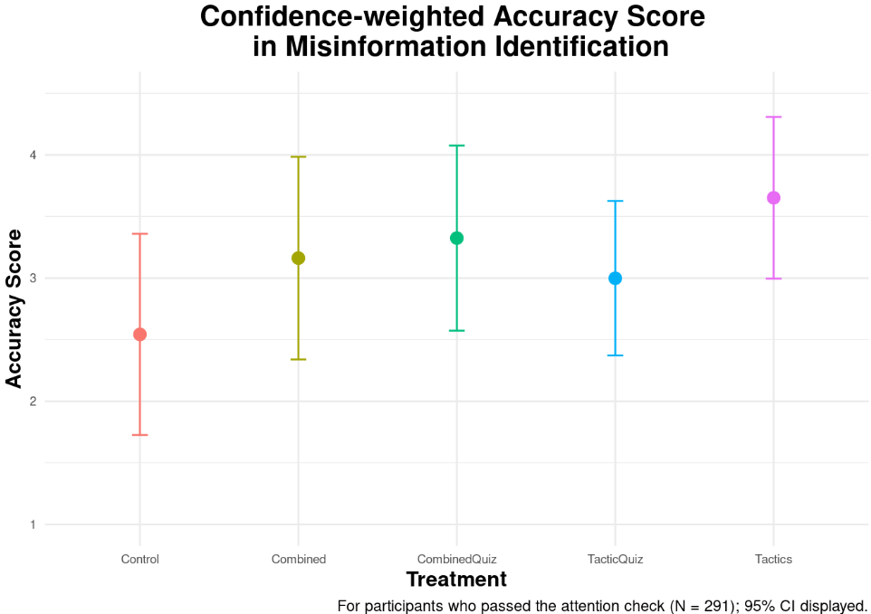

### Research Questions

In light of our motivation and decision to focus on teaching participants about specific manipulative tactics, we decided to focus on the following research questions for our study:

1. Can a 6-minute course focused on manipulative tactics, in the vein of First Draft’s existing SMS courses, help users better identify manipulative content?

2. Does the course reduce the sharing of manipulative content online and offline?

3. Does the course make participants better at identifying each individual tactic covered in the course?

4. Are there heterogeneous treatment effects (HTE) where our course works better for certain subgroups than others? In particular, are there any differences based on users’ misinformation susceptibility at baseline (as measured during the pre-test), political ideology, and income level?


## Hypotheses

These research questions are supplemented with a list of 10 hypotheses:

1. H1: Participants will be more capable of rating misinformation correctly as manipulative after taking the course.

    1. SH1: Participants will not identify true content as more manipulative after taking the course.

2. H2: Participants will be more capable of identifying misleading graphs after taking the course.

3. H3: Participants will be more capable of identifying anecdotes after taking the course.

4. H4: Participants will be more capable of identifying false comparisons after taking the course.

5. H5: Participants will be less likely to share misinformation online after taking the course.

6. H6: Participants will be less likely to share misinformation offline after taking the course.

7. H7: Participants with different levels of susceptibility to misinformation at baseline will react differently to the treatment in terms of their overall ability to identify manipulative content.

8. H8: Participants with different political ideologies will react differently to the treatment in terms of their overall ability to identify manipulative content.

9. H9: Participants with different levels of income will react differently to the treatment in terms of their overall ability to identify manipulative content.

# Methodology

## Overview

Our experiment was designed to navigate several constraints:

* The experiment is limited to a 15-minute online survey. This survey is responsible for collecting participant demographics/covariates, delivering the treatment or control messaging, and evaluating its effectiveness by implementing a pre and post-treatment test. This time-limit constrains the length and depth of the course we can show to participants.
* The online survey is unable to target participants based on their characteristics (such as demographics or misinformation susceptibility). This prevents customizing the content for a particular audience. The survey must instead be accessible by and effective for a representative sample of the US population.
* The study has a limited sample size of ~1,000 participants ). First Draft also indicated that they expect the treatment effect to be small.
* Taking these together, we were wary of the experiment’s power. (prior to attention checks). First Draft also indicated that they expect the treatment effect to be small.

Taking these together, we were wary of the experiment’s power. We focused on obtaining sufficient power to detect our main outcomes (i.e. identifying manipulative tactics), while also accommodating several HTE analyses on priority subgroups. To do this, we estimated the experiment’s power by leveraging the results from the pilot study. See details about this in the following section and in our [pre-analysis plan](https://drive.google.com/file/d/1ju8i62mImEzKa-X-o3MZ5x4EF7Fb03ge/view?usp=sharing).

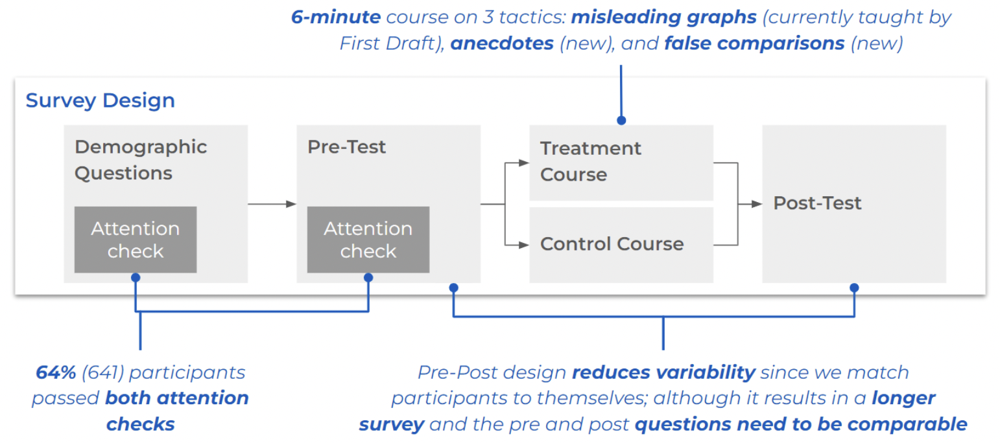

## Pre and Post Design

```{r}
lm_interacted_model <- function(N,
                                # overall sample size
                                p_list,
                                # probability of treatment assignment,
                                # separate entry for each factor,
                                # entries will be normalized to sum to 1
                                b0,
                                # baseline mean outcome (i.e., mean for the control)
                                b_main_list,
                                # main effects above baseline,
                                # separate entry for each factor level
                                b_2wy_list,
                                # 2-way interactions
                                sigma,
                                # SD, used to construct residual error,
                                fmla = NULL
                                # formula for test we are performing
) {

  K <- length(p_list) # number of factors
  degree = 2 # max order of interaction in the model

  # Count number of levels in each factor
  L_list <- list()
  for(k in 1:length(p_list)){
    L_list[[paste0('L', k)]] <- length(p_list[[k]]) # naming the levels
  }
  number_marginal = n #(sum(unlist(L_list))-length(L_list)) # number of marginal effects

  # complete randomization of treatment assignment
  wmat <- as.data.frame(lapply(1:K, function(k)
    factor(
      complete_ra(N,
                  num_arms = L_list[[k]],
                  prob_each = p_list[[k]]),
      levels = paste0('T', 1:L_list[[k]]),
      labels = 1:L_list[[k]]
    ) ))

  # add names for the treatment assignment
  colnames(wmat) <- paste0('w', 1:K, '.')

  # simulation based on provided data generation process
  if (is.null(fmla)) fmla = paste0('~.^', degree)
  mmat <- model.matrix(fmla , as.data.frame(wmat)) # indicators for whether to include w1, w2 and the interaction

  betas <- unlist(c(b0, b_main_list, b_2wy_list)) # define the betas
  y <- as.vector(mmat %*% betas + rnorm(N, sd = sigma)) # simulate outcomes

    # analysis of outcomes by including interaction in the model
  lm_long <- lm_robust(y~., data = as.data.frame(cbind(y, mmat[,-1]))) # regression of simulated outcome on all the indicators except intercept

  # analysis of outcomes by excluding interactions in the model
  lm_short <- lm_robust(y~., data = as.data.frame(cbind(y, mmat[,hte]))) # regression of simulated outcome on all the indicators except intercept and interaction


  return(list(lm_long,lm_short))
}

#### POWER CALCULATION
set.seed(103851)

# definition
possible.ns <- seq(from = 100, to = 2000, by = 100) # possible total sample size
power.interaction <- rep(NA, length(possible.ns)) # save power to detect the specified interaction effect
power.onemarginal <- rep(NA, length(possible.ns)) # save power to detect at least one of the marginal effects
power.allmarginals <- rep(NA, length(possible.ns)) # save power to detect all marginal effects, with Bonferroni correction
power.all_FDR <- rep(NA, length(possible.ns)) # save power to detect all marginal effects, with FDR control

alpha <- 0.05  # significance level
sims <- 100 # 100 simulations

# based on pilot data
b0 <- 1.525574 # mean of control # 2.542623
sigma <- 2.520098 # SD of control # 3.253432

## YOU NEED TO EDIT THE FOLLOWING PARAMETERS:


p_list <- list(c(1/2, 1/2),
               c(168/291, 123/291),
               c(119/291, 172/291),
               c(190/291, 101/291))


no_hte = sum(sapply(p_list[-1], function(a) length(a)-1))


b_main_list <- list('w1.2' = 0.153) # Tactics Course


# what is a meaningful interaction to test?
b_2wy_list <- list('w1.1:w2.2' = 1.158, # Income
                   'w1.2:w2.2' = 0.153,
                   'w1.1:w3.2' = 1.09, # Reflect
                   'w1.2:w3.2' = 0.153,
                   'w1.1:w4.2' = 0.68, # Ideology
                   'w1.2:w4.2' = 0.153
                   )

fmla = formula('~w1. + w1.:w2. + w1.:w3. + w1.:w4.  ') # formula we are testing for to make mmat
n <- length(b_2wy_list) + length(b_main_list) # total number of hypotheses
m <- 3 # index of which interaction to test (here, Tactics Course & quiz)
hte <- 2*(2:(no_hte+1))

hypotheses <- rep("two.tailed", n) # hypothesis type for marginal effect 1, marginal effect 2, and interaction effect, can be "two.tailed", "greater", or "lower"

## END OF PARAMETERS

#### Outer loop to vary the experiment size
for (j in 1:length(possible.ns)) {
  N <- possible.ns[j]
  # Count number of levels in each factor
  L_list <- list()
  for(k in 1:length(p_list)){
    L_list[[paste0('L', k)]] <- length(p_list[[k]]) # naming the levels
  }
  number_marginal = n #(sum(unlist(L_list))-length(L_list)) # number of marginal effects

  # hold the p values and coefficients from both long and short models
  pvec <- cvec <- matrix(NA, sims, n)
  pvec_s <- cvec_s <- matrix(NA, sims, no_hte)

  #### Inner loop to conduct experiments "sims" times over for each N ####
  for (i in 1:sims) {

    # apply the analysis function defined above

    fits <- lm_interacted_model(N,
                                p_list = p_list, # randomization probs
                                b0 = b0, # intercept
                                b_main_list = b_main_list, # main effects
                                b_2wy_list = b_2wy_list, # 2-way
                                sigma = sigma,
                                fmla = fmla)
    fit0 <- fits[[1]] # long model with interaction
    fit1 <- fits[[2]] # short model without interaction # TODO: not used not, check back see if needed

    ### To capture coefficients and pvalues, according to the hypothesis type
    for(h in 1:n){
      if(hypotheses[h] == 'two.tailed'){
        pvec[i,h] <- summary(fit0)$coefficients[h + 1, 4] # pvalues for the h-th indicator (+1 due to intercept), 4th column: p-value for a two-sided test
        cvec[i,h] <- TRUE     # check if sign of coefficient is consistent with the hypothesis
      } else if (hypotheses[h] == 'greater'){
        pvec[i,h] <- pt(coef(summary(fit0))[h + 1, 3], fit0$df[h + 1], # 3rd column: t-stat
                        lower.tail = FALSE
        )
        cvec[i,h] <- summary(fit0)$coefficients[h + 1, 1]>0 # greater: >0
      } else if (hypotheses[h] == 'lower'){
        pvec[i,h] <- pt(coef(summary(fit0))[h + 1, 3], fit0$df[h + 1],
                        lower.tail = TRUE)
        cvec[i,h] <- summary(fit0)$coefficients[h + 1, 1]<0 # lower: <0
      }
    }
    # from short model without interactions
    for(s in 1:length(hte)){
      if(hypotheses[s] == 'two.tailed'){
        pvec_s[i,s] <- summary(fit1)$coefficients[s + 1, 4]

        cvec_s[i,s] <- TRUE
      } else if (hypotheses[s] == 'greater'){
        pvec_s[i,s] <- pt(coef(summary(fit1))[s + 1, 3], fit1$df[s + 1],
                        lower.tail = FALSE
        )
        cvec_s[i,s] <- summary(fit1)$coefficients[s + 1, 1]>0
      } else if (hypotheses[s] == 'lower'){
        pvec_s[i,s] <- pt(coef(summary(fit1))[s + 1, 3], fit1$df[s + 1],
                        lower.tail = TRUE)
        cvec_s[i,s] <- summary(fit1)$coefficients[s + 1, 1]<0
      }
    }
  }


  # power for detecting the chosen interaction with index m
  power.interaction[j] <- mean(sapply(1:sims, function(x)
    cvec[x, m]*(pvec[x, m]<alpha)
    )) # get pvalues and coefficients of the relevant interaction term

  # power for detecting at least one marginal effect
  power.onemarginal[j] <- mean(sapply(1:sims, function(x)
    max(cvec_s[x,]*( pvec_s[x,]<alpha/no_hte ))==1)) # Bonferroni or FDR

  # power for detecting all marginal effects
  power.allmarginals[j] <- mean(sapply(1:sims, function(x)
    all(cvec_s[x,]*( pvec_s[x,]<(alpha/no_hte ))) )) # Bonferroni
  # note that power for detecting at least one is the same with Bonferroni or FDR, but not the power for detecting all effects
  power.all_FDR[j] <- mean(sapply(1:sims, function(x)
    all(cvec_s[x,]*(pvec_s[x,]<alpha)) )) # FDR - cutoff for the max pvalue is alpha
}


# save simulated power data
gg_df2 <- data.frame(
  N = possible.ns,
  Interaction = power.interaction,
  `At least one` = power.onemarginal,
  `All with Bonferroni` = power.allmarginals,
  `All with FDR` = power.all_FDR
)

# start the plot
gg_df2 <- gg_df2 %>% melt(
  id.vars = "N", value.name = "Power", # the y-axis
  variable.name = "Type" # legend
)

# plotting power against sample size by type of power
ggplot(data = gg_df2, aes(x = N, y = Power, group = Type, col = Type)) + # power against size
  theme_minimal() +
  geom_point() +
  # vertical line indicating sample size where power first exceeds 0.8
  geom_segment(aes(
    x = possible.ns[min(which(power.interaction>0.8))],
    y = 0,
    xend = possible.ns[min(which(power.interaction>0.8))],
    yend = 0.8
  ),
  data = gg_df2, colour = "blue", lty = "dashed"
  ) +
  # horizontal line indicating sample size where power first exceeds 0.8
  geom_segment(aes(
    x = min(possible.ns),
    y = 0.8,
    xend = possible.ns[min(which(power.interaction>0.8))],
    yend = 0.8
  ),
  data = gg_df2, colour = "blue", lty = "dashed"
  ) +
  # vertical line indicating sample size where power first exceeds 0.8
  geom_segment(aes(
    x = possible.ns[min(which(power.allmarginals>0.8))],
    y = 0,
    xend = possible.ns[min(which(power.allmarginals>0.8))],
    yend = 0.8
  ),
  data = gg_df2, colour = "blue", lty = "dashed"
  ) +
  # horizontal line indicating sample size where power first exceeds 0.8
  geom_segment(aes(
    x = min(possible.ns),
    y = 0.8,
    xend = possible.ns[min(which(power.allmarginals>0.8))],
    yend = 0.8
  ),
  data = gg_df2, colour = "blue", lty = "dashed"
  ) +
  # vertical line indicating sample size where power first exceeds 0.8
  geom_segment(aes(
    x = possible.ns[min(which(power.all_FDR>0.8))],
    y = 0,
    xend = possible.ns[min(which(power.all_FDR>0.8))],
    yend = 0.8
  ),
  data = gg_df2, colour = "blue", lty = "dashed"
  ) +
  # horizontal line indicating sample size where power first exceeds 0.8
  geom_segment(aes(
    x = min(possible.ns),
    y = 0.8,
    xend = possible.ns[min(which(power.all_FDR>0.8))],
    yend = 0.8
  ),
  data = gg_df2, colour = "blue", lty = "dashed"
  ) +
  # vertical line indicating sample size where power first exceeds 0.8
  geom_segment(aes(
    x = possible.ns[min(which(power.onemarginal>0.8))],
    y = 0,
    xend = possible.ns[min(which(power.onemarginal>0.8))],
    yend = 0.8
  ),
  data = gg_df2, colour = "blue", lty = "dashed"
  ) +
  # horizontal line indicating sample size where power first exceeds 0.8
  geom_segment(aes(
    x = min(possible.ns),
    y = 0.8,
    xend = possible.ns[min(which(power.onemarginal>0.8))],
    yend = 0.8
  ),
  data = gg_df2, colour = "blue", lty = "dashed"
  ) +
  scale_y_continuous(breaks = seq(0.2, 1, .2)) +  # y axis scale +
ggtitle('Power analysis without pre-post test design for main outcome & 3 HTE')
```


We performed a simulation using the pilot experiment design, testing for a statistically significant change in the confidence weighted accuracy score and 3 HTEs (4 outcomes in total) using only 1 treatment arm (Tactics). As shown in the figure above, a power analysis for the outcomes of interest suggests that 1,500 participants would give us less than 20% power for each hypothesis. (Since we are interested in giving precise recommendations, the “at least one” approach isn’t appropriate for this context.)

The above results prompted us to modify our experiment to include a pre-post test design. After asking the basic demographics questions, the participants respond to a pre-test that is representative of the tactics we will be teaching in the treatment arm. The answers to the pre-test questions form a baseline for each participant to measure the incremental impact of our treatments. We also use this score as one of the covariates of interest for HTE analysis: susceptibility to misinformation at baseline.

Both the pre- and the post-test involve 6 comparable social media post examples each. They see one example in each of the following categories:

* True (without a graph)
* True (with a non manipulative graph)
* Misinformation (with a manipulative graph)
* Misinformation (with manipulative anecdote)
* Misinformation (with false comparison)
* Misinformation (with manipulative anecdote, false comparison, and non manipulative graph).

We created two social media post examples for each of the six above categories and for each participant and each category we randomized which one they see in the pre and which in the post test. Additionally, we randomized the order of the posts for both the pre and the post test. To see the details of the social media post examples used, please see our survey script [here](https://docs.google.com/document/d/1t88qhy2M1ysVQHT0DTT5LrQTa2_ALSI1IWRADCECPn8/edit?usp=sharing).

Additionally, we decided to include two attention checks prior to treatment assignment to ensure quality answers and further reduce noise in our data.

## Outcomes of Interest

Our outcomes of interest are based on the study’s four research questions. After each social media post example, we ask the same set of questions corresponding to our outcomes of interest. These questions are:

1. How manipulative do you find this post? _(6 point scale from “Not at all” to “Very”)_
2. Which aspect of the post is manipulative? _(multi-select)_
    1. Post not manipulative
    2. False comparison
    3. Misleading anecdote
    4. Manipulative graph
    5. Evidence taken out of context
    6. Other (require text entry)
3. Would you like to share this post on social media? _(6 point scale from “Definitely not” to “Definitely yes”)_
4. Would you want to talk to others about this information offline? _(6 point scale from “Definitely not” to “Definitely yes”)_

We use the answers to the first question across all six post examples to investigate H1, SH1, and the HTE related H7-9. (We look at the difference between the answers to the six posts before versus after the treatment or control messages).

For H2-4 about the ability to identify specific manipulative tactics, we use the selected answers for the second question, across all six post examples. (We look at the difference between the answers to the six posts before versus after the treatment or control messages). When evaluating whether or not a specific tactic was correctly identified for a given post, we compare whether the tactic was selected or not against whether the tactic is actually present or not. In general, for correct answers we expect the tactic to be selected when it is present, and unselected when it is not present. However, we explore multiple ways of scoring these answers that focus on subtle differences in what we care about: for example, always having exactly the correct answer or making sure that the tactic is selected when it is present. See the Metrics Definition section of the Tactics sections of Results for more details.

We use the answers to the third (fourth) question across the four manipulative post examples to investigate H5 (H6). We look at the difference between the answers to the four posts before versus after the treatment or control messages. 


## Intervention

We decided to focus on only three specific manipulative tactics because we have very limited time to deliver our intervention. We picked one tactic already included in the First Draft SMS course and the pilot: misleading graphs. We chose two other tactics that are less studied in the literature and not yet in the First Draft course, because of the Partner’s above-mentioned request to investigate new tactics. These two were picked from the Cook (2020)’s FLICC taxonomy (shown below). We selected anecdotes and false comparisons because they: (i) are not dependent on context or prior knowledge, (ii) may be applied to a post on any topic, (iii) are not widely analyzed in the literature, and (iv) can each be feasibly taught in ~2-minutes.


In designing the intervention, we wanted to maximize participant engagement. Both First Draft and the literature suggested that interactive course elements increase participant engagement (Roblyer & Wiencke (2003), Hake (1998)). Interestingly, our analysis of the pilot data suggests that the pilot courses with quizzes didn’t outperform those without (there is also large uncertainty as the confidence intervals are greatly overlapping). However, based on our literature review and conversations with First Draft, these quizzes only encouraged limited engagement – adding just a single quiz question at the very end of the treatment message. Therefore, following the literature, we expanded on the pilot and included the following additional elements in delivering our message for increased engagement (Klein, Junior & Barbosa (2015), Ziden & Rahman (2013)):

* Short and engaging, SMS style message snippets 


* Infographics (McCready, 2020).


* Interactive questions to provoke thought 

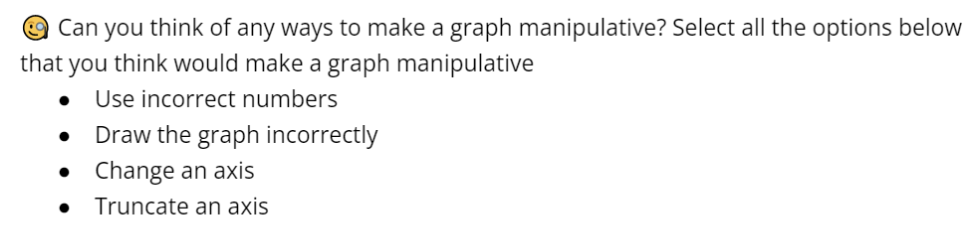

* Interactive and relatable examples 


To be able to use the above interactive elements, we edited the First Draft content on manipulative graphs. Additionally, we designed novel content on false comparisons and manipulative anecdotes. We made sure that all three tactics are covered in a comparable and analogous way using the above mentioned engagement strategies. 

See below some key snippets of our intervention content. The full survey script, including the full intervention, can be accessed [here](https://docs.google.com/document/d/1t88qhy2M1ysVQHT0DTT5LrQTa2_ALSI1IWRADCECPn8/edit?usp=sharing).

Key pieces of the misleading graphs content:

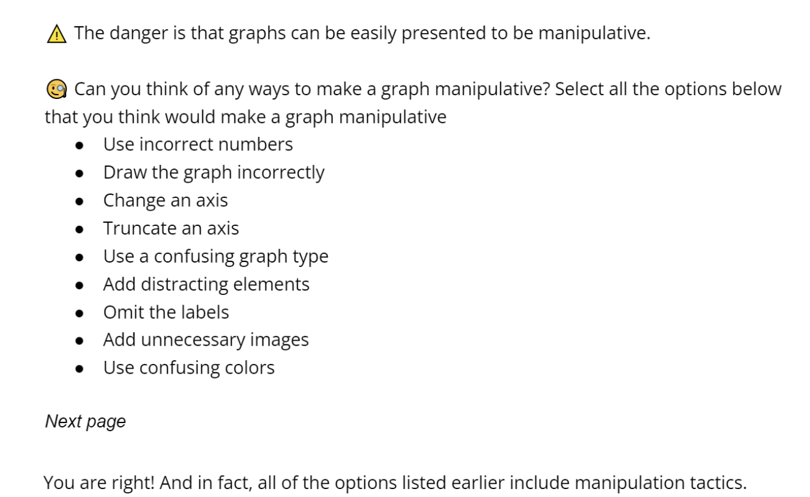

Key messages of the anecdotes content:

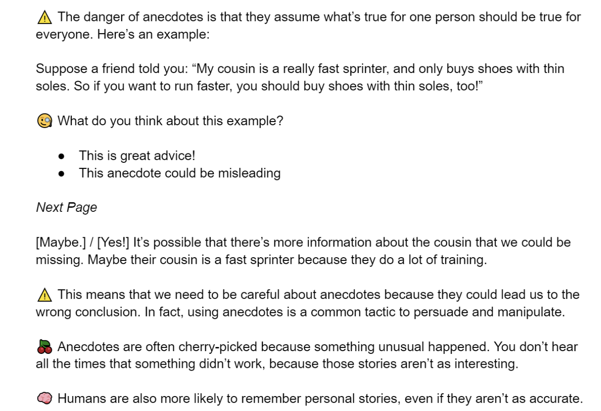

Key pieces of the false comparisons message:


## Control

Our final consideration in treatment design is selecting a control message to be as neutral as possible. Our control messages use the same delivery style and interactive elements as the treatment. They are also educational but focused on a neutral topic unrelated to manipulative tactics and news, and that is also not too boring nor too exciting. We considered various options based on the literature (e.g. freezer burn in Lewandowsky & Van Der Linden (2021)). The best topic we found that fits these criteria is “sleep.” We are using specific pieces of information based on the book Why We Sleep by Matthew Walker. To make the control “intervention” as comparable to the treatment as possible, we focused on three key messages related to sleep: sleep quantity, caffeine, and sleep schedule. For each of the three topics, we had comparable delivery styles and lengths as for the three parts of the treatment messages.

Here is an example screenshot of the control message:

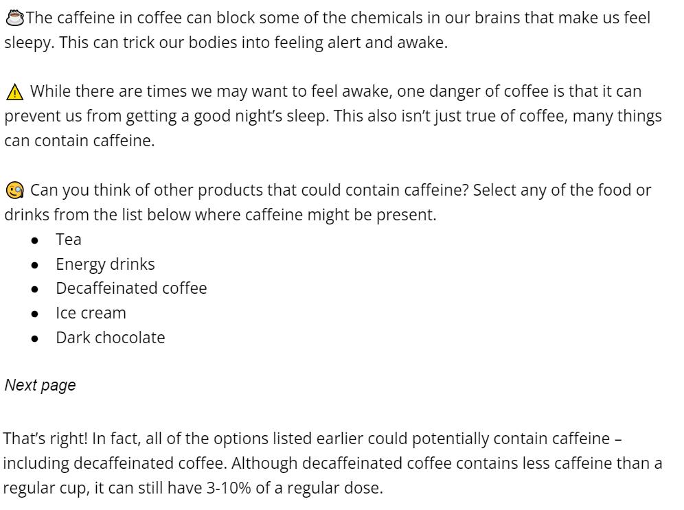

The full survey script, including the full control message, can be accessed [here](https://docs.google.com/document/d/1t88qhy2M1ysVQHT0DTT5LrQTa2_ALSI1IWRADCECPn8/edit?usp=sharing).

# Key Findings

## Summary of Insights

1. Our 6-minutes tactics focused course helped participants label manipulative posts as 12 percentage points more manipulative.
2. At the same time, we see increased skepticism for posts in general. Participants also labeled non-manipulative posts as 15.4 percentage points more manipulative. In particular, participants were more skeptical of non-manipulative graphs.
3. The rate at which participants can identify the tactics taught in our course increases (although this is only statistically significant for misleading graphs and anecdotes). However, we see drops in accuracy across all 3. This drop is due to a general increase in the frequency that participants selected tactics in the post-test. There is a (not statistically significant) increase in false positive identification, suggesting the users are not precise in their recognition of these tactics. 
4. Our tactics course did not seem to change online and offline sharing behavior. 
5. We found a heterogeneous treatment effect (HTE) for income only. In particular, we found that our treatment was relatively more effective for participants with lower incomes compared to participants with higher incomes. Otherwise, the treatment was consistent for participants with different ideologies and baseline misinformation susceptibility.
6. We performed additional covariate balancing and variance reduction techniques. These helped improve the significance of our estimates slightly, but not enough to change any of our initial conclusions.

# Data Processing

This section processes our data so that we have all the necessary variables and calculations to investigate our hypotheses. We also fix up some column naming typos and values to make them more tractable for analysis.

## Import Data

```{r import_data}
df <- read.csv('Data/FirstDraft_Data.csv', stringsAsFactors=F)
# Drop first 2 rows as they are additional json headers
df <- df[-(1:2),]
# Add index column based on row number
df <- rownames_to_column(df, "idx")

# Fix a few column name typos
df <- df %>% rename(
  'Gender' = 'Gender.',
  'Race' = 'Race.',
  'Education' = 'Education.',
  'ReportUserSocialMedia' = 'ReportUserSocialMedi',
  'misgraph1' = 'misgraph',
  'falsecomp1' = 'falsecomp',
  'anecdotes1' = 'anecdotes',
  'combined1' = 'combined'
)
```

## Generate Easy Access Column Names
This section stores column names from the dataset for later analysis.

```{r}
# Test Questions (original ones, these will get rewritten in next step)
test_colnames_orig <- c('True1a', 'True1a2', 'True1a3a', 'True1a3b', 'True1b', 'True1b2', 'True1b3a', 'True1b3b', 'True2a', 'True2a2', 'True2a3a', 'True2a3b', 'True2b', 'True2b2', 'True2b3a', 'True2b3b', 'MisGraph1a', 'MisGraph1a2', 'MisGraph1a3a', 'MisGraph1a3b', 'MisGraph1b', 'MisGraph1b2', 'MisGraph1b3a', 'MisGraph1b3b', 'FalseComp1a', 'FalseComp1a2', 'FalseComp1a3a', 'FalseComp1a3b', 'FalseComp1b', 'FalseComp1b2', 'FalseComp1b3a', 'FalseComp1b3b', 'Anecdotes1a', 'Anecdotes1a2', 'Anecdotes1a3a', 'Anecdotes1a3b', 'Anecdotes1b', 'Anecdotes1b2', 'Anecdotes1b3a', 'Anecdotes1b3b', 'Combined1a', 'Combined1a2', 'Combined1a3a', 'Combined1a3b', 'Combined1b', 'Combined1b2', 'Combined1b3a', 'Combined1b3b')

# Rename first test questions with prefix 1
df <-
  df %>% rename_with(
    .fn = ~ paste0(.x, "1"),
    .cols = grep('^[A-Za-z]*\\d[A-Za-z]$', test_colnames_orig, value = T)
  )

# Use these test column names going forward
test_colnames <- unlist(lapply(test_colnames_orig,
                               function(x) {
                                 ifelse(str_detect(x, "^[A-Za-z]*\\d[A-Za-z]$"), paste0(x, '1'), x)
                               }))
```


```{r}
# Demographics
demographic_colnames <- c('Gender', 'Race', 'Education', 'Income', 'Ideology', 'GeneralTrust', 'KnowFauci', 'TrustFauci', 'TrustScientists', 'NewsSources', 'PostFrequency', 'BlockUserSocialMedia', 'ReportUserSocialMedia', 'SeenManipulative', 'KnowSpot')

qualtrics_demographic_colnames <- c('age', 'gender', 'hhi', 'ethnicity', 'hispanic', 'education', 'political_party', 'region')

# Course
control_course_colnames <- c('SleepSchedulQ1', 'SleepSchedulQ2', 'SleepSchedulQ3', 'SleepCaffineQ1', 'SleepCaffineQ2', 'SleepCaffineQ3', 'SleepHoursQ1', 'SleepHoursQ2', 'SleepHoursQ3')

# Treatment
treat_course_colnames <- c('TreatGraphsQ1', 'TreatGraphsQ2', 'TreatGraphsQ3', 'TreatAnecdotesQ1', 'TreatAnecdotesQ2', 'TreatAnecdotesQ3', 'TreatFalseCompsQ1', 'TreatFalseCompsQ2', 'TreatFalseCompsQ3')
```


## Clean Test Answer Choices

The answer choices currently have the word labels for 1 and 6. We remove the words and then cast the column to integer.

```{r}
# Clean all numeric test question answers
num_test_cols <- grep('2$', test_colnames, value = T, invert = T)
df[num_test_cols] <-
  sapply(df[num_test_cols], function(x) {
    as.integer(substr(x, 1, 1))
  })
```

```{r}
# Flip True Values since higher score for selecting not manipulative
df[grep('^True', num_test_cols, value = T)] <-
  sapply(df[grep('^True', num_test_cols, value = T)], function(x) {
    as.integer(7 - x)
  })
```


## Generate Pre-Post Columns

We tracked which question (a or b) was shown to each user during their pre and post tests since this allocation was randomized. For analysis, we want a column of all the pre-rest questions and another for all the post-test questions. We look up the right columns for each question for each user and create pre- and post-test columns.

```{r}
# function to add pre and post columns
prepost_lookup <-
  function(df,
           lookup_col,
           qnum = '',
           timer = FALSE) {
    lower_lookup_col <- tolower(lookup_col)
    neg_lower_lookup_col <- paste0('neg_', lower_lookup_col)
    df[neg_lower_lookup_col] = ifelse(df[[lower_lookup_col]] == 'a', 'b', 'a')
    
    if (timer == FALSE) {
      df[paste0(lookup_col, '_Pre_', qnum)] <-
        df[cbind(seq_len(nrow(df)),
                 match(paste0(lookup_col, df[[lower_lookup_col]], qnum), colnames(df)))]
      
      df[paste0(lookup_col, '_Post_', qnum)] <-
        df[cbind(seq_len(nrow(df)),
                 match(paste0(lookup_col, df[[neg_lower_lookup_col]], qnum), colnames(df)))]
      
    } else {
      df[paste0(lookup_col, '_Pre_', 'Timer')] <-
        df[cbind(seq_len(nrow(df)),
                 match(
                   paste0('Timer_', lower_lookup_col, df[[lower_lookup_col]], '_Page.Submit'),
                   colnames(df)
                 ))]
      
      df[paste0(lookup_col, '_Post_', 'Timer')] <-
        df[cbind(seq_len(nrow(df)),
                 match(
                   paste0('Timer_', lower_lookup_col, df[[neg_lower_lookup_col]], '_Page.Submit'),
                   colnames(df)
                 ))]
      
    }
    
    return(df)
  }
```

```{r}
# Create pre and post columns
for (testq in c('True1',
                'True2',
                'MisGraph1',
                'FalseComp1',
                'Anecdotes1',
                'Combined1')) {
  # cycle through 4 questions
  for (qnum in c('1', '2', '3a', '3b')) {
    df <- prepost_lookup(df, testq, qnum)
  }
}

# Create pre and post columns for question times
for (testq in c('True1',
                'True2',
                'MisGraph1',
                'FalseComp1',
                'Anecdotes1',
                'Combined1')) {
  df <- prepost_lookup(df, testq, '', timer = TRUE)
}

# Convert numeric columns to numeric type
df[, grep('.*_(?:Pre|Post)_.*[^2]$', colnames(df))] <-
  df[, grep('.*_(?:Pre|Post)_.*[^2]$', colnames(df))] %>% mutate_if(is.character, as.numeric)
```

We also calculate the delta between post and pre test.

```{r}
# Delta Post - Pre per question
df[str_replace(grep('.*_Post_.*[^2]$', colnames(df), value = T), 'Post', 'Delta')] <-
  df[, grep('.*_Post_.*[^2]$', colnames(df))] - df[, grep('.*_Pre_.*[^2]$', colnames(df))]
```

Below is sample code to pull the new columns.

```{r, results='hide'}
# Pull Pre Test columns
pre_test_colnames <- grep('.*_Pre_.*', colnames(df))
df[, pre_test_colnames] %>% head()

# Pull Post Test columns
post_test_colnames <- grep('.*_Post_.*', colnames(df))
df[, post_test_colnames] %>% head()

# Pull Delta columns
delta_test_colnames <- grep('.*_Delta_.*', colnames(df))
df[, delta_test_colnames] %>% head()
```


## Add in Tactics Columns, Deltas, Means

We also need to process the multi-select tactics identification question. We look at every selection box and evaluate if it is correct or not. The user receives a final score based on the proportion of correct answer choices selected. We also calculate various metrics (explained later) for the individual tactics and the overall results.

```{r}
df <- df %>%
  mutate(
    True1_Pre_2_binary = if_else(str_detect(True1_Pre_2, "Post is not manipulative"), 1, 0),
    True1_Post_2_binary = if_else(str_detect(True1_Post_2, "Post is not manipulative"), 1, 0),
    True2_Pre_2_binary = if_else(str_detect(True2_Pre_2, "Post is not manipulative"), 1, 0),
    True2_Post_2_binary = if_else(str_detect(True2_Post_2, "Post is not manipulative"), 1, 0),
    MisGraph1_Pre_2_binary = if_else(str_detect(MisGraph1_Pre_2, "Manipulative graph"), 1, 0),
    MisGraph1_Post_2_binary = if_else(str_detect(MisGraph1_Post_2, "Manipulative graph"), 1, 0),
    FalseComp1_Pre_2_binary = if_else(str_detect(FalseComp1_Pre_2, "False comparison"), 1, 0),
    FalseComp1_Post_2_binary = if_else(str_detect(FalseComp1_Post_2, "False comparison"), 1, 0),
    Anecdotes1_Pre_2_binary = if_else(str_detect(Anecdotes1_Pre_2, "Misleading anecdote"), 1, 0),
    Anecdotes1_Post_2_binary = if_else(str_detect(Anecdotes1_Post_2, "Misleading anecdote"), 1, 0),
    Combined1_Pre_2_binary = if_else(str_detect(Combined1_Pre_2, "False comparison"), 1, 0),
    Combined1_Pre_2_binary = if_else(str_detect(Combined1_Pre_2, "Misleading anecdote"), Combined1_Pre_2_binary+1, Combined1_Pre_2_binary),
    Combined1_Pre_2_binary = Combined1_Pre_2_binary / 2,
    Combined1_Post_2_binary = if_else(str_detect(Combined1_Post_2, "False comparison"), 1, 0),
    Combined1_Post_2_binary = if_else(str_detect(Combined1_Post_2, "Misleading anecdote"), Combined1_Post_2_binary+1, Combined1_Post_2_binary),
    Combined1_Post_2_binary = Combined1_Post_2_binary / 2,) %>%
  mutate(
    True1_Pre_2_accuracy = if_else(str_detect(True1_Pre_2, "Post is not manipulative"), 1, 0),
    True1_Pre_2_accuracy = if_else(
      str_detect(True2_Pre_2, "Post is not manipulative"),
      True1_Pre_2_accuracy + 1,
      True1_Pre_2_accuracy
    ),
    True1_Pre_2_accuracy = if_else(
      !str_detect(MisGraph1_Pre_2, "Post is not manipulative"),
      True1_Pre_2_accuracy + 1,
      True1_Pre_2_accuracy
    ),
    True1_Pre_2_accuracy = if_else(
      !str_detect(FalseComp1_Pre_2, "Post is not manipulative"),
      True1_Pre_2_accuracy + 1,
      True1_Pre_2_accuracy
    ),
    True1_Pre_2_accuracy = if_else(
      !str_detect(Anecdotes1_Pre_2, "Post is not manipulative"),
      True1_Pre_2_accuracy + 1,
      True1_Pre_2_accuracy
    ),
    True1_Pre_2_accuracy = if_else(
      !str_detect(Combined1_Pre_2, "Post is not manipulative"),
      True1_Pre_2_accuracy + 1,
      True1_Pre_2_accuracy
    ),
    True1_Pre_2_accuracy = True1_Pre_2_accuracy / 6
  ) %>%
  mutate (
    True1_Post_2_accuracy = if_else(str_detect(True1_Post_2, "Post is not manipulative"), 1, 0),

    True1_Post_2_accuracy = if_else(
      str_detect(True2_Post_2, "Post is not manipulative"),
      True1_Post_2_accuracy + 1,
      True1_Post_2_accuracy
    ),
    True1_Post_2_accuracy = if_else(
      !str_detect(MisGraph1_Post_2, "Post is not manipulative"),
      True1_Post_2_accuracy + 1,
      True1_Post_2_accuracy
    ),
    True1_Post_2_accuracy = if_else(
      !str_detect(FalseComp1_Post_2, "Post is not manipulative"),
      True1_Post_2_accuracy + 1,
      True1_Post_2_accuracy
    ),
    True1_Post_2_accuracy = if_else(
      !str_detect(Anecdotes1_Post_2, "Post is not manipulative"),
      True1_Post_2_accuracy + 1,
      True1_Post_2_accuracy
    ),
    True1_Post_2_accuracy = if_else(
      !str_detect(Combined1_Post_2, "Post is not manipulative"),
      True1_Post_2_accuracy + 1,
      True1_Post_2_accuracy
    ),
    True1_Post_2_accuracy = True1_Post_2_accuracy / 6
  ) %>%
  mutate(
    True2_Pre_2_accuracy = if_else(
      str_detect(True2_Pre_2, "Post is not manipulative"),
      1, 0),
    True2_Pre_2_accuracy = if_else(
      str_detect(True1_Pre_2, "Post is not manipulative"),
      True2_Pre_2_accuracy + 1,
      True2_Pre_2_accuracy
    ),
    True2_Pre_2_accuracy = if_else(
      !str_detect(MisGraph1_Pre_2, "Post is not manipulative"),
      True2_Pre_2_accuracy + 1,
      True2_Pre_2_accuracy
    ),
    True2_Pre_2_accuracy = if_else(
      !str_detect(FalseComp1_Pre_2, "Post is not manipulative"),
      True2_Pre_2_accuracy + 1,
      True2_Pre_2_accuracy
    ),
    True2_Pre_2_accuracy = if_else(
      !str_detect(Anecdotes1_Pre_2, "Post is not manipulative"),
      True2_Pre_2_accuracy + 1,
      True2_Pre_2_accuracy
    ),
    True2_Pre_2_accuracy = if_else(
      !str_detect(Combined1_Pre_2, "Post is not manipulative"),
      True2_Pre_2_accuracy + 1,
      True2_Pre_2_accuracy
    ),
    True2_Pre_2_accuracy = True2_Pre_2_accuracy / 6
  ) %>%
  mutate (
    True2_Post_2_accuracy = if_else(
      str_detect(True2_Post_2, "Post is not manipulative"),
      1, 0),
    True2_Post_2_accuracy = if_else(
      str_detect(True1_Post_2, "Post is not manipulative"),
      True2_Post_2_accuracy + 1,
      True2_Post_2_accuracy
    ),
    True2_Post_2_accuracy = if_else(
      !str_detect(MisGraph1_Post_2, "Post is not manipulative"),
      True2_Post_2_accuracy + 1,
      True2_Post_2_accuracy
    ),
    True2_Post_2_accuracy = if_else(
      !str_detect(FalseComp1_Post_2, "Post is not manipulative"),
      True2_Post_2_accuracy + 1,
      True2_Post_2_accuracy
    ),
    True2_Post_2_accuracy = if_else(
      !str_detect(Anecdotes1_Post_2, "Post is not manipulative"),
      True2_Post_2_accuracy + 1,
      True2_Post_2_accuracy
    ),
    True2_Post_2_accuracy = if_else(
      !str_detect(Combined1_Post_2, "Post is not manipulative"),
      True2_Post_2_accuracy + 1,
      True2_Post_2_accuracy
    ),
    True2_Post_2_accuracy = True2_Post_2_accuracy / 6
  ) %>%
  mutate(
    MisGraph1_Pre_2_accuracy = if_else(str_detect(
      MisGraph1_Pre_2, "Manipulative graph"),
      1, 0),
    MisGraph1_Pre_2_accuracy = if_else(
      !str_detect(True1_Pre_2, "Manipulative graph"),
      MisGraph1_Pre_2_accuracy + 1,
      MisGraph1_Pre_2_accuracy
    ),
    MisGraph1_Pre_2_accuracy = if_else(
      !str_detect(True2_Pre_2, "Manipulative graph"),
      MisGraph1_Pre_2_accuracy + 1,
      MisGraph1_Pre_2_accuracy
    ),
    MisGraph1_Pre_2_accuracy = if_else(
      !str_detect(FalseComp1_Pre_2, "Manipulative graph"),
      MisGraph1_Pre_2_accuracy + 1,
      MisGraph1_Pre_2_accuracy
    ),
    MisGraph1_Pre_2_accuracy = if_else(
      !str_detect(Anecdotes1_Pre_2, "Manipulative graph"),
      MisGraph1_Pre_2_accuracy + 1,
      MisGraph1_Pre_2_accuracy
    ),
    MisGraph1_Pre_2_accuracy = if_else(
      !str_detect(Combined1_Pre_2, "Manipulative graph"),
      MisGraph1_Pre_2_accuracy + 1,
      MisGraph1_Pre_2_accuracy
    ),
    MisGraph1_Pre_2_accuracy = MisGraph1_Pre_2_accuracy / 6
  ) %>%
  mutate (
    MisGraph1_Post_2_accuracy = if_else(
      str_detect(MisGraph1_Post_2, "Manipulative graph"),
      1, 0),
    MisGraph1_Post_2_accuracy = if_else(
      !str_detect(True1_Post_2, "Manipulative graph"),
      MisGraph1_Post_2_accuracy + 1,
      MisGraph1_Post_2_accuracy
    ),
    MisGraph1_Post_2_accuracy = if_else(
      !str_detect(True2_Post_2, "Manipulative graph"),
      MisGraph1_Post_2_accuracy + 1,
      MisGraph1_Post_2_accuracy
    ),
    MisGraph1_Post_2_accuracy = if_else(
      !str_detect(FalseComp1_Post_2, "Manipulative graph"),
      MisGraph1_Post_2_accuracy + 1,
      MisGraph1_Post_2_accuracy
    ),
    MisGraph1_Post_2_accuracy = if_else(
      !str_detect(Anecdotes1_Post_2, "Manipulative graph"),
      MisGraph1_Post_2_accuracy + 1,
      MisGraph1_Post_2_accuracy
    ),
    MisGraph1_Post_2_accuracy = if_else(
      !str_detect(Combined1_Post_2, "Manipulative graph"),
      MisGraph1_Post_2_accuracy + 1,
      MisGraph1_Post_2_accuracy
    ),
    MisGraph1_Post_2_accuracy = MisGraph1_Post_2_accuracy / 6
  ) %>%
  mutate(
    FalseComp1_Pre_2_accuracy = if_else(
      str_detect(FalseComp1_Pre_2, "False comparison"),
      1, 0),
    FalseComp1_Pre_2_accuracy = if_else(
      !str_detect(True1_Pre_2, "False comparison"),
      FalseComp1_Pre_2_accuracy + 1,
      FalseComp1_Pre_2_accuracy
    ),
    FalseComp1_Pre_2_accuracy = if_else(
      !str_detect(True2_Pre_2, "False comparison"),
      FalseComp1_Pre_2_accuracy + 1,
      FalseComp1_Pre_2_accuracy
    ),
    FalseComp1_Pre_2_accuracy = if_else(
      !str_detect(MisGraph1_Pre_2, "False comparison"),
      FalseComp1_Pre_2_accuracy + 1,
      FalseComp1_Pre_2_accuracy
    ),
    FalseComp1_Pre_2_accuracy = if_else(
      !str_detect(Anecdotes1_Pre_2, "False comparison"),
      FalseComp1_Pre_2_accuracy + 1,
      FalseComp1_Pre_2_accuracy
    ),
    FalseComp1_Pre_2_accuracy = if_else(
      str_detect(Combined1_Pre_2, "False comparison"),
      FalseComp1_Pre_2_accuracy + 1,
      FalseComp1_Pre_2_accuracy
    ),
    FalseComp1_Pre_2_accuracy = FalseComp1_Pre_2_accuracy / 6
  ) %>%
  mutate (
    FalseComp1_Post_2_accuracy = if_else(
      str_detect(FalseComp1_Post_2, "False comparison"),
      1, 0),
    FalseComp1_Post_2_accuracy = if_else(
      !str_detect(True1_Post_2, "False comparison"),
      FalseComp1_Post_2_accuracy + 1,
      FalseComp1_Post_2_accuracy
    ),
    FalseComp1_Post_2_accuracy = if_else(
      !str_detect(True2_Post_2, "False comparison"),
      FalseComp1_Post_2_accuracy + 1,
      FalseComp1_Post_2_accuracy
    ),
    FalseComp1_Post_2_accuracy = if_else(
      !str_detect(MisGraph1_Post_2, "False comparison"),
      FalseComp1_Post_2_accuracy + 1,
      FalseComp1_Post_2_accuracy
    ),
    FalseComp1_Post_2_accuracy = if_else(
      !str_detect(Anecdotes1_Post_2, "False comparison"),
      FalseComp1_Post_2_accuracy + 1,
      FalseComp1_Post_2_accuracy
    ),
    FalseComp1_Post_2_accuracy = if_else(
      str_detect(Combined1_Post_2, "False comparison"),
      FalseComp1_Post_2_accuracy + 1,
      FalseComp1_Post_2_accuracy
    ),
    FalseComp1_Post_2_accuracy = FalseComp1_Post_2_accuracy / 6
  ) %>%
  mutate(
    Anecdotes1_Pre_2_accuracy = if_else(
      str_detect(Anecdotes1_Pre_2, "Misleading anecdote"),
      1, 0),
    Anecdotes1_Pre_2_accuracy = if_else(
      !str_detect(True1_Pre_2, "Misleading anecdote"),
      Anecdotes1_Pre_2_accuracy + 1,
      Anecdotes1_Pre_2_accuracy
    ),
    Anecdotes1_Pre_2_accuracy = if_else(
      !str_detect(True2_Pre_2, "Misleading anecdote"),
      Anecdotes1_Pre_2_accuracy + 1,
      Anecdotes1_Pre_2_accuracy
    ),
    Anecdotes1_Pre_2_accuracy = if_else(
      !str_detect(FalseComp1_Pre_2, "Misleading anecdote"),
      Anecdotes1_Pre_2_accuracy + 1,
      Anecdotes1_Pre_2_accuracy
    ),
    Anecdotes1_Pre_2_accuracy = if_else(
      !str_detect(MisGraph1_Pre_2, "Misleading anecdote"),
      Anecdotes1_Pre_2_accuracy + 1,
      Anecdotes1_Pre_2_accuracy
    ),
    Anecdotes1_Pre_2_accuracy = if_else(
      str_detect(Combined1_Pre_2, "Misleading anecdote"),
      Anecdotes1_Pre_2_accuracy + 1,
      Anecdotes1_Pre_2_accuracy
    ),
    Anecdotes1_Pre_2_accuracy = Anecdotes1_Pre_2_accuracy / 6
  ) %>%
  mutate (
    Anecdotes1_Post_2_accuracy = if_else(
      str_detect(Anecdotes1_Post_2, "Misleading anecdote"),
      1, 0),
    Anecdotes1_Post_2_accuracy = if_else(
      !str_detect(True1_Post_2, "Misleading anecdote"),
      Anecdotes1_Post_2_accuracy + 1,
      Anecdotes1_Post_2_accuracy
    ),
    Anecdotes1_Post_2_accuracy = if_else(
      !str_detect(True2_Post_2, "Misleading anecdote"),
      Anecdotes1_Post_2_accuracy + 1,
      Anecdotes1_Post_2_accuracy
    ),
    Anecdotes1_Post_2_accuracy = if_else(
      !str_detect(FalseComp1_Post_2, "Misleading anecdote"),
      Anecdotes1_Post_2_accuracy + 1,
      Anecdotes1_Post_2_accuracy
    ),
    Anecdotes1_Post_2_accuracy = if_else(
      !str_detect(MisGraph1_Post_2, "Misleading anecdote"),
      Anecdotes1_Post_2_accuracy + 1,
      Anecdotes1_Post_2_accuracy
    ),
    Anecdotes1_Post_2_accuracy = if_else(
      str_detect(Combined1_Post_2, "Misleading anecdote"),
      Anecdotes1_Post_2_accuracy + 1,
      Anecdotes1_Post_2_accuracy
    ),
    Anecdotes1_Post_2_accuracy = Anecdotes1_Post_2_accuracy / 6
  ) %>%
  mutate(
    MisGraph1_Pre_2_tp = if_else(
      str_detect(MisGraph1_Pre_2, "Manipulative graph"),
      1, 0),
    MisGraph1_Pre_2_fp = if_else(
      str_detect(Combined1_Pre_2, "Manipulative graph"),
      1,
      0
    ),
    MisGraph1_Pre_2_fp = if_else(
      str_detect(True1_Pre_2, "Manipulative graph"),
      MisGraph1_Pre_2_fp + 1,
      MisGraph1_Pre_2_fp
    ),
    MisGraph1_Pre_2_fp = if_else(
      str_detect(True2_Pre_2, "Manipulative graph"),
      MisGraph1_Pre_2_fp + 1,
      MisGraph1_Pre_2_fp
    ),
    MisGraph1_Pre_2_fp = if_else(
      str_detect(FalseComp1_Pre_2, "Manipulative graph"),
      MisGraph1_Pre_2_fp + 1,
      MisGraph1_Pre_2_fp
    ),
    MisGraph1_Pre_2_fp = if_else(
      str_detect(Anecdotes1_Pre_2, "Manipulative graph"),
      MisGraph1_Pre_2_fp + 1,
      MisGraph1_Pre_2_fp
    ),
    MisGraph1_Pre_2_precision = MisGraph1_Pre_2_tp / (MisGraph1_Pre_2_tp + MisGraph1_Pre_2_fp),
    MisGraph1_Pre_2_recall = MisGraph1_Pre_2_tp,
    MisGraph1_Pre_2_fpr = MisGraph1_Pre_2_fp / 5
  ) %>%
  mutate(
    MisGraph1_Post_2_tp = if_else(str_detect(
      MisGraph1_Post_2, "Manipulative graph"),
      1, 0),
    MisGraph1_Post_2_fp = if_else(
      str_detect(Combined1_Post_2, "Manipulative graph"),
      1,
      0
    ),
    MisGraph1_Post_2_fp = if_else(
      str_detect(True1_Post_2, "Manipulative graph"),
      MisGraph1_Post_2_fp + 1,
      MisGraph1_Post_2_fp
    ),
    MisGraph1_Post_2_fp = if_else(
      str_detect(True2_Post_2, "Manipulative graph"),
      MisGraph1_Post_2_fp + 1,
      MisGraph1_Post_2_fp
    ),
    MisGraph1_Post_2_fp = if_else(
      str_detect(FalseComp1_Post_2, "Manipulative graph"),
      MisGraph1_Post_2_fp + 1,
      MisGraph1_Post_2_fp
    ),
    MisGraph1_Post_2_fp = if_else(
      str_detect(Anecdotes1_Post_2, "Manipulative graph"),
      MisGraph1_Post_2_fp + 1,
      MisGraph1_Post_2_fp
    ),
    MisGraph1_Post_2_precision = MisGraph1_Post_2_tp / (MisGraph1_Post_2_tp + MisGraph1_Post_2_fp),
    MisGraph1_Post_2_recall = MisGraph1_Post_2_tp,
    MisGraph1_Post_2_fpr = MisGraph1_Post_2_fp / 5
  ) %>%
  mutate(
    FalseComp1_Pre_2_tp = if_else(
      str_detect(FalseComp1_Pre_2, "False comparison"),
      1, 0),
    FalseComp1_Pre_2_tp = if_else(
      str_detect(Combined1_Pre_2, "False comparison"),
      FalseComp1_Pre_2_tp + 1,
      FalseComp1_Pre_2_tp
    ),
    FalseComp1_Pre_2_fp = if_else(
      str_detect(True1_Pre_2, "False comparison"),
      1,
      0
    ),
    FalseComp1_Pre_2_fp = if_else(
      str_detect(True2_Pre_2, "False comparison"),
      FalseComp1_Pre_2_fp + 1,
      FalseComp1_Pre_2_fp
    ),
    FalseComp1_Pre_2_fp = if_else(
      str_detect(MisGraph1_Pre_2, "False comparison"),
      FalseComp1_Pre_2_fp + 1,
      FalseComp1_Pre_2_fp
    ),
    FalseComp1_Pre_2_fp = if_else(
      str_detect(Anecdotes1_Pre_2, "False comparison"),
      FalseComp1_Pre_2_fp + 1,
      FalseComp1_Pre_2_fp
    ),
    FalseComp1_Pre_2_precision = FalseComp1_Pre_2_tp / (FalseComp1_Pre_2_tp + FalseComp1_Pre_2_fp),
    FalseComp1_Pre_2_recall = FalseComp1_Pre_2_tp / 2,
    FalseComp1_Pre_2_fpr = FalseComp1_Pre_2_fp / 4
  ) %>%
  mutate(
    FalseComp1_Post_2_tp = if_else(
      str_detect(FalseComp1_Post_2, "False comparison"),
      1, 0),
    FalseComp1_Post_2_tp = if_else(
      str_detect(Combined1_Post_2, "False comparison"),
      FalseComp1_Post_2_tp + 1,
      FalseComp1_Post_2_tp
    ),
    FalseComp1_Post_2_fp = if_else(
      str_detect(True1_Post_2, "False comparison"),
      1,
      0
    ),
    FalseComp1_Post_2_fp = if_else(
      str_detect(True2_Post_2, "False comparison"),
      FalseComp1_Post_2_fp + 1,
      FalseComp1_Post_2_fp
    ),
    FalseComp1_Post_2_fp = if_else(
      str_detect(MisGraph1_Post_2, "False comparison"),
      FalseComp1_Post_2_fp + 1,
      FalseComp1_Post_2_fp
    ),
    FalseComp1_Post_2_fp = if_else(
      str_detect(Anecdotes1_Post_2, "False comparison"),
      FalseComp1_Post_2_fp + 1,
      FalseComp1_Post_2_fp
    ),
    FalseComp1_Post_2_precision = FalseComp1_Post_2_tp / (FalseComp1_Post_2_tp + FalseComp1_Post_2_fp),
    FalseComp1_Post_2_recall = FalseComp1_Post_2_tp / 2,
    FalseComp1_Post_2_fpr = FalseComp1_Post_2_fp / 4
  ) %>%
  mutate(
    Anecdotes1_Pre_2_tp = if_else(
      str_detect(Anecdotes1_Pre_2, "Misleading anecdote"),
      1, 0),
    Anecdotes1_Pre_2_tp = if_else(
      str_detect(Combined1_Pre_2, "Misleading anecdote"),
      Anecdotes1_Pre_2_tp + 1,
      Anecdotes1_Pre_2_tp
    ),
    Anecdotes1_Pre_2_fp = if_else(
      str_detect(True1_Pre_2, "Misleading anecdote"),
      1,
      0
    ),
    Anecdotes1_Pre_2_fp = if_else(
      str_detect(True2_Pre_2, "Misleading anecdote"),
      Anecdotes1_Pre_2_fp + 1,
      Anecdotes1_Pre_2_fp
    ),
    Anecdotes1_Pre_2_fp = if_else(
      str_detect(MisGraph1_Pre_2, "Misleading anecdote"),
      Anecdotes1_Pre_2_fp + 1,
      Anecdotes1_Pre_2_fp
    ),
    Anecdotes1_Pre_2_fp = if_else(
      str_detect(FalseComp1_Pre_2, "Misleading anecdote"),
      Anecdotes1_Pre_2_fp + 1,
      Anecdotes1_Pre_2_fp
    ),
    Anecdotes1_Pre_2_precision = Anecdotes1_Pre_2_tp / (Anecdotes1_Pre_2_tp + Anecdotes1_Pre_2_fp),
    Anecdotes1_Pre_2_recall = Anecdotes1_Pre_2_tp / 2,
    Anecdotes1_Pre_2_fpr = Anecdotes1_Pre_2_fp / 4
  ) %>%
  mutate(
    Anecdotes1_Post_2_tp = if_else(
      str_detect(Anecdotes1_Post_2, "Misleading anecdote"),
      1, 0),
    Anecdotes1_Post_2_tp = if_else(
      str_detect(Combined1_Post_2, "Misleading anecdote"),
      Anecdotes1_Post_2_tp + 1,
      Anecdotes1_Post_2_tp
    ),
    Anecdotes1_Post_2_fp = if_else(
      str_detect(True1_Post_2, "Misleading anecdote"),
      1,
      0
    ),
    Anecdotes1_Post_2_fp = if_else(
      str_detect(True2_Post_2, "Misleading anecdote"),
      Anecdotes1_Post_2_fp + 1,
      Anecdotes1_Post_2_fp
    ),
    Anecdotes1_Post_2_fp = if_else(
      str_detect(MisGraph1_Post_2, "Misleading anecdote"),
      Anecdotes1_Post_2_fp + 1,
      Anecdotes1_Post_2_fp
    ),
    Anecdotes1_Post_2_fp = if_else(
      str_detect(FalseComp1_Post_2, "Misleading anecdote"),
      Anecdotes1_Post_2_fp + 1,
      Anecdotes1_Post_2_fp
    ),
    Anecdotes1_Post_2_precision = Anecdotes1_Post_2_tp / (Anecdotes1_Post_2_tp + Anecdotes1_Post_2_fp),
    Anecdotes1_Post_2_recall = Anecdotes1_Post_2_tp / 2,
    Anecdotes1_Post_2_fpr = Anecdotes1_Post_2_fp / 4
  ) %>%
  mutate(
    True1_Delta_2 = True1_Post_2_binary - True1_Pre_2_binary,
    True2_Delta_2 = True2_Post_2_binary - True2_Pre_2_binary,
    MisGraph1_Delta_2 = MisGraph1_Post_2_binary - MisGraph1_Pre_2_binary,
    FalseComp1_Delta_2 = FalseComp1_Post_2_binary - FalseComp1_Pre_2_binary,
    Anecdotes1_Delta_2 = Anecdotes1_Post_2_binary - Anecdotes1_Pre_2_binary,
    Combined1_Delta_2 = Combined1_Post_2_binary - Combined1_Pre_2_binary,
    tactics_Delta_2 = True1_Delta_2 + True2_Delta_2 + MisGraph1_Delta_2 + FalseComp1_Delta_2 + Anecdotes1_Delta_2 + Combined1_Delta_2,
    # True1_Delta_2_accuracy = True1_Post_2_accuracy - True1_Pre_2_accuracy,
    # True2_Delta_2_accuracy = True2_Post_2_accuracy - True2_Pre_2_accuracy,
    MisGraph1_Delta_2_accuracy = MisGraph1_Post_2_accuracy - MisGraph1_Pre_2_accuracy,
    FalseComp1_Delta_2_accuracy = FalseComp1_Post_2_accuracy - FalseComp1_Pre_2_accuracy,
    Anecdotes1_Delta_2_accuracy = Anecdotes1_Post_2_accuracy - Anecdotes1_Pre_2_accuracy,
    True1_Delta_2_accuracy = True1_Post_2_accuracy - True1_Pre_2_accuracy,
    MisGraph1_Delta_2_precision = MisGraph1_Post_2_precision - MisGraph1_Pre_2_precision,
    FalseComp1_Delta_2_precision = FalseComp1_Post_2_precision - FalseComp1_Pre_2_precision,
    Anecdotes1_Delta_2_precision = Anecdotes1_Post_2_precision - Anecdotes1_Pre_2_precision,
    MisGraph1_Delta_2_recall = MisGraph1_Post_2_recall - MisGraph1_Pre_2_recall,
    FalseComp1_Delta_2_recall = FalseComp1_Post_2_recall - FalseComp1_Pre_2_recall,
    Anecdotes1_Delta_2_recall = Anecdotes1_Post_2_recall - Anecdotes1_Pre_2_recall,
    MisGraph1_Delta_2_fpr = MisGraph1_Post_2_fpr - MisGraph1_Pre_2_fpr,
    FalseComp1_Delta_2_fpr = FalseComp1_Post_2_fpr - FalseComp1_Pre_2_fpr,
    Anecdotes1_Delta_2_fpr = Anecdotes1_Post_2_fpr - Anecdotes1_Pre_2_fpr,
    tactics_pre_2_binary = True1_Pre_2_binary + True2_Pre_2_binary + MisGraph1_Pre_2_binary + FalseComp1_Pre_2_binary + Anecdotes1_Pre_2_binary + Combined1_Pre_2_binary,
    tactics_post_2_binary = True1_Post_2_binary + True2_Post_2_binary + MisGraph1_Post_2_binary + FalseComp1_Post_2_binary + Anecdotes1_Post_2_binary + Combined1_Post_2_binary,
    tactics_delta_2_binary = tactics_post_2_binary - tactics_pre_2_binary,
    tactics_Delta = MisGraph1_Delta_2_accuracy + FalseComp1_Delta_2_accuracy + Anecdotes1_Delta_2_accuracy
    # tactics_pre = True1_Pre_2_binary + True2_Pre_2_binary + MisGraph1_Pre_2_binary + FalseComp1_Pre_2_binary + Anecdotes1_Pre_2_binary + Combined1_Pre_2_binary,
    # tactics_post = True1_Post_2_binary + True2_Post_2_binary + MisGraph1_Post_2_binary + FalseComp1_Post_2_binary + Anecdotes1_Post_2_binary + Combined1_Post_2_binary,
    # tactics_Delta = tactics_post - tactics_pre,
    # tactics_Delta_2 = True1_Delta_2 + True2_Delta_2 + MisGraph1_Delta_2 + FalseComp1_Delta_2 + Anecdotes1_Delta_2 + Combined1_Delta_2
  ) %>% 
  mutate(
      mean_Delta_1 = (
        True1_Delta_1 + True2_Delta_1 + MisGraph1_Delta_1 + FalseComp1_Delta_1 + Anecdotes1_Delta_1 + Combined1_Delta_1
      ) / 6,
      mean_Delta_1_False = (
        MisGraph1_Delta_1 + FalseComp1_Delta_1 + Anecdotes1_Delta_1 + Combined1_Delta_1
      ) / 4,
      mean_Delta_1_True = (True1_Delta_1 + True2_Delta_1) / 2,
      mean_Delta_3a = (
        True1_Delta_3a + True2_Delta_3a +
          MisGraph1_Delta_3a + FalseComp1_Delta_3a + Anecdotes1_Delta_3a + Combined1_Delta_3a
      ) / 6,
      mean_Delta_3b = (
        True1_Delta_3b + True2_Delta_3b +
          MisGraph1_Delta_3b + FalseComp1_Delta_3b + Anecdotes1_Delta_3b + Combined1_Delta_3b
      ) / 6,
      mean_Delta_3a_False = (
        MisGraph1_Delta_3a + FalseComp1_Delta_3a + Anecdotes1_Delta_3a + Combined1_Delta_3a
      ) / 4,
      mean_Delta_3b_False = (
        MisGraph1_Delta_3b + FalseComp1_Delta_3b + Anecdotes1_Delta_3b + Combined1_Delta_3b
      ) / 4
    ) %>% 
  mutate(
    True1_Pre_2_tactics_2 = if_else(str_detect(True1_Pre_2, "Post is not manipulative"), 1, 0),
    True1_Post_2_tactics_2 = if_else(str_detect(True1_Post_2, "Post is not manipulative"), 1, 0),
    True2_Pre_2_tactics_2 = if_else(str_detect(True2_Pre_2, "Post is not manipulative"), 1, 0),
    True2_Post_2_tactics_2 = if_else(str_detect(True2_Post_2, "Post is not manipulative"), 1, 0),
    MisGraph1_Pre_2_tactics_2 = if_else(str_detect(MisGraph1_Pre_2, "Manipulative graph") | str_detect(MisGraph1_Pre_2, "False comparison") | str_detect(MisGraph1_Pre_2, "Misleading anecdote"), 1, 0),
    MisGraph1_Post_2_tactics_2 = if_else(str_detect(MisGraph1_Post_2, "Manipulative graph") | str_detect(MisGraph1_Post_2, "False comparison") | str_detect(MisGraph1_Post_2, "Misleading anecdote"), 1, 0),
    FalseComp1_Pre_2_tactics_2 = if_else(str_detect(FalseComp1_Pre_2, "Manipulative graph") | str_detect(FalseComp1_Pre_2, "False comparison") | str_detect(FalseComp1_Pre_2, "Misleading anecdote"), 1, 0),
    FalseComp1_Post_2_tactics_2 = if_else(str_detect(FalseComp1_Post_2, "Manipulative graph") | str_detect(FalseComp1_Post_2, "False comparison") | str_detect(FalseComp1_Post_2, "Misleading anecdote"), 1, 0),
    Anecdotes1_Pre_2_tactics_2 = if_else(str_detect(Anecdotes1_Pre_2, "Manipulative graph") | str_detect(Anecdotes1_Pre_2, "False comparison") | str_detect(Anecdotes1_Pre_2, "Misleading anecdote"), 1, 0),
    Anecdotes1_Post_2_tactics_2 = if_else(str_detect(Anecdotes1_Post_2, "Manipulative graph") | str_detect(Anecdotes1_Post_2, "False comparison") | str_detect(Anecdotes1_Post_2, "Misleading anecdote"), 1, 0),
    Combined1_Pre_2_tactics_2 = if_else(str_detect(Combined1_Pre_2, "Manipulative graph") | str_detect(Combined1_Pre_2, "False comparison") | str_detect(Combined1_Pre_2, "Misleading anecdote"), 1, 0),
    Combined1_Post_2_tactics_2 = if_else(str_detect(Combined1_Post_2, "Manipulative graph") | str_detect(Combined1_Post_2, "False comparison") | str_detect(Combined1_Post_2, "Misleading anecdote"), 1, 0),
    True1_Delta_2_tactics_2 = True1_Post_2_tactics_2 - True1_Pre_2_tactics_2,
    True2_Delta_2_tactics_2 = True2_Post_2_tactics_2 - True2_Pre_2_tactics_2,
    MisGraph1_Delta_2_tactics_2 = MisGraph1_Post_2_tactics_2 - MisGraph1_Pre_2_tactics_2,
    FalseComp1_Delta_2_tactics_2 = FalseComp1_Post_2_tactics_2 - FalseComp1_Pre_2_tactics_2,
    Anecdotes1_Delta_2_tactics_2 = Anecdotes1_Post_2_tactics_2 - Anecdotes1_Pre_2_tactics_2,
    Combined1_Delta_2_tactics_2 = Combined1_Post_2_tactics_2 - Combined1_Pre_2_tactics_2,
    tactics_2_pre = True1_Pre_2_tactics_2 + True2_Pre_2_tactics_2 + MisGraph1_Pre_2_tactics_2 + FalseComp1_Pre_2_tactics_2 + Anecdotes1_Pre_2_tactics_2 + Combined1_Pre_2_tactics_2,
    tactics_2_post = True1_Post_2_tactics_2 + True2_Post_2_tactics_2 + MisGraph1_Post_2_tactics_2 + FalseComp1_Post_2_tactics_2 + Anecdotes1_Post_2_tactics_2 + Combined1_Post_2_tactics_2,
    tactics_2_delta = tactics_2_post - tactics_2_pre
    ) %>%
  mutate(
    True1_Pre_2_n_tactics = if_else(str_detect(True1_Pre_2, "Manipulative graph"), 1, 0),
    True1_Pre_2_n_tactics = if_else(str_detect(True1_Pre_2, "False comparison"), True1_Pre_2_n_tactics + 1, True1_Pre_2_n_tactics),
    True1_Pre_2_n_tactics = if_else(str_detect(True1_Pre_2, "Misleading anecdote"), True1_Pre_2_n_tactics + 1, True1_Pre_2_n_tactics),
    True1_Pre_2_n_tactics = if_else(str_detect(True1_Pre_2, "Evidence taken out of context"), True1_Pre_2_n_tactics + 1, True1_Pre_2_n_tactics),
    True1_Post_2_n_tactics = if_else(str_detect(True1_Post_2, "Manipulative graph"), 1, 0),
    True1_Post_2_n_tactics = if_else(str_detect(True1_Post_2, "False comparison"), True1_Post_2_n_tactics + 1, True1_Post_2_n_tactics),
    True1_Post_2_n_tactics = if_else(str_detect(True1_Post_2, "Misleading anecdote"), True1_Post_2_n_tactics + 1, True1_Post_2_n_tactics),
    True1_Post_2_n_tactics = if_else(str_detect(True1_Post_2, "Evidence taken out of context"), True1_Post_2_n_tactics + 1, True1_Post_2_n_tactics),
    True2_Pre_2_n_tactics = if_else(str_detect(True2_Pre_2, "Manipulative graph"), 1, 0),
    True2_Pre_2_n_tactics = if_else(str_detect(True2_Pre_2, "False comparison"), True2_Pre_2_n_tactics + 1, True2_Pre_2_n_tactics),
    True2_Pre_2_n_tactics = if_else(str_detect(True2_Pre_2, "Misleading anecdote"), True2_Pre_2_n_tactics + 1, True2_Pre_2_n_tactics),
    True2_Pre_2_n_tactics = if_else(str_detect(True2_Pre_2, "Evidence taken out of context"), True2_Pre_2_n_tactics + 1, True2_Pre_2_n_tactics),
    True2_Post_2_n_tactics = if_else(str_detect(True2_Post_2, "Manipulative graph"), 1, 0),
    True2_Post_2_n_tactics = if_else(str_detect(True2_Post_2, "False comparison"), True2_Post_2_n_tactics + 1, True2_Post_2_n_tactics),
    True2_Post_2_n_tactics = if_else(str_detect(True2_Post_2, "Misleading anecdote"), True2_Post_2_n_tactics + 1, True2_Post_2_n_tactics),
    True2_Post_2_n_tactics = if_else(str_detect(True2_Post_2, "Evidence taken out of context"), True2_Post_2_n_tactics + 1, True2_Post_2_n_tactics),
    MisGraph1_Pre_2_n_tactics = if_else(str_detect(MisGraph1_Pre_2, "Manipulative graph"), 1, 0),
    MisGraph1_Pre_2_n_tactics = if_else(str_detect(MisGraph1_Pre_2, "False comparison"), MisGraph1_Pre_2_n_tactics + 1, MisGraph1_Pre_2_n_tactics),
    MisGraph1_Pre_2_n_tactics = if_else(str_detect(MisGraph1_Pre_2, "Misleading anecdote"), MisGraph1_Pre_2_n_tactics + 1, MisGraph1_Pre_2_n_tactics),
    MisGraph1_Pre_2_n_tactics = if_else(str_detect(MisGraph1_Pre_2, "Evidence taken out of context"), MisGraph1_Pre_2_n_tactics + 1, MisGraph1_Pre_2_n_tactics),
    MisGraph1_Post_2_n_tactics = if_else(str_detect(MisGraph1_Post_2, "Manipulative graph"), 1, 0),
    MisGraph1_Post_2_n_tactics = if_else(str_detect(MisGraph1_Post_2, "False comparison"), MisGraph1_Post_2_n_tactics + 1, MisGraph1_Post_2_n_tactics),
    MisGraph1_Post_2_n_tactics = if_else(str_detect(MisGraph1_Post_2, "Misleading anecdote"), MisGraph1_Post_2_n_tactics + 1, MisGraph1_Post_2_n_tactics),
    MisGraph1_Post_2_n_tactics = if_else(str_detect(MisGraph1_Post_2, "Evidence taken out of context"), MisGraph1_Post_2_n_tactics + 1, MisGraph1_Post_2_n_tactics),
    FalseComp1_Pre_2_n_tactics = if_else(str_detect(FalseComp1_Pre_2, "Manipulative graph"), 1, 0),
    FalseComp1_Pre_2_n_tactics = if_else(str_detect(FalseComp1_Pre_2, "False comparison"), FalseComp1_Pre_2_n_tactics + 1, FalseComp1_Pre_2_n_tactics),
    FalseComp1_Pre_2_n_tactics = if_else(str_detect(FalseComp1_Pre_2, "Misleading anecdote"), FalseComp1_Pre_2_n_tactics + 1, FalseComp1_Pre_2_n_tactics),
    FalseComp1_Pre_2_n_tactics = if_else(str_detect(FalseComp1_Pre_2, "Evidence taken out of context"), FalseComp1_Pre_2_n_tactics + 1, FalseComp1_Pre_2_n_tactics),
    FalseComp1_Post_2_n_tactics = if_else(str_detect(FalseComp1_Post_2, "Manipulative graph"), 1, 0),
    FalseComp1_Post_2_n_tactics = if_else(str_detect(FalseComp1_Post_2, "False comparison"), FalseComp1_Post_2_n_tactics + 1, FalseComp1_Post_2_n_tactics),
    FalseComp1_Post_2_n_tactics = if_else(str_detect(FalseComp1_Post_2, "Misleading anecdote"), FalseComp1_Post_2_n_tactics + 1, FalseComp1_Post_2_n_tactics),
    FalseComp1_Post_2_n_tactics = if_else(str_detect(FalseComp1_Post_2, "Evidence taken out of context"), FalseComp1_Post_2_n_tactics + 1, FalseComp1_Post_2_n_tactics),
    Anecdotes1_Pre_2_n_tactics = if_else(str_detect(Anecdotes1_Pre_2, "Manipulative graph"), 1, 0),
    Anecdotes1_Pre_2_n_tactics = if_else(str_detect(Anecdotes1_Pre_2, "False comparison"), Anecdotes1_Pre_2_n_tactics + 1, Anecdotes1_Pre_2_n_tactics),
    Anecdotes1_Pre_2_n_tactics = if_else(str_detect(Anecdotes1_Pre_2, "Misleading anecdote"), Anecdotes1_Pre_2_n_tactics + 1, Anecdotes1_Pre_2_n_tactics),
    Anecdotes1_Pre_2_n_tactics = if_else(str_detect(Anecdotes1_Pre_2, "Evidence taken out of context"), Anecdotes1_Pre_2_n_tactics + 1, Anecdotes1_Pre_2_n_tactics),
    Anecdotes1_Post_2_n_tactics = if_else(str_detect(Anecdotes1_Post_2, "Manipulative graph"), 1, 0),
    Anecdotes1_Post_2_n_tactics = if_else(str_detect(Anecdotes1_Post_2, "False comparison"), Anecdotes1_Post_2_n_tactics + 1, Anecdotes1_Post_2_n_tactics),
    Anecdotes1_Post_2_n_tactics = if_else(str_detect(Anecdotes1_Post_2, "Misleading anecdote"), Anecdotes1_Post_2_n_tactics + 1, Anecdotes1_Post_2_n_tactics),
    Anecdotes1_Post_2_n_tactics = if_else(str_detect(Anecdotes1_Post_2, "Evidence taken out of context"), Anecdotes1_Post_2_n_tactics + 1, Anecdotes1_Post_2_n_tactics),
    Combined1_Pre_2_n_tactics = if_else(str_detect(Combined1_Pre_2, "Manipulative graph"), 1, 0),
    Combined1_Pre_2_n_tactics = if_else(str_detect(Combined1_Pre_2, "False comparison"), Combined1_Pre_2_n_tactics + 1, Combined1_Pre_2_n_tactics),
    Combined1_Pre_2_n_tactics = if_else(str_detect(Combined1_Pre_2, "Misleading anecdote"), Combined1_Pre_2_n_tactics + 1, Combined1_Pre_2_n_tactics),
    Combined1_Pre_2_n_tactics = if_else(str_detect(Combined1_Pre_2, "Evidence taken out of context"), Combined1_Pre_2_n_tactics + 1, Combined1_Pre_2_n_tactics),
    Combined1_Post_2_n_tactics = if_else(str_detect(Combined1_Post_2, "Manipulative graph"), 1, 0),
    Combined1_Post_2_n_tactics = if_else(str_detect(Combined1_Post_2, "False comparison"), Combined1_Post_2_n_tactics + 1, Combined1_Post_2_n_tactics),
    Combined1_Post_2_n_tactics = if_else(str_detect(Combined1_Post_2, "Misleading anecdote"), Combined1_Post_2_n_tactics + 1, Combined1_Post_2_n_tactics),
    Combined1_Post_2_n_tactics = if_else(str_detect(Combined1_Post_2, "Evidence taken out of context"), Combined1_Post_2_n_tactics + 1, Combined1_Post_2_n_tactics),
    n_tactics_pre = True1_Pre_2_n_tactics + True2_Pre_2_n_tactics + MisGraph1_Pre_2_n_tactics + FalseComp1_Pre_2_n_tactics + Anecdotes1_Pre_2_n_tactics + Combined1_Pre_2_n_tactics,
    n_tactics_post = True1_Post_2_n_tactics + True2_Post_2_n_tactics + MisGraph1_Post_2_n_tactics + FalseComp1_Post_2_n_tactics + Anecdotes1_Post_2_n_tactics + Combined1_Post_2_n_tactics,
    n_tactics_delta = n_tactics_post - n_tactics_pre) %>% 
  mutate(True1_Pre_2_n_misgraph = if_else(str_detect(True1_Pre_2, "Manipulative graph"), 1, 0),
    True1_Pre_2_n_falsecomp = if_else(str_detect(True1_Pre_2, "False comparison"), 1, 0),
    True1_Pre_2_n_anecdote = if_else(str_detect(True1_Pre_2, "Misleading anecdote"), 1, 0),
    True1_Pre_2_n_evidence = if_else(str_detect(True1_Pre_2, "Evidence taken out of context"), 1, 0),
    True1_Post_2_n_misgraph = if_else(str_detect(True1_Post_2, "Manipulative graph"), 1, 0),
    True1_Post_2_n_falsecomp = if_else(str_detect(True1_Post_2, "False comparison"), 1, 0),
    True1_Post_2_n_anecdote = if_else(str_detect(True1_Post_2, "Misleading anecdote"), 1, 0),
    True1_Post_2_n_evidence = if_else(str_detect(True1_Post_2, "Evidence taken out of context"), 1, 0),
    True2_Pre_2_n_misgraph = if_else(str_detect(True2_Pre_2, "Manipulative graph"), 1, 0),
    True2_Pre_2_n_falsecomp = if_else(str_detect(True2_Pre_2, "False comparison"), 1, 0),
    True2_Pre_2_n_anecdote = if_else(str_detect(True2_Pre_2, "Misleading anecdote"), 1, 0),
    True2_Pre_2_n_evidence = if_else(str_detect(True2_Pre_2, "Evidence taken out of context"), 1, 0),
    True2_Post_2_n_misgraph = if_else(str_detect(True2_Post_2, "Manipulative graph"), 1, 0),
    True2_Post_2_n_falsecomp = if_else(str_detect(True2_Post_2, "False comparison"), 1, 0),
    True2_Post_2_n_anecdote = if_else(str_detect(True2_Post_2, "Misleading anecdote"), 1, 0),
    True2_Post_2_n_evidence = if_else(str_detect(True2_Post_2, "Evidence taken out of context"), 1, 0),
    MisGraph1_Pre_2_n_misgraph = if_else(str_detect(MisGraph1_Pre_2, "Manipulative graph"), 1, 0),
    MisGraph1_Pre_2_n_falsecomp = if_else(str_detect(MisGraph1_Pre_2, "False comparison"), 1, 0),
    MisGraph1_Pre_2_n_anecdote = if_else(str_detect(MisGraph1_Pre_2, "Misleading anecdote"), 1, 0),
    MisGraph1_Pre_2_n_evidence = if_else(str_detect(MisGraph1_Pre_2, "Evidence taken out of context"), 1, 0),
    MisGraph1_Post_2_n_misgraph = if_else(str_detect(MisGraph1_Post_2, "Manipulative graph"), 1, 0),
    MisGraph1_Post_2_n_falsecomp = if_else(str_detect(MisGraph1_Post_2, "False comparison"), 1, 0),
    MisGraph1_Post_2_n_anecdote = if_else(str_detect(MisGraph1_Post_2, "Misleading anecdote"), 1, 0),
    MisGraph1_Post_2_n_evidence = if_else(str_detect(MisGraph1_Post_2, "Evidence taken out of context"), 1, 0),
    FalseComp1_Pre_2_n_misgraph = if_else(str_detect(FalseComp1_Pre_2, "Manipulative graph"), 1, 0),
    FalseComp1_Pre_2_n_falsecomp = if_else(str_detect(FalseComp1_Pre_2, "False comparison"), 1, 0),
    FalseComp1_Pre_2_n_anecdote = if_else(str_detect(FalseComp1_Pre_2, "Misleading anecdote"), 1, 0),
    FalseComp1_Pre_2_n_evidence = if_else(str_detect(FalseComp1_Pre_2, "Evidence taken out of context"), 1, 0),
    FalseComp1_Post_2_n_misgraph = if_else(str_detect(FalseComp1_Post_2, "Manipulative graph"), 1, 0),
    FalseComp1_Post_2_n_falsecomp = if_else(str_detect(FalseComp1_Post_2, "False comparison"), 1, 0),
    FalseComp1_Post_2_n_anecdote = if_else(str_detect(FalseComp1_Post_2, "Misleading anecdote"), 1, 0),
    FalseComp1_Post_2_n_evidence = if_else(str_detect(FalseComp1_Post_2, "Evidence taken out of context"), 1, 0),
    Anecdotes1_Pre_2_n_misgraph = if_else(str_detect(Anecdotes1_Pre_2, "Manipulative graph"), 1, 0),
    Anecdotes1_Pre_2_n_falsecomp = if_else(str_detect(Anecdotes1_Pre_2, "False comparison"), 1, 0),
    Anecdotes1_Pre_2_n_anecdote = if_else(str_detect(Anecdotes1_Pre_2, "Misleading anecdote"), 1, 0),
    Anecdotes1_Pre_2_n_evidence = if_else(str_detect(Anecdotes1_Pre_2, "Evidence taken out of context"), 1, 0),
    Anecdotes1_Post_2_n_misgraph = if_else(str_detect(Anecdotes1_Post_2, "Manipulative graph"), 1, 0),
    Anecdotes1_Post_2_n_falsecomp = if_else(str_detect(Anecdotes1_Post_2, "False comparison"), 1, 0),
    Anecdotes1_Post_2_n_anecdote = if_else(str_detect(Anecdotes1_Post_2, "Misleading anecdote"), 1, 0),
    Anecdotes1_Post_2_n_evidence = if_else(str_detect(Anecdotes1_Post_2, "Evidence taken out of context"), 1, 0),
    Combined1_Pre_2_n_misgraph = if_else(str_detect(Combined1_Pre_2, "Manipulative graph"), 1, 0),
    Combined1_Pre_2_n_falsecomp = if_else(str_detect(Combined1_Pre_2, "False comparison"), 1, 0),
    Combined1_Pre_2_n_anecdote = if_else(str_detect(Combined1_Pre_2, "Misleading anecdote"), 1, 0),
    Combined1_Pre_2_n_evidence = if_else(str_detect(Combined1_Pre_2, "Evidence taken out of context"), 1, 0),
    Combined1_Post_2_n_misgraph = if_else(str_detect(Combined1_Post_2, "Manipulative graph"), 1, 0),
    Combined1_Post_2_n_falsecomp = if_else(str_detect(Combined1_Post_2, "False comparison"), 1, 0),
    Combined1_Post_2_n_anecdote = if_else(str_detect(Combined1_Post_2, "Misleading anecdote"), 1, 0),
    Combined1_Post_2_n_evidence = if_else(str_detect(Combined1_Post_2, "Evidence taken out of context"), 1, 0)) %>% 
      mutate(
    n_misgraph_pre = True1_Pre_2_n_misgraph + True2_Pre_2_n_misgraph + MisGraph1_Pre_2_n_misgraph + FalseComp1_Pre_2_n_misgraph + Anecdotes1_Pre_2_n_misgraph + Combined1_Pre_2_n_misgraph,
    n_misgraph_post = True1_Post_2_n_misgraph + True2_Post_2_n_misgraph + MisGraph1_Post_2_n_misgraph + FalseComp1_Post_2_n_misgraph + Anecdotes1_Post_2_n_misgraph + Combined1_Post_2_n_misgraph,
    n_misgraph_delta = n_misgraph_post - n_misgraph_pre,
    n_falsecomp_pre = True1_Pre_2_n_falsecomp + True2_Pre_2_n_falsecomp + MisGraph1_Pre_2_n_falsecomp + FalseComp1_Pre_2_n_falsecomp + Anecdotes1_Pre_2_n_falsecomp + Combined1_Pre_2_n_falsecomp,
    n_falsecomp_post = True1_Post_2_n_falsecomp + True2_Post_2_n_falsecomp + MisGraph1_Post_2_n_falsecomp + FalseComp1_Post_2_n_falsecomp + Anecdotes1_Post_2_n_falsecomp + Combined1_Post_2_n_falsecomp,
    n_falsecomp_delta = n_falsecomp_post - n_falsecomp_pre,
    n_anecdote_pre = True1_Pre_2_n_anecdote + True2_Pre_2_n_anecdote + MisGraph1_Pre_2_n_anecdote + FalseComp1_Pre_2_n_anecdote + Anecdotes1_Pre_2_n_anecdote + Combined1_Pre_2_n_anecdote,
    n_anecdote_post = True1_Post_2_n_anecdote + True2_Post_2_n_anecdote + MisGraph1_Post_2_n_anecdote + FalseComp1_Post_2_n_anecdote + Anecdotes1_Post_2_n_anecdote + Combined1_Post_2_n_anecdote,
    n_anecdote_delta = n_anecdote_post - n_anecdote_pre,
    n_evidence_pre = True1_Pre_2_n_evidence + True2_Pre_2_n_evidence + MisGraph1_Pre_2_n_evidence + FalseComp1_Pre_2_n_evidence + Anecdotes1_Pre_2_n_evidence + Combined1_Pre_2_n_evidence,
    n_evidence_post = True1_Post_2_n_evidence + True2_Post_2_n_evidence + MisGraph1_Post_2_n_evidence + FalseComp1_Post_2_n_evidence + Anecdotes1_Post_2_n_evidence + Combined1_Post_2_n_evidence,
    n_evidence_delta = n_evidence_post - n_evidence_pre) %>%
  mutate(
    True1_Pre_2_selectall = if_else(
      True1_Pre_2 == "Manipulative graph,False comparison,Misleading anecdote",
      1,
      0
    ),
    True1_Post_2_selectall = if_else(
      True1_Post_2 == "Manipulative graph,False comparison,Misleading anecdote",
      1,
      0
    ),
    True2_Pre_2_selectall = if_else(
      True2_Pre_2 == "Manipulative graph,False comparison,Misleading anecdote",
      1,
      0
    ),
    True2_Post_2_selectall = if_else(
      True2_Post_2 == "Manipulative graph,False comparison,Misleading anecdote",
      1,
      0
    ),
    MisGraph1_Pre_2_selectall = if_else(
      MisGraph1_Pre_2 == "Manipulative graph,False comparison,Misleading anecdote",
      1,
      0
    ),
    MisGraph1_Post_2_selectall = if_else(
      MisGraph1_Post_2 == "Manipulative graph,False comparison,Misleading anecdote",
      1,
      0
    ),
    FalseComp1_Pre_2_selectall = if_else(
      FalseComp1_Pre_2 == "Manipulative graph,False comparison,Misleading anecdote",
      1,
      0
    ),
    FalseComp1_Post_2_selectall = if_else(
      FalseComp1_Post_2 == "Manipulative graph,False comparison,Misleading anecdote",
      1,
      0
    ),
    Anecdotes1_Pre_2_selectall = if_else(
      Anecdotes1_Pre_2 == "Manipulative graph,False comparison,Misleading anecdote",
      1,
      0
    ),
    Anecdotes1_Post_2_selectall = if_else(
      Anecdotes1_Post_2 == "Manipulative graph,False comparison,Misleading anecdote",
      1,
      0
    ),
    Combined1_Pre_2_selectall = if_else(
      Combined1_Pre_2 == "Manipulative graph,False comparison,Misleading anecdote",
      1,
      0
    ),
    Combined1_Post_2_selectall = if_else(
      Combined1_Post_2 == "Manipulative graph,False comparison,Misleading anecdote",
      1,
      0
    )
  )
```


## Time Spent

We process the Timer columns to analyze how long users took for different parts of the survey.

```{r}
# Convert times to numeric type
df[, grep('Timer_.*$', colnames(df))] <-
  df[, grep('Timer_.*$', colnames(df))] %>% mutate_if(is.character, as.numeric)

# Calculate total times for treatment and control courses
df <- df %>%
  mutate(
    Control_Timer_SleepSchedule = Timer_sleepschedul1_Page.Submit + Timer_sleepschedul2_Page.Submit +
      Timer_sleepschedul3_Page.Submit + Timer_sleepschedul4_Page.Submit,
    Control_Timer_SleepCaffeine = Timer_sleepcaffine1_Page.Submit + Timer_sleepcaffine2_Page.Submit +
      Timer_sleepcaffine3_Page.Submit + Timer_sleepcaffine4_Page.Submit,
    Control_Timer_SleepHours = Timer_sleephours1_Page.Submit + Timer_sleephours2_Page.Submit +
      Timer_sleephours3_Page.Submit + Timer_sleephours4_Page.Submit,
    Control_Timer_Total = Timer_control_preint_Page.Submit + Timer_intro_control_Page.Submit +
      Control_Timer_SleepSchedule + Control_Timer_SleepCaffeine + Control_Timer_SleepHours,
    Treatment_Timer_MisGraph = Timer_graphs1_Page.Submit + Timer_graphs2_Page.Submit +
      Timer_graphs3_Page.Submit + Timer_graphs4_Page.Submit,
    Treatment_Timer_Anecdotes = Timer_anecdotes1_Page.Submit + Timer_anecdotes2_Page.Submit +
      Timer_anecdotes3_Page.Submit + Timer_anecdotes4_Page.Submit,
    Treatment_Timer_FalseComp = Timer_falsecomps1_Page.Submit + Timer_falsecomps2_Page.Submit +
      Timer_falsecomps3_Page.Submit + Timer_falsecomps4_Page.Submit,
    Treatment_Timer_Total = Timer_treat_preint_Page.Submit + Timer_intro_treat_Page.Submit +
      Treatment_Timer_MisGraph + Treatment_Timer_Anecdotes + Treatment_Timer_FalseComp
  )

# Calculate total times for pre and post tests
df <- df %>%
  mutate(
    Pre_Timer_Total = True1_Pre_Timer + True2_Pre_Timer + MisGraph1_Pre_Timer +
      FalseComp1_Pre_Timer + Anecdotes1_Pre_Timer + Combined1_Pre_Timer,
    Post_Timer_Total = True1_Post_Timer + True2_Post_Timer + MisGraph1_Post_Timer +
      FalseComp1_Post_Timer + Anecdotes1_Post_Timer + Combined1_Post_Timer,
    Delta_Timer_Total = Post_Timer_Total - Pre_Timer_Total
  )
```

## Attention Checks

Our survey included two attention checks before treatment/control assignment. The results are captured by the following conditions:

* `attention_miss` == 0 (pass both)  
* `attention_miss` < 2 (pass at least one)  
* `ATT1` == 'I don’t remember' (pass first)

The results of these attention checks are summarized below.

```{r}
df %>% summarize(
  att1 = sum(ATT1 == 'I don’t remember'),
  pass_both = sum(attention_miss == 0),
  pass_one = sum(attention_miss < 2),
  total = n()
) %>%
  mutate(
    pct_att1 = att1 / total,
    pct_one = pass_one / total,
    pct_both = pass_both / total
  )
```

We choose to filter for respondents who passed both attention checks. This gives us 641 participants, which is 64.4% of our original pool of respondents. See Attention Check Robustness for more details on what happens when we adjust our attention check criteria.

```{r}
df_attention <-  df %>%
  filter(attention_miss == 0)
```

# Main Results

## Treatment Effect on Identifying Manipulation

### Summary Results - Identifying Manipulation

1. After our course, participants became more skeptical of all information.
2. Treated participants labelled manipulative posts as 12.3 percentage points (0.63 out of scale of 1-6) more manipulative.
3. They also labelled non-manipulative posts 15 percentage points (0.77 out of scale of 1-6) more manipulative.
4. Treated participants more confidently identified manipulative posts as manipulative than non-manipulative posts.

### H1 - Identifying Manipulativeness

H1 is that: participants will be more capable of rating misinformation correctly as manipulative after taking the course.

Note that, by construction, we test this hypothesis by only looking at test questions that actually contain manipulative tactics. SH1 will examine the test questions that were non-manipulative.

The table below summarizes the output of the standard t.test function in R:  

* `estimate` represents the delta in the group means (treated vs. control)  
* `estimate1` is the treated group’s mean delta  
* `estimate2` is the control group’s mean delta  
* `statistic` is the test statistic  
* `p.value` is the unadjusted p-value  
* `p.value_ajusted` is the p-value with 10 adjustments using the BH correction  
* `conf.low` and `conf.high` are the bounds of a 95% confidence interval 

```{r}
# Calculations for this in a later section
alpha_corrected = 0.007 # calculate by simulating through bootstrap on control data.
conf_level = 1 - alpha_corrected/2
```


```{r}
t.test(
  df_attention %>% filter(treated == 1) %>% pull(mean_Delta_1_False),
  df_attention %>% filter(treated == 0) %>% pull(mean_Delta_1_False),
  conf.level = conf_level
) %>%
  broom::tidy() %>%
  # mutate(p.value_adjusted = p.adjust(p.value, method = "BH", n = 10)) %>%
  mutate_if(is.numeric, round, digits = 2) %>%
  dplyr::select(-method, -alternative)
```

These results indicate that those who take our tactics course rate manipulative posts 0.63 points more manipulative on our 6 point scale. This is 12.6 percentage points ($0.63/5$) of our 1-6 point scale and is significant before and after multiple testing adjustments. This suggests that participants became more capable of identifying misinformation after taking the course.

Our graphs in this and the following section follow a similar design - with each line representing the transition from pre (left hand side point) to post (right hand side point). The bold line represents treatment, and the grey line represents control. Therefore, a positive slope bold line represents an increase in the y value from pre to post.

```{r}
pre_post_individual <- df_attention %>%
  mutate(
    pre_mean = (
      MisGraph1_Pre_1 + FalseComp1_Pre_1 + Anecdotes1_Pre_1 + Combined1_Pre_1
    ) / 4,
    post_mean = (
      MisGraph1_Post_1 + FalseComp1_Post_1 + Anecdotes1_Post_1 + Combined1_Post_1
    ) / 4
  )

t.test(pre_post_individual %>% filter(treated == 1) %>% pull(pre_mean)) %>% broom::tidy() %>% mutate(period = "pre", treated = "1") %>%
  rbind(
    t.test(pre_post_individual %>% filter(treated == 0) %>% pull(pre_mean)) %>% broom::tidy() %>% mutate(period = "pre", treated = "0")
  ) %>%
  rbind(
    t.test(pre_post_individual %>% filter(treated == 1) %>% pull(post_mean)) %>% broom::tidy() %>% mutate(period = "post", treated = "1")
  ) %>%
  rbind(
    t.test(pre_post_individual %>% filter(treated == 0) %>% pull(post_mean)) %>% broom::tidy() %>% mutate(period = "post", treated = "0")
  ) %>%
  mutate(period = factor(period, levels = c("pre", "post")),
         treated = factor(treated, levels = c("1", "0"))) %>%
  ggplot(aes(
    period,
    estimate,
    ymin = conf.low,
    ymax = conf.high,
    color = treated
  )) +
  geom_pointrange(position = position_dodge(.05)) +
  geom_line(aes(group = treated)) +
  scale_color_grey() +
  labs(
    title = "H1: Identifying Manipulativeness",
    subtitle = "Average score on scale 1-6, with 6 being most manipulative",
    x = "pre- or post-treatment period",
    y = "Average score"
  ) +
  theme_classic()
```

```{r}
# Calculations for this in a later section
alpha_corrected = 0.007 # calculate by simulating through bootstrap on control data.
conf_level = 1 - alpha_corrected/2
```

For reference, if we also penalize participants for identifying factual questions as manipulative, then this result is dampened (as illustrated below). This is discussed further with SH1. 

```{r}
t.test(
  df_attention %>% filter(treated == 1) %>% pull(mean_Delta_1),
  df_attention %>% filter(treated == 0) %>% pull(mean_Delta_1),
  conf.level = conf_level
) %>%
  broom::tidy() %>%
  # mutate(p.value_adjusted = p.adjust(p.value, method = "BH", n = 10)) %>%
  mutate_if(is.numeric, round, digits = 2) %>%
  dplyr::select(-method, -alternative)
```

### SH1 - Misidentifying True

SH1 is that: participants will not identify true content as more manipulative after taking the course.

Those who take our tactics course also rate true posts 0.77 points more manipulative on our 1-6 point scale (15.4 percentage points ($0.77/5$)). In other words, our treatment also caused people to be more suspicious of factual information. 

This effect may be a result of priming or the experimenter demand effect, and might not last as long as the knowledge they gained about identifying misinformation. Thus, we cannot tell apart whether either of these effects is driving the results, or if it is because participants became generally skeptical of all information. In any case, this is something First Draft should be aware of. This finding is plotted in the figure above alongside the result for test questions with misinformation. As illustrated, treated participants became more likely to identify true and false statements as misinformation in the post-test.

```{r}
pre_post_individual <- df_attention %>%
  mutate(
    pre_mean_true = ((7 - True1_Pre_1) + (7 - True2_Pre_1)) / 2,
    pre_mean_false = (
      MisGraph1_Pre_1 + FalseComp1_Pre_1 + Anecdotes1_Pre_1 + Combined1_Pre_1
    ) / 4,
    post_mean_true = ((7 - True1_Post_1) + (7 - True2_Post_1)) / 2,
    post_mean_false = (
      MisGraph1_Post_1 + FalseComp1_Post_1 + Anecdotes1_Post_1 + Combined1_Post_1
    ) / 4
  )

t.test(pre_post_individual %>% filter(treated == 1) %>% pull(pre_mean_true)) %>% broom::tidy() %>% mutate(period = "pre",
                                                                                                          treated = "1",
                                                                                                          type = "Not Misinformation") %>%
  rbind(
    t.test(
      pre_post_individual %>% filter(treated == 0) %>% pull(pre_mean_true)
    ) %>% broom::tidy() %>% mutate(
      period = "pre",
      treated = "0",
      type = "Not Misinformation"
    )
  ) %>%
  rbind(
    t.test(
      pre_post_individual %>% filter(treated == 1) %>% pull(post_mean_true)
    ) %>% broom::tidy() %>% mutate(
      period = "post",
      treated = "1",
      type = "Not Misinformation"
    )
  ) %>%
  rbind(
    t.test(
      pre_post_individual %>% filter(treated == 0) %>% pull(post_mean_true)
    ) %>% broom::tidy() %>% mutate(
      period = "post",
      treated = "0",
      type = "Not Misinformation"
    )
  ) %>%
  rbind(
    t.test(
      pre_post_individual %>% filter(treated == 1) %>% pull(pre_mean_false)
    ) %>% broom::tidy() %>% mutate(
      period = "pre",
      treated = "1",
      type = "Misinformation"
    )
  ) %>%
  rbind(
    t.test(
      pre_post_individual %>% filter(treated == 0) %>% pull(pre_mean_false)
    ) %>% broom::tidy() %>% mutate(
      period = "pre",
      treated = "0",
      type = "Misinformation"
    )
  ) %>%
  rbind(
    t.test(
      pre_post_individual %>% filter(treated == 1) %>% pull(post_mean_false)
    ) %>% broom::tidy() %>% mutate(
      period = "post",
      treated = "1",
      type = "Misinformation"
    )
  ) %>%
  rbind(
    t.test(
      pre_post_individual %>% filter(treated == 0) %>% pull(post_mean_false)
    ) %>% broom::tidy() %>% mutate(
      period = "post",
      treated = "0",
      type = "Misinformation"
    )
  ) %>%
  mutate(
    period = factor(period, levels = c("pre", "post")),
    treated = factor(treated, levels = c("1", "0")),
    estimate = if_else(type == "Not Misinformation", estimate, estimate),
    conf.low = if_else(type == "Not Misinformation", conf.low, conf.low),
    conf.high = if_else(type == "Not Misinformation", conf.high, conf.high)
  ) %>%
  ggplot(aes(
    period,
    estimate,
    ymin = conf.low,
    ymax = conf.high,
    color = treated
  )) +
  geom_pointrange(position = position_dodge(.1)) +
  geom_line(aes(group = interaction(treated, type))) +
  scale_color_grey() +
  labs(
    title = "SH1: Misinformation Identification by True & False Questions",
    subtitle = "Average score on scale 1-6, with 6 being most manipulative",
    x = "pre- or post-treatment period",
    y = "Manipulativeness Score (1-6)"
  ) +
  theme_classic() +
  facet_wrap(. ~ type)
```

```{r}
t.test(
  df_attention %>% filter(treated == 1) %>% pull(mean_Delta_1_True),
  df_attention %>% filter(treated == 0) %>% pull(mean_Delta_1_True),
  conf.level = conf_level
) %>%
  broom::tidy() %>%
  # mutate(p.value_adjusted = p.adjust(p.value, method = "BH", n = 10)) %>%
  mutate_if(is.numeric, round, digits = 2) %>%
  dplyr::select(-method, -alternative)
```

We try to reduce variance with covariate adjustments and other checks. The summary of results are shown in the table below, confirming the results we've shown above. See the Additional Analyses section for more details on variance reduction.

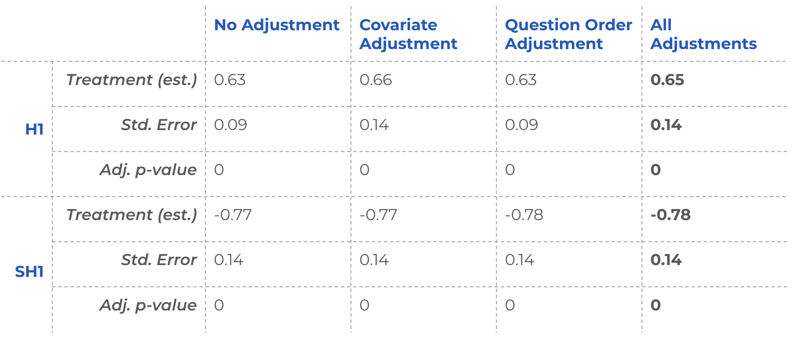

### Breakdown by Question

To get a better understanding of treatment effects on different types of questions, we look at the change in manipulativeness for each question category.

We see that the graph questions result in the largest increase in manipulative answers for both manipulative and non-manipulative questions (`True1` has a valid graph).

```{r}
pre_post_individual %>%
  mutate(
    True1_Pre_1 = 7 - True1_Pre_1,
    True2_Pre_1 = 7 - True2_Pre_1,
    True1_Post_1 = 7 - True1_Post_1,
    True2_Post_1 = 7 - True2_Post_1
  ) %>%
  dplyr::select(
    treated,
    MisGraph1_Pre_1,
    FalseComp1_Pre_1,
    Anecdotes1_Pre_1,
    Combined1_Pre_1,
    MisGraph1_Post_1,
    FalseComp1_Post_1,
    Anecdotes1_Post_1,
    Combined1_Post_1,
    True1_Pre_1,
    True2_Pre_1,
    True1_Post_1,
    True2_Post_1
  ) %>%
  filter(treated == 1) %>%
  select_if(is.numeric) %>%
  map_df(~ broom::tidy(t.test(., conf.level = conf_level)), .id = 'var') %>%
  mutate(treated = "1") %>%
  rbind(
    pre_post_individual %>%
      mutate(
        True1_Pre_1 = 7 - True1_Pre_1,
        True2_Pre_1 = 7 - True2_Pre_1,
        True1_Post_1 = 7 - True1_Post_1,
        True2_Post_1 = 7 - True2_Post_1
      ) %>%
      dplyr::select(
        treated,
        MisGraph1_Pre_1,
        FalseComp1_Pre_1,
        Anecdotes1_Pre_1,
        Combined1_Pre_1,
        MisGraph1_Post_1,
        FalseComp1_Post_1,
        Anecdotes1_Post_1,
        Combined1_Post_1,
        True1_Pre_1,
        True2_Pre_1,
        True1_Post_1,
        True2_Post_1
      ) %>%
      filter(treated == 0) %>%
      select_if(is.numeric) %>%
      map_df(~ broom::tidy(t.test(., conf.level = conf_level)), .id = 'var') %>%
      mutate(treated = "0")
  ) %>%
  separate(var, into = c("type", "period")) %>%
  mutate(period = factor(period, levels = c("Pre", "Post")),
         treated = factor(treated, levels = c("1", "0"))) %>%
  ggplot(aes(
    period,
    estimate,
    ymin = conf.low,
    ymax = conf.high,
    color = treated
  )) +
  geom_pointrange(position = position_dodge(.1)) +
  geom_line(aes(group = interaction(treated, type))) +
  scale_color_grey() +
  labs(
    title = "Identifying Manipulativeness by Question",
    subtitle = "Average score on scale 1-6, with 6 being most manipulative",
    x = "pre- or post-treatment period",
    y = "Average score"
  ) +
  theme_classic() +
  facet_wrap(. ~ type)
```

### Deep Dive into Score Distributions

We explore the score distributions of the pre- and post-tests to gain a better understanding of participant responses. We look at the treated group's pre-treatment distribution of answers to non-manipulative questions and manipulative questions.

As shown, pre-test scores for non-manipulative posts are skewed right, whereas scores for manipulative posts are relatively uniform.

In the post-test distribution, however, there is a clear shift towards "6 definitely manipulative" for many of the manipulative posts. There is also a shift for non-manipulative posts, and while on average the size of the changes are similar, they are not as concentrated at the value 6.

```{r}
df_attention %>%
  select(
    treated,
    True1_Pre_1,
    True1_Post_1,
    True2_Pre_1,
    True2_Post_1,
    MisGraph1_Pre_1,
    MisGraph1_Post_1,
    Anecdotes1_Pre_1,
    Anecdotes1_Post_1,
    FalseComp1_Pre_1,
    FalseComp1_Post_1,
    Combined1_Pre_1,
    Combined1_Post_1
  ) %>% 
  mutate(
    True1_Pre_1 = 7 - True1_Pre_1,
    True1_Post_1 = 7 - True1_Post_1,
    True2_Pre_1 = 7 - True2_Pre_1,
    True2_Post_1 = 7 - True2_Post_1
  ) %>% 
  pivot_longer(
    !treated,
    names_to = "question", 
    values_to = "Score"
  ) %>% 
  mutate(
    is_pre = if_else(str_detect(question, "Pre"), '1) pre-test', '2) post-test'),
    question_name = str_extract(question, '[^_]*'),
    question_type = ifelse(str_detect(question_name, 'True'), 'Non-Manipulative Posts', 'Manipulative Posts')
  ) %>% 
  filter(treated == 1) %>% 
  group_by(question_type) %>% 
  ggplot(aes(x=Score, group=is_pre, fill=is_pre)) +
  # geom_bar(aes(y=..prop..), position=position_dodge()) +
  geom_bar(aes(y=..prop..), position='identity') +
  scale_fill_manual(values = alpha(c("#E69F00","#0072B2"), .5)) +
  facet_wrap(question_type ~ .) +
  ggtitle('Score Distributions for Treated') +
  scale_x_continuous(breaks = seq(1, 6, by = 1)) +
  ylab('proportion')
```


<!-- These are additional checks we looked at that got summarized with the new graph above. -->

<!-- ```{r} -->
<!-- pre_true <- -->
<!--   c(7 - df[df$treated == 1, 'True1_Pre_1'], 7 - df[df$treated == 1, 'True2_Pre_1']) -->
<!-- pre_misinfo <- -->
<!--   c(df[df$treated == 1, 'MisGraph1_Pre_1'], df[df$treated == 1, 'Anecdotes1_Pre_1'], df[df$treated == 1, 'FalseComp1_Pre_1'], df[df$treated == 1, 'Combined1_Pre_1']) -->

<!-- pre_true_graph <- ggplot(data.frame(pre_true), aes(x = pre_true)) + -->
<!--   geom_bar(aes(y = (..count..) / sum(..count..))) + -->
<!--   ggtitle('Non-Manipulative Posts') + -->
<!--   xlab('Score') + -->
<!--   ylab('% of Ratings') + -->
<!--   scale_x_continuous(breaks = seq(1, 6, by = 1)) -->

<!-- pre_misinfo_graph <- -->
<!--   ggplot(data.frame(pre_misinfo), aes(x = pre_misinfo)) + -->
<!--   geom_bar(aes(y = (..count..) / sum(..count..))) + -->
<!--   ggtitle('Manipulative Posts') + -->
<!--   xlab('Score') + -->
<!--   ylab('% of Ratings') + -->
<!--   scale_x_continuous(breaks = seq(1, 6, by = 1)) -->

<!-- grid.arrange(pre_true_graph, -->
<!--              pre_misinfo_graph, -->
<!--              ncol = 2, -->
<!--              top = 'Distribution of Pre-Test Scores') -->
<!-- ``` -->


<!-- ```{r} -->
<!-- post_true <- -->
<!--   c(7 - df[df$treated == 1, 'True1_Post_1'], 7 - df[df$treated == 1, 'True2_Post_1']) -->
<!-- post_misinfo <- -->
<!--   c(df[df$treated == 1, 'MisGraph1_Post_1'], df[df$treated == 1, 'Anecdotes1_Post_1'], df[df$treated == 1, 'FalseComp1_Post_1'], df[df$treated == 1, 'Combined1_Post_1']) -->

<!-- post_true_graph <- ggplot(data.frame(post_true), aes(x = post_true)) + -->
<!--   geom_bar(aes(y = (..count..) / sum(..count..))) + -->
<!--   ggtitle('Non-Manipulative Posts') + -->
<!--   xlab('Score') + -->
<!--   ylab('% of Ratings') + -->
<!--   scale_x_continuous(breaks = seq(1, 6, by = 1)) -->

<!-- post_misinfo_graph <- -->
<!--   ggplot(data.frame(post_misinfo), aes(x = post_misinfo)) + -->
<!--   geom_bar(aes(y = (..count..) / sum(..count..))) + -->
<!--   ggtitle('Manipulative Posts') + -->
<!--   xlab('Score') + -->
<!--   ylab('% of Ratings') + -->
<!--   scale_x_continuous(breaks = seq(1, 6, by = 1)) -->

<!-- grid.arrange(post_true_graph, -->
<!--              post_misinfo_graph, -->
<!--              ncol = 2, -->
<!--              top = 'Distribution of Post-Test Scores') -->
<!-- ``` -->

<!-- Another view: -->
<!-- ```{r} -->
<!-- pre_true_graph <- ggplot(data.frame(pre_true), aes(x = pre_true)) + -->
<!--   geom_bar(aes(y = (..count..) / sum(..count..))) + -->
<!--   ggtitle('Pre-Test') + -->
<!--   xlab('Score') + -->
<!--   ylab('% of Ratings') + -->
<!--   scale_x_continuous(breaks = seq(1, 6, by = 1)) -->

<!-- pre_misinfo_graph <- -->
<!--   ggplot(data.frame(pre_misinfo), aes(x = pre_misinfo)) + -->
<!--   geom_bar(aes(y = (..count..) / sum(..count..))) + -->
<!--   ggtitle('Pre-Test') + -->
<!--   xlab('Score') + -->
<!--   ylab('% of Ratings') + -->
<!--   scale_x_continuous(breaks = seq(1, 6, by = 1)) -->

<!-- post_true_graph <- ggplot(data.frame(post_true), aes(x = post_true)) + -->
<!--   geom_bar(aes(y = (..count..) / sum(..count..))) + -->
<!--   ggtitle('Post-Test') + -->
<!--   xlab('Score') + -->
<!--   ylab('% of Ratings') + -->
<!--   scale_x_continuous(breaks = seq(1, 6, by = 1)) -->

<!-- post_misinfo_graph <- -->
<!--   ggplot(data.frame(post_misinfo), aes(x = post_misinfo)) + -->
<!--   geom_bar(aes(y = (..count..) / sum(..count..))) + -->
<!--   ggtitle('Post-Test') + -->
<!--   xlab('Score') + -->
<!--   ylab('% of Ratings') + -->
<!--   scale_x_continuous(breaks = seq(1, 6, by = 1)) -->

<!-- grid.arrange(pre_true_graph, -->
<!--              post_true_graph, -->
<!--              ncol = 2, -->
<!--              top = 'Distribution for Non-Manipulative Posts') -->

<!-- grid.arrange(pre_misinfo_graph, -->
<!--              post_misinfo_graph, -->
<!--              ncol = 2, -->
<!--              top = 'Distribution for Manipulative Posts') -->
<!-- ``` -->

<!-- We can also look at the change in score between true and misinfo posts. Both look similar with true having a larger amount of 5 point increases. -->

<!-- ```{r} -->
<!-- delta_true <- -->
<!--   c(-1 * df[df$treated == 1, 'True1_Delta_1'], -1 * df[df$treated == 1, 'True2_Delta_1']) -->
<!-- delta_misinfo <- -->
<!--   c(df[df$treated == 1, 'MisGraph1_Delta_1'], df[df$treated == 1, 'Anecdotes1_Delta_1'], df[df$treated == 1, 'FalseComp1_Delta_1'], df[df$treated == 1, 'Combined1_Delta_1']) -->

<!-- delta_true_graph <- -->
<!--   ggplot(data.frame(delta_true), aes(x = delta_true)) + -->
<!--   geom_bar(aes(y = (..count..) / sum(..count..))) + -->
<!--   ggtitle('Non-Manipulative Posts') + -->
<!--   xlab('Change in Score') + -->
<!--   ylab('% of Ratings') + -->
<!--   scale_x_continuous(breaks = seq(-5, 5, by = 1)) -->

<!-- delta_misinfo_graph <- -->
<!--   ggplot(data.frame(delta_misinfo), aes(x = delta_misinfo)) + -->
<!--   geom_bar(aes(y = (..count..) / sum(..count..))) + -->
<!--   ggtitle('Manipulative Posts') + -->
<!--   xlab('Change in Score') + -->
<!--   ylab('% of Ratings') + -->
<!--   scale_x_continuous(breaks = seq(-5, 5, by = 1)) -->

<!-- grid.arrange(delta_true_graph, -->
<!--              delta_misinfo_graph, -->
<!--              ncol = 2, -->
<!--              top = 'Distribution of Change in Scores') -->
<!-- ``` -->
<!-- ```{r} -->
<!-- pre_true1 <- 7-df[df$treated == 1,'True1_Pre_1'] -->
<!-- pre_true2 <- 7-df[df$treated == 1,'True2_Pre_1'] -->
<!-- ``` -->

<!-- ```{r} -->
<!-- ggplot(data.frame(pre_true1), aes(x=pre_true1)) + -->
<!--   geom_bar(aes(y = (..count..)/sum(..count..))) + -->
<!--   ggtitle('Distribution of Pre-Test for True1 Posts') + -->
<!--   xlab('Score') + -->
<!--   ylab('% of Ratings') + -->
<!--   scale_x_continuous(breaks = seq(1, 6, by = 1)) -->
<!-- ``` -->

<!-- ```{r} -->
<!-- ggplot(data.frame(pre_true2), aes(x=pre_true2)) + -->
<!--   geom_bar(aes(y = (..count..)/sum(..count..))) + -->
<!--   ggtitle('Distribution of Pre-Test for True2 Posts') + -->
<!--   xlab('Score') + -->
<!--   ylab('% of Ratings') + -->
<!--   scale_x_continuous(breaks = seq(1, 6, by = 1)) -->
<!-- ``` -->

<!-- ```{r} -->
<!-- post_true1 <- 7-df[df$treated == 1,'True1_Post_1'] -->
<!-- post_true2 <- 7-df[df$treated == 1,'True2_Post_1'] -->
<!-- ``` -->

<!-- ```{r} -->
<!-- ggplot(data.frame(post_true1), aes(x=post_true1)) + -->
<!--   geom_bar(aes(y = (..count..)/sum(..count..))) + -->
<!--   ggtitle('Distribution of Post-Test for True1 Posts') + -->
<!--   xlab('Score') + -->
<!--   ylab('% of Ratings') + -->
<!--   scale_x_continuous(breaks = seq(1, 6, by = 1)) -->
<!-- ``` -->

<!-- ```{r} -->
<!-- ggplot(data.frame(post_true2), aes(x=post_true2)) + -->
<!--   geom_bar(aes(y = (..count..)/sum(..count..))) + -->
<!--   ggtitle('Distribution of Post-Test for True2 Posts') + -->
<!--   xlab('Score') + -->
<!--   ylab('% of Ratings') + -->
<!--   scale_x_continuous(breaks = seq(1, 6, by = 1)) -->
<!-- ``` -->


<!-- ```{r} -->
<!-- delta_true1 <- -1 * df[df$treated == 1, 'True1_Delta_1'] -->
<!-- delta_true2 <- -1 * df[df$treated == 1, 'True2_Delta_1'] -->
<!-- ``` -->


<!-- ```{r} -->
<!-- ggplot(data.frame(delta_true1), aes(x = delta_true1)) + -->
<!--   geom_bar(aes(y = (..count..) / sum(..count..))) + -->
<!--   ggtitle('Distribution of Delta for True1 Posts') + -->
<!--   xlab('Change in Score') + -->
<!--   ylab('% of Ratings') + -->
<!--   scale_x_continuous(breaks = seq(-5, 5, by = 1)) -->
<!-- ``` -->


<!-- ```{r} -->
<!-- ggplot(data.frame(delta_true2), aes(x = delta_true2)) + -->
<!--   geom_bar(aes(y = (..count..) / sum(..count..))) + -->
<!--   ggtitle('Distribution of Delta for True2 Posts') + -->
<!--   xlab('Change in Score') + -->
<!--   ylab('% of Ratings') + -->
<!--   scale_x_continuous(breaks = seq(-5, 5, by = 1)) -->
<!-- ``` -->


### Non-Linearity

Although we see a relatively large effect of misidentifying non-manipulative posts, we also suspect that the 6 point scale of labeling for manipulativeness may not be linear. It is probably easier for participants to move from 2 to 3 than it is for them to move from 5 to 6 since it is easier to be less confident than to be very confident.

To explore this change more formally, binarized the scores to approximate participants' intentions when selecting different values. We wanted to understand where would be a suitable cutoff where users really felt a change in manipulativeness.

We use the pre-test distributions to explore where the greatest relative change is on the scale in the distribution of answers to the true and manipulative posts. We do this by looking at the difference between the share of answers falling above a potential binary split for the true versus for the manipulative posts. We calculate these values for all possible binary splits and choose the one where the difference is the greatest. This is where the distributions are the most different in the pre true and manipulative answers. Our goal is to find the best binary split in terms of how people perceive the scale. This method is not ideal as it is still not a direct measure of perception. However, it is the best we can do given our data.

```{r}
df %>%
  dplyr::select(
    'True1_Pre_1',
    'True2_Pre_1',
    'MisGraph1_Pre_1',
    'Anecdotes1_Pre_1',
    'FalseComp1_Pre_1',
    'Combined1_Pre_1'
  ) %>%
  mutate(True1_Pre_1 = 7 - True1_Pre_1,
         True2_Pre_1 = 7 - True2_Pre_1) %>%
  pivot_longer(
    c(
      'True1_Pre_1',
      'True2_Pre_1',
      'MisGraph1_Pre_1',
      'Anecdotes1_Pre_1',
      'FalseComp1_Pre_1',
      'Combined1_Pre_1'
    ),
    names_to = "question",
    values_to = "value"
  ) %>%
  mutate(
    is_true = question %in% c('True1_Pre_1',
                              'True2_Pre_1'),
    split_lte_1 = value <= 1,
    split_lte_2 = value <= 2,
    split_lte_3 = value <= 3,
    split_lte_4 = value <= 4,
    split_lte_5 = value <= 5
  ) %>%
  # group_by(is_true) %>%
  pivot_longer(
    c(
      'split_lte_1',
      'split_lte_2',
      'split_lte_3',
      'split_lte_4',
      'split_lte_5'
    ),
    names_to = "split",
    values_to = "split_value"
  ) %>%
  group_by(is_true, split) %>%
  mutate(split_total = n()) %>%
  ungroup() %>%
  group_by(is_true, split, split_value) %>%
  mutate(num_in_split = n(),
         pct_in_split = num_in_split / split_total) %>%
  ungroup() %>%
  dplyr::select(is_true, split, split_value, pct_in_split) %>%
  group_by(is_true, split) %>%
  pivot_wider(names_from = split_value,
              values_from = pct_in_split,
              values_fn = mean) %>%
  ungroup() %>%
  mutate(pct_above = `FALSE`,
         pct_diff = `TRUE` - `FALSE`) %>%
  dplyr::select(is_true,
                split,
                pct_above) %>%
  group_by(split) %>%
  pivot_wider(names_from = is_true,
              values_from = pct_above) %>%
  ungroup() %>%
  rename(
    split_less_than_equal_to = split,
    true_questions_above = `TRUE`,
    false_questions_above = `FALSE`
  ) %>%
  mutate(
    true_questions_above = round(true_questions_above, 4),
    false_questions_above = round(false_questions_above, 4),
    abs_diff = round(abs(
      true_questions_above - false_questions_above
    ), 4)
  )
```

We see that the optimal split is at a score of 2. Note that we needed the optimal split to be greater than the status quo score of 3 in order to notice a reduced treatment effect for non-manipulative posts. This is since manipulative posts have higher scores on average already, so we need a higher cut-off if we wanted the non-manipulative posts to not have as much change. Thus, using a score less than 3 does not change the direction of our insights. Skepticism of both manipulative and non-manipulative posts still increased after our treatment even if we use this binary metric.

```{r}
t.test(
  df_attention %>% filter(treated == 1) %>% pull(mean_Delta_1_False),
  df_attention %>% filter(treated == 0) %>% pull(mean_Delta_1_False),
  conf.level = conf_level
) %>%
  broom::tidy() %>%
  # mutate(p.value_adjusted = p.adjust(p.value, method = "BH", n = 10)) %>%
  mutate_if(is.numeric, round, digits = 2) %>%
  dplyr::select(-method, -alternative)
```


## Tactics

### Summary Results - Tactics

1. Treated participants could better identify tactics when they are present in the post.
2. They also were more likely to incorrectly state that a tactic is used when in fact it is not present in the post.
3. Treated participants were more likely to select more tactics after the course, but only the tactics that we had taught them.
4. There wasn't a significant decrease in precision, indicating that the treated participants were not randomly selecting more tactics. It is likely that participants selected the correct tactic, then added a few other tactics with lower confidence just in case. This hypothesis would need to be validated in a future experiment.
5. The treatment caused participants to be more skeptical with true posts. Their overall performance on the true posts decreased, which offset the improved performance on manipulative posts. This result is comparable to the above results about overall perception of manipulativeness. It may be driven by the same potential reasons: priming effects, experimenter demand effects, or increase in skepticism in general. In case of the misidentification of tactics, the result may also be due to the inherent trickiness of our true posts.

### Metrics Definitions

We evaluate multiple metrics to understand the behavior and understanding gained by participants in relation to our tactics. 

In this section, we define the metrics for our analysis using a toy example.

Consider a case with 2 posts: a true post that should be answered "true" and an anecdote post that should be answered as "misleading anecdote." 

For each post, the user has 2 checkboxes that they could select: "true" or "misleading anecdote". The user could select 1 or both checkboxes per post.

Let's assume the user only picked "misleading anecdote" as their choice for both of these posts (shown below using yellow shading).

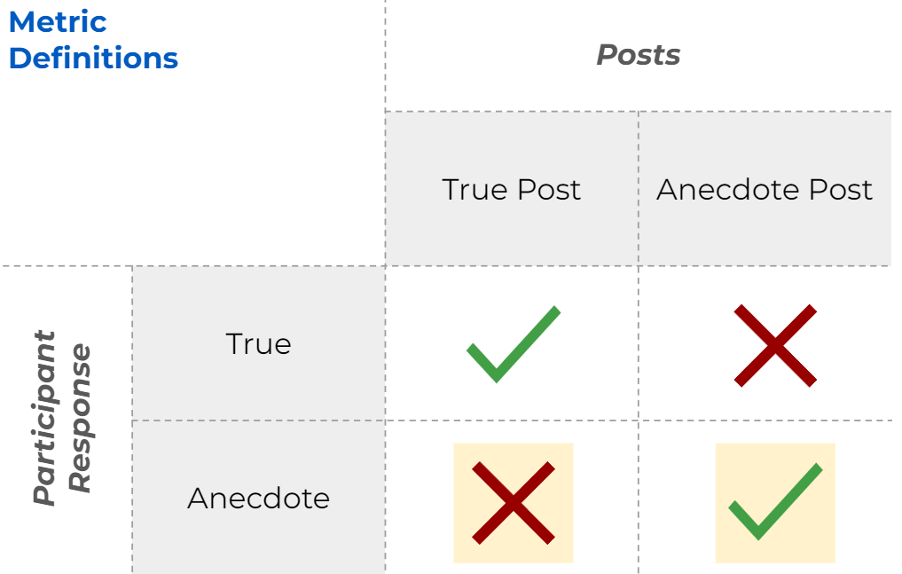

Accuracy measures the number of times the user correctly identified the existence or lack of existence of a specific tactic. This participant's accuracy is 0.5.

Note that the correct "tactic" for the true post is "True".

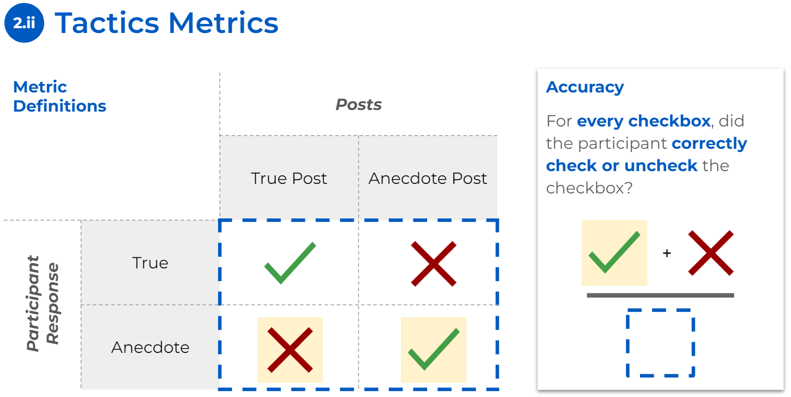


True Positive Rate (Recall) measure the number of times the user identified the tactic out of all the posts that do contain the tactic. This participant's true positive rate is 0.5.

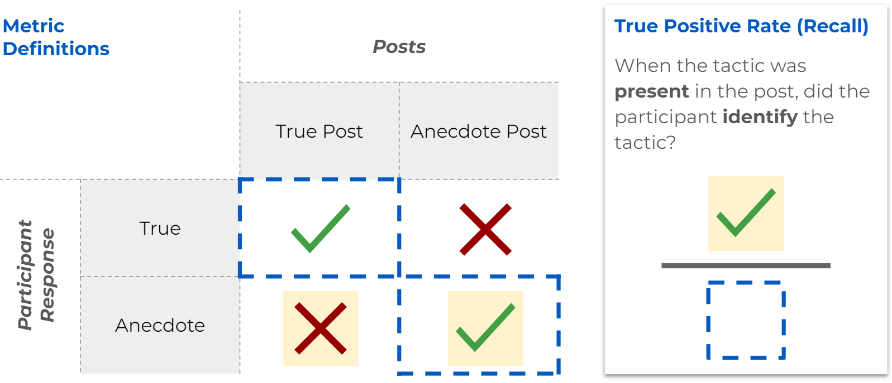


False positive rate measures the number of times user mistakenly chose a tactic out of posts that do not have the tactic. This participant's false positive rate is 0.5.

Note once again that the correct "tactic" for the true post is "True".

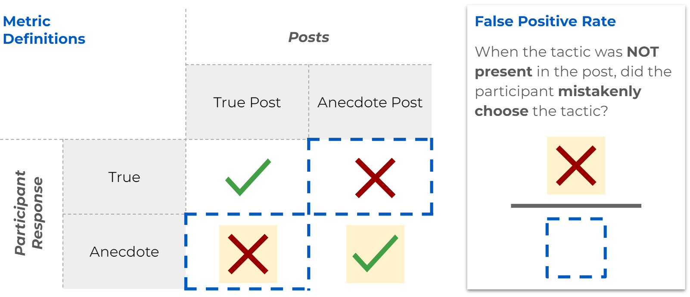


Precision measures the number of times the tactic is actually present in the post out of all the times the user says that the tactic is present. This participant's precision is 0.5.

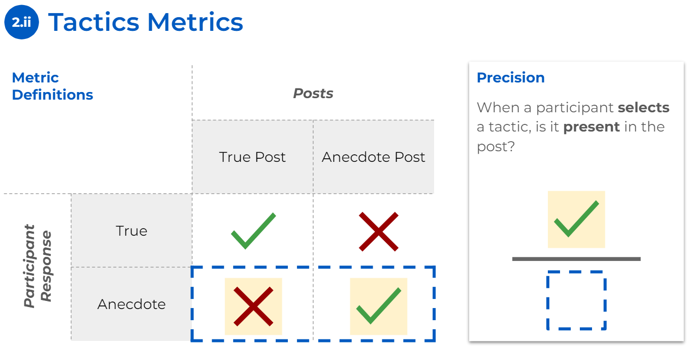

### Metrics Overview for Tactics and Questions

The following figures plot the accuracy, true positive rate, false positive rate, and precision of the participants' abilities to identify individual manipulative tactics in the test questions. 

The first figure plots accuracy, which measures the overall performance for all the tactics. We notice a non-significant drop in accuracy across all three tactics.

```{r}
t.test(df_attention %>% 
         filter(treated == 1) %>% 
         pull(True1_Pre_2_accuracy), conf.level = conf_level) %>% 
  broom::tidy() %>% 
  mutate(period = "pre",
         treated = "1",
         type = "True") %>%
  rbind(
    t.test(
      df_attention %>% filter(treated == 0) %>% pull(True1_Pre_2_accuracy), conf.level = conf_level
    ) %>% broom::tidy() %>% mutate(
      period = "pre",
      treated = "0",
      type = "True"
    )
  ) %>%
  rbind(
    t.test(
      df_attention %>% filter(treated == 1) %>% pull(True1_Post_2_accuracy), conf.level = conf_level
    ) %>% broom::tidy() %>% mutate(
      period = "post",
      treated = "1",
      type = "True"
    )
  ) %>%
  rbind(
    t.test(
      df_attention %>% filter(treated == 0) %>% pull(True1_Post_2_accuracy), conf.level = conf_level
    ) %>% broom::tidy() %>% mutate(
      period = "post",
      treated = "0",
      type = "True"
    )
  ) %>% 
  rbind(
    t.test(
      df_attention %>% filter(treated == 1) %>% pull(MisGraph1_Pre_2_accuracy), conf.level = conf_level
    ) %>% broom::tidy() %>% mutate(
      period = "pre",
      treated = "1",
      type = "Misleading Graphs"
    )
  ) %>%
  rbind(
    t.test(
      df_attention %>% filter(treated == 0) %>% pull(MisGraph1_Pre_2_accuracy), conf.level = conf_level
    ) %>% broom::tidy() %>% mutate(
      period = "pre",
      treated = "0",
      type = "Misleading Graphs"
    )
  ) %>%
  rbind(
    t.test(
      df_attention %>% filter(treated == 1) %>% pull(MisGraph1_Post_2_accuracy), conf.level = conf_level
    ) %>% broom::tidy() %>% mutate(
      period = "post",
      treated = "1",
      type = "Misleading Graphs"
    )
  ) %>%
  rbind(
    t.test(
      df_attention %>% filter(treated == 0) %>% pull(MisGraph1_Post_2_accuracy), conf.level = conf_level
    ) %>% broom::tidy() %>% mutate(
      period = "post",
      treated = "0",
      type = "Misleading Graphs"
    )
  ) %>%
  rbind(
    t.test(
      df_attention %>% filter(treated == 1) %>% pull(FalseComp1_Pre_2_accuracy), conf.level = conf_level
    ) %>% broom::tidy() %>% mutate(
      period = "pre",
      treated = "1",
      type = "False Comparisons"
    )
  ) %>%
  rbind(
    t.test(
      df_attention %>% filter(treated == 0) %>% pull(FalseComp1_Pre_2_accuracy), conf.level = conf_level
    ) %>% broom::tidy() %>% mutate(
      period = "pre",
      treated = "0",
      type = "False Comparisons"
    )
  ) %>%
  rbind(
    t.test(
      df_attention %>% filter(treated == 1) %>% pull(FalseComp1_Post_2_accuracy), conf.level = conf_level
    ) %>% broom::tidy() %>% mutate(
      period = "post",
      treated = "1",
      type = "False Comparisons"
    )
  ) %>%
  rbind(
    t.test(
      df_attention %>% filter(treated == 0) %>% pull(FalseComp1_Post_2_accuracy), conf.level = conf_level
    ) %>% broom::tidy() %>% mutate(
      period = "post",
      treated = "0",
      type = "False Comparisons"
    )
  ) %>%
  rbind(
    t.test(
      df_attention %>% filter(treated == 1) %>% pull(Anecdotes1_Pre_2_accuracy), conf.level = conf_level
    ) %>% broom::tidy() %>% mutate(
      period = "pre",
      treated = "1",
      type = "Anecdotes"
    )
  ) %>%
  rbind(
    t.test(
      df_attention %>% filter(treated == 0) %>% pull(Anecdotes1_Pre_2_accuracy), conf.level = conf_level
    ) %>% broom::tidy() %>% mutate(
      period = "pre",
      treated = "0",
      type = "Anecdotes"
    )
  ) %>%
  rbind(
    t.test(
      df_attention %>% filter(treated == 1) %>% pull(Anecdotes1_Post_2_accuracy), conf.level = conf_level
    ) %>% broom::tidy() %>% mutate(
      period = "post",
      treated = "1",
      type = "Anecdotes"
    )
  ) %>%
  rbind(
    t.test(
      df_attention %>% filter(treated == 0) %>% pull(Anecdotes1_Post_2_accuracy), conf.level = conf_level
    ) %>% broom::tidy() %>% mutate(
      period = "post",
      treated = "0",
      type = "Anecdotes"
    )
  ) %>%
  
  mutate(period = factor(period, levels = c("pre", "post")),
         treated = factor(treated, levels = c("1", "0"))) %>%
  ggplot(aes(
    period,
    estimate,
    ymin = conf.low,
    ymax = conf.high,
    color = treated
  )) +
  geom_pointrange(position = position_dodge(.1)) +
  geom_line(aes(group = interaction(treated, type))) +
  scale_color_grey() +
  labs(title = "Accuracy Across Tactics",
       x = "pre- or post-treatment period",
       y = "Tactic Accuracy") +
  theme_classic() +
  facet_wrap(. ~ type)

```


To better understand the lack of change in accuracy, we break down accuracy into the true positive rate and false positive rate. From here, we can see significant increases in ability to identify tactics when they are present (true positive rate) as well as an increase in mistakes made when tactics do not exist (false positive rate). The increase in false positive rate is due to an increase in the number of tactics selected after treatment (see the Number of Tactics Selected section below). Since the correct answers consisted primarily of unchecked boxes, selecting more boxes yields more false positives and could lead to an overall decrease in accuracy. The biggest contributor to the drop in accuracy is due to mistakes made on true posts (see the Unpenalized Tactics Identification section below for more detail).


```{r}
recall_by_tactic <-   t.test(
    df_attention %>% filter(treated == 1) %>% pull(MisGraph1_Pre_2_recall)
  ) %>% broom::tidy() %>% mutate(
    period = "pre",
    treated = "1",
    type = "Misleading Graphs"
  ) %>%
  rbind(
    t.test(
      df_attention %>% filter(treated == 0) %>% pull(MisGraph1_Pre_2_recall)
    ) %>% broom::tidy() %>% mutate(
      period = "pre",
      treated = "0",
      type = "Misleading Graphs"
    )
  ) %>%
  rbind(
    t.test(
      df_attention %>% filter(treated == 1) %>% pull(MisGraph1_Post_2_recall)
    ) %>% broom::tidy() %>% mutate(
      period = "post",
      treated = "1",
      type = "Misleading Graphs"
    )
  ) %>%
  rbind(
    t.test(
      df_attention %>% filter(treated == 0) %>% pull(MisGraph1_Post_2_recall)
    ) %>% broom::tidy() %>% mutate(
      period = "post",
      treated = "0",
      type = "Misleading Graphs"
    )
  ) %>%
  rbind(
    t.test(
      df_attention %>% filter(treated == 1) %>% pull(FalseComp1_Pre_2_recall)
    ) %>% broom::tidy() %>% mutate(
      period = "pre",
      treated = "1",
      type = "False Comparisons"
    )
  ) %>%
  rbind(
    t.test(
      df_attention %>% filter(treated == 0) %>% pull(FalseComp1_Pre_2_recall)
    ) %>% broom::tidy() %>% mutate(
      period = "pre",
      treated = "0",
      type = "False Comparisons"
    )
  ) %>%
  rbind(
    t.test(
      df_attention %>% filter(treated == 1) %>% pull(FalseComp1_Post_2_recall)
    ) %>% broom::tidy() %>% mutate(
      period = "post",
      treated = "1",
      type = "False Comparisons"
    )
  ) %>%
  rbind(
    t.test(
      df_attention %>% filter(treated == 0) %>% pull(FalseComp1_Post_2_recall)
    ) %>% broom::tidy() %>% mutate(
      period = "post",
      treated = "0",
      type = "False Comparisons"
    )
  ) %>%
  rbind(
    t.test(
      df_attention %>% filter(treated == 1) %>% pull(Anecdotes1_Pre_2_recall)
    ) %>% broom::tidy() %>% mutate(
      period = "pre",
      treated = "1",
      type = "Anecdotes"
    )
  ) %>%
  rbind(
    t.test(
      df_attention %>% filter(treated == 0) %>% pull(Anecdotes1_Pre_2_recall)
    ) %>% broom::tidy() %>% mutate(
      period = "pre",
      treated = "0",
      type = "Anecdotes"
    )
  ) %>%
  rbind(
    t.test(
      df_attention %>% filter(treated == 1) %>% pull(Anecdotes1_Post_2_recall)
    ) %>% broom::tidy() %>% mutate(
      period = "post",
      treated = "1",
      type = "Anecdotes"
    )
  ) %>%
  rbind(
    t.test(
      df_attention %>% filter(treated == 0) %>% pull(Anecdotes1_Post_2_recall)
    ) %>% broom::tidy() %>% mutate(
      period = "post",
      treated = "0",
      type = "Anecdotes"
    )
  ) %>%
  
  mutate(period = factor(period, levels = c("pre", "post")),
         treated = factor(treated, levels = c("1", "0"))) %>%
  ggplot(aes(
    period,
    estimate,
    ymin = conf.low,
    ymax = conf.high,
    color = treated
  )) +
  geom_pointrange(position = position_dodge(.1)) +
  geom_line(aes(group = interaction(treated, type))) +
  scale_color_grey() +
  labs(
    title = "True Positive Rate (Recall) Across Tactics",
       x = "pre- or post-treatment period",
       y = "Tactic Recall") +
  theme_classic() +
  theme(axis.title.x=element_blank()) +
  facet_wrap(. ~ type)
```

```{r}
fpr_by_tactic <- t.test(df_attention %>% filter(treated == 1) %>% pull(MisGraph1_Pre_2_fpr)) %>% broom::tidy() %>% mutate(period = "pre",
                                                                                                         treated = "1",
                                                                                                         type = "Misleading Graphs") %>%
  rbind(
    t.test(
      df_attention %>% filter(treated == 0) %>% pull(MisGraph1_Pre_2_fpr)
    ) %>% broom::tidy() %>% mutate(
      period = "pre",
      treated = "0",
      type = "Misleading Graphs"
    )
  ) %>%
  rbind(
    t.test(
      df_attention %>% filter(treated == 1) %>% pull(MisGraph1_Post_2_fpr)
    ) %>% broom::tidy() %>% mutate(
      period = "post",
      treated = "1",
      type = "Misleading Graphs"
    )
  ) %>%
  rbind(
    t.test(
      df_attention %>% filter(treated == 0) %>% pull(MisGraph1_Post_2_fpr)
    ) %>% broom::tidy() %>% mutate(
      period = "post",
      treated = "0",
      type = "Misleading Graphs"
    )
  ) %>%
  rbind(
    t.test(
      df_attention %>% filter(treated == 1) %>% pull(FalseComp1_Pre_2_fpr)
    ) %>% broom::tidy() %>% mutate(
      period = "pre",
      treated = "1",
      type = "False Comparisons"
    )
  ) %>%
  rbind(
    t.test(
      df_attention %>% filter(treated == 0) %>% pull(FalseComp1_Pre_2_fpr)
    ) %>% broom::tidy() %>% mutate(
      period = "pre",
      treated = "0",
      type = "False Comparisons"
    )
  ) %>%
  rbind(
    t.test(
      df_attention %>% filter(treated == 1) %>% pull(FalseComp1_Post_2_fpr)
    ) %>% broom::tidy() %>% mutate(
      period = "post",
      treated = "1",
      type = "False Comparisons"
    )
  ) %>%
  rbind(
    t.test(
      df_attention %>% filter(treated == 0) %>% pull(FalseComp1_Post_2_fpr)
    ) %>% broom::tidy() %>% mutate(
      period = "post",
      treated = "0",
      type = "False Comparisons"
    )
  ) %>%
  rbind(
    t.test(
      df_attention %>% filter(treated == 1) %>% pull(Anecdotes1_Pre_2_fpr)
    ) %>% broom::tidy() %>% mutate(
      period = "pre",
      treated = "1",
      type = "Anecdotes"
    )
  ) %>%
  rbind(
    t.test(
      df_attention %>% filter(treated == 0) %>% pull(Anecdotes1_Pre_2_fpr)
    ) %>% broom::tidy() %>% mutate(
      period = "pre",
      treated = "0",
      type = "Anecdotes"
    )
  ) %>%
  rbind(
    t.test(
      df_attention %>% filter(treated == 1) %>% pull(Anecdotes1_Post_2_fpr)
    ) %>% broom::tidy() %>% mutate(
      period = "post",
      treated = "1",
      type = "Anecdotes"
    )
  ) %>%
  rbind(
    t.test(
      df_attention %>% filter(treated == 0) %>% pull(Anecdotes1_Post_2_fpr)
    ) %>% broom::tidy() %>% mutate(
      period = "post",
      treated = "0",
      type = "Anecdotes"
    )
  ) %>%
  mutate(period = factor(period, levels = c("pre", "post")),
         treated = factor(treated, levels = c("1", "0"))) %>%
  ggplot(aes(
    period,
    estimate,
    ymin = conf.low,
    ymax = conf.high,
    color = treated
  )) +
  geom_pointrange(position = position_dodge(.1)) +
  geom_line(aes(group = interaction(treated, type))) +
  scale_color_grey() +
  labs(
    title = "False Positive Rate Across Tactics",
       x = "pre- or post-treatment period",
       y = "Tactic FPR") +
  theme_classic() +
  facet_wrap(. ~ type)
```

```{r}
grid.arrange(recall_by_tactic, fpr_by_tactic, ncol=1)
```

If participants were just randomly selecting more checkboxes after treatment, we would see a drop in precision as there would be a much larger increase in the number of false positives. This, however, isn't the case. This indicates that our participants are not just randomly selecting more checkboxes after treatment.

```{r}
precision_by_tactic <-   t.test(
    df_attention %>% filter(treated == 1) %>% pull(MisGraph1_Pre_2_precision)
  ) %>% broom::tidy() %>% mutate(
    period = "pre",
    treated = "1",
    type = "Misleading Graphs"
  ) %>%
  rbind(
    t.test(
      df_attention %>% filter(treated == 0) %>% pull(MisGraph1_Pre_2_precision)
    ) %>% broom::tidy() %>% mutate(
      period = "pre",
      treated = "0",
      type = "Misleading Graphs"
    )
  ) %>%
  rbind(
    t.test(
      df_attention %>% filter(treated == 1) %>% pull(MisGraph1_Post_2_precision)
    ) %>% broom::tidy() %>% mutate(
      period = "post",
      treated = "1",
      type = "Misleading Graphs"
    )
  ) %>%
  rbind(
    t.test(
      df_attention %>% filter(treated == 0) %>% pull(MisGraph1_Post_2_precision)
    ) %>% broom::tidy() %>% mutate(
      period = "post",
      treated = "0",
      type = "Misleading Graphs"
    )
  ) %>%
  rbind(
    t.test(
      df_attention %>% filter(treated == 1) %>% pull(FalseComp1_Pre_2_precision)
    ) %>% broom::tidy() %>% mutate(
      period = "pre",
      treated = "1",
      type = "False Comparisons"
    )
  ) %>%
  rbind(
    t.test(
      df_attention %>% filter(treated == 0) %>% pull(FalseComp1_Pre_2_precision)
    ) %>% broom::tidy() %>% mutate(
      period = "pre",
      treated = "0",
      type = "False Comparisons"
    )
  ) %>%
  rbind(
    t.test(
      df_attention %>% filter(treated == 1) %>% pull(FalseComp1_Post_2_precision)
    ) %>% broom::tidy() %>% mutate(
      period = "post",
      treated = "1",
      type = "False Comparisons"
    )
  ) %>%
  rbind(
    t.test(
      df_attention %>% filter(treated == 0) %>% pull(FalseComp1_Post_2_precision)
    ) %>% broom::tidy() %>% mutate(
      period = "post",
      treated = "0",
      type = "False Comparisons"
    )
  ) %>%
  rbind(
    t.test(
      df_attention %>% filter(treated == 1) %>% pull(Anecdotes1_Pre_2_precision)
    ) %>% broom::tidy() %>% mutate(
      period = "pre",
      treated = "1",
      type = "Anecdotes"
    )
  ) %>%
  rbind(
    t.test(
      df_attention %>% filter(treated == 0) %>% pull(Anecdotes1_Pre_2_precision)
    ) %>% broom::tidy() %>% mutate(
      period = "pre",
      treated = "0",
      type = "Anecdotes"
    )
  ) %>%
  rbind(
    t.test(
      df_attention %>% filter(treated == 1) %>% pull(Anecdotes1_Post_2_precision)
    ) %>% broom::tidy() %>% mutate(
      period = "post",
      treated = "1",
      type = "Anecdotes"
    )
  ) %>%
  rbind(
    t.test(
      df_attention %>% filter(treated == 0) %>% pull(Anecdotes1_Post_2_precision)
    ) %>% broom::tidy() %>% mutate(
      period = "post",
      treated = "0",
      type = "Anecdotes"
    )
  ) %>%

  mutate(period = factor(period, levels = c("pre", "post")),
         treated = factor(treated, levels = c("1", "0"))) %>%
  ggplot(aes(
    period,
    estimate,
    ymin = conf.low,
    ymax = conf.high,
    color = treated
  )) +
  geom_pointrange(position = position_dodge(.1)) +
  geom_line(aes(group = interaction(treated, type))) +
  scale_color_grey() +
  labs(
    title = "Precision Across Tactics",
       x = "pre- or post-treatment period",
       y = "Tactic Precision") +
  theme_classic() +
  facet_wrap(. ~ type)

precision_by_tactic
```

### Number of Tactics Selected

We see that the treated group selects significantly more checkboxes in the post-test.

```{r}
t.test(df %>% filter(treated == 1) %>% pull(n_tactics_pre)) %>% broom::tidy() %>% mutate(period = "pre", treated = "1") %>%
  rbind(
    t.test(df %>% filter(treated == 0) %>% pull(n_tactics_pre)) %>% broom::tidy() %>% mutate(period = "pre", treated = "0")
  ) %>%
  rbind(
    t.test(df %>% filter(treated == 1) %>% pull(n_tactics_post)) %>% broom::tidy() %>% mutate(period = "post", treated = "1")
  ) %>%
  rbind(
    t.test(df %>% filter(treated == 0) %>% pull(n_tactics_post)) %>% broom::tidy() %>% mutate(period = "post", treated = "0")
  ) %>%
  mutate(period = factor(period, levels = c("pre", "post")),
         treated = factor(treated, levels = c("1", "0"))) %>%
  ggplot(aes(
    period,
    estimate,
    ymin = conf.low,
    ymax = conf.high,
    color = treated
  )) +
  geom_pointrange(position = position_dodge(.05)) +
  geom_line(aes(group = treated)) +
  scale_color_grey() +
  labs(
    title = "Number of Tactics Checkboxes Selected",
    x = "pre- or post-treatment period",
    y = "score"
  ) +
  theme_classic()
```
```{r}
t.test(
  df_attention %>% filter(treated == 1) %>% pull(n_tactics_delta),
  df_attention %>% filter(treated == 0) %>% pull(n_tactics_delta)
) %>%
  broom::tidy() %>%
  mutate(p.value_adjusted = p.adjust(p.value, method = "BH", n = 10)) %>%
  mutate_if(is.numeric, round, digits = 2) %>%
  dplyr::select(-method, -alternative)
```

The increase in checkboxes selected seems to focus on the tactics that we taught the participants in the tactics course. The increase in the placebo tactic that we included was not significant. This indicates that the participants did recognize the tactics that we taught them to an extent.

```{r}
t.test(df %>% filter(treated == 1) %>% pull(n_misgraph_pre)) %>% broom::tidy() %>% mutate(period = "pre", treated = "1", type = "Misleading Graphs") %>%
  rbind(
    t.test(df %>% filter(treated == 0) %>% pull(n_misgraph_pre)) %>% broom::tidy() %>% mutate(period = "pre", treated = "0", type = "Misleading Graphs")
  ) %>%
  rbind(
    t.test(df %>% filter(treated == 1) %>% pull(n_misgraph_post)) %>% broom::tidy() %>% mutate(period = "post", treated = "1", type = "Misleading Graphs")
  ) %>%
  rbind(
    t.test(df %>% filter(treated == 0) %>% pull(n_misgraph_post)) %>% broom::tidy() %>% mutate(period = "post", treated = "0", type = "Misleading Graphs")
  ) %>%
  rbind(
    t.test(df %>% filter(treated == 1) %>% pull(n_falsecomp_pre)) %>% broom::tidy() %>% mutate(period = "pre", treated = "1", type = "False Comparisons")
    ) %>%
  rbind(
    t.test(df %>% filter(treated == 0) %>% pull(n_falsecomp_pre)) %>% broom::tidy() %>% mutate(period = "pre", treated = "0", type = "False Comparisons")
  ) %>%
  rbind(
    t.test(df %>% filter(treated == 1) %>% pull(n_falsecomp_post)) %>% broom::tidy() %>% mutate(period = "post", treated = "1", type = "False Comparisons")
  ) %>%
  rbind(
    t.test(df %>% filter(treated == 0) %>% pull(n_falsecomp_post)) %>% broom::tidy() %>% mutate(period = "post", treated = "0", type = "False Comparisons")
  ) %>% 
    rbind(
    t.test(df %>% filter(treated == 1) %>% pull(n_anecdote_pre)) %>% broom::tidy() %>% mutate(period = "pre", treated = "1", type = "Anecdotes")
    ) %>%
  rbind(
    t.test(df %>% filter(treated == 0) %>% pull(n_anecdote_pre)) %>% broom::tidy() %>% mutate(period = "pre", treated = "0", type = "Anecdotes")
  ) %>%
  rbind(
    t.test(df %>% filter(treated == 1) %>% pull(n_anecdote_post)) %>% broom::tidy() %>% mutate(period = "post", treated = "1", type = "Anecdotes")
  ) %>%
  rbind(
    t.test(df %>% filter(treated == 0) %>% pull(n_anecdote_post)) %>% broom::tidy() %>% mutate(period = "post", treated = "0", type = "Anecdotes")
  ) %>% 
    rbind(
    t.test(df %>% filter(treated == 1) %>% pull(n_evidence_pre)) %>% broom::tidy() %>% mutate(period = "pre", treated = "1", type = "Evidence out of Context")
    ) %>%
  rbind(
    t.test(df %>% filter(treated == 0) %>% pull(n_evidence_pre)) %>% broom::tidy() %>% mutate(period = "pre", treated = "0", type = "Evidence out of Context")
  ) %>%
  rbind(
    t.test(df %>% filter(treated == 1) %>% pull(n_evidence_post)) %>% broom::tidy() %>% mutate(period = "post", treated = "1", type = "Evidence out of Context")
  ) %>%
  rbind(
    t.test(df %>% filter(treated == 0) %>% pull(n_evidence_post)) %>% broom::tidy() %>% mutate(period = "post", treated = "0", type = "Evidence out of Context")
  ) %>% 
  mutate(period = factor(period, levels = c("pre", "post")),
         treated = factor(treated, levels = c("1", "0"))) %>%
  ggplot(aes(
    period,
    estimate,
    ymin = conf.low,
    ymax = conf.high,
    color = treated
  )) +
  geom_pointrange(position = position_dodge(.05)) +
  geom_line(aes(group = treated)) +
  scale_color_grey() +
  labs(
    title = "Number of Tactics Checkboxes Selected",
    subtitle = "By Tactic",
    x = "pre- or post-treatment period",
    y = "score"
  ) +
  theme_classic() +
  facet_wrap(.~type)
```

```{r}
t.test(
  df_attention %>% filter(treated == 1) %>% pull(n_evidence_delta),
  df_attention %>% filter(treated == 0) %>% pull(n_evidence_delta),
  conf.level = conf_level
) %>%
  broom::tidy() %>%
  mutate(p.value_adjusted = p.adjust(p.value, method = "BH", n = 10)) %>%
  mutate_if(is.numeric, round, digits = 2) %>%
  dplyr::select(-method, -alternative)
```

As reference, we also checked if there is a significant increase in selecting all 3 tactics for each question.

In general, it looks like this behavior only occurred for the True Graph question (which makes some sense given it contained true anecdotes and comparisons). The absence of this behavior in the other questions suggests that participants are being somewhat deliberate in the tactics they select for each question.

```{r}
pre_post_individual %>%
  dplyr::select(
    treated,
    MisGraph1_Pre_2_selectall,
    FalseComp1_Pre_2_selectall,
    Anecdotes1_Pre_2_selectall,
    Combined1_Pre_2_selectall,
    MisGraph1_Post_2_selectall,
    FalseComp1_Post_2_selectall,
    Anecdotes1_Post_2_selectall,
    Combined1_Post_2_selectall,
    True1_Pre_2_selectall,
    True2_Pre_2_selectall,
    True1_Post_2_selectall,
    True2_Post_2_selectall
  ) %>%
  filter(treated == 1) %>%
  select_if(is.numeric) %>%
  map_df(~ broom::tidy(t.test(.)), .id = 'var') %>%
  mutate(treated = "1") %>%
  rbind(
    pre_post_individual %>%
      dplyr::select(
        treated,
        MisGraph1_Pre_2_selectall,
        FalseComp1_Pre_2_selectall,
        Anecdotes1_Pre_2_selectall,
        Combined1_Pre_2_selectall,
        MisGraph1_Post_2_selectall,
        FalseComp1_Post_2_selectall,
        Anecdotes1_Post_2_selectall,
        Combined1_Post_2_selectall,
        True1_Pre_2_selectall,
        True2_Pre_2_selectall,
        True1_Post_2_selectall,
        True2_Post_2_selectall
      ) %>%
      filter(treated == 0) %>%
      select_if(is.numeric) %>%
      map_df(~ broom::tidy(t.test(.)), .id = 'var') %>%
      mutate(treated = "0")
  ) %>%
  separate(var, into = c("type", "period")) %>%
  mutate(period = factor(period, levels = c("Pre", "Post")),
         treated = factor(treated, levels = c("1", "0"))) %>%
  ggplot(aes(
    period,
    estimate,
    ymin = conf.low,
    ymax = conf.high,
    color = treated
  )) +
  geom_pointrange(position = position_dodge(.1)) +
  geom_line(aes(group = interaction(treated, type))) +
  scale_color_grey() +
  labs(
    title = "Select All 3 Tactics Per Question",
    x = "pre- or post-treatment period",
    y = "Average score"
  ) +
  theme_classic() +
  facet_wrap(. ~ type)
```

### Unpenalized Tactics Identification

The previous metrics all penalized the user for selecting too many checkboxes. However, we did not explicitly tell the participant that they would be penalized for selecting extra tactics in the treatment or question prompt. We therefore considered an alternative to our analysis without such a penalty.

Specifically, for each post, we gave the participant a score of 1 if they recognized that the post was not misleading or if they at least selected the correct misleading tactic for the post (without penalty for selecting other tactics). Otherwise, they scored a 0.

The overall performance is very noisy for this metric, so we broke it down by question.

```{r}
t.test(df %>% filter(treated == 1) %>% pull(tactics_pre_2_binary)) %>% broom::tidy() %>% mutate(period = "pre", treated = "1") %>%
  rbind(
    t.test(df %>% filter(treated == 0) %>% pull(tactics_pre_2_binary)) %>% broom::tidy() %>% mutate(period = "pre", treated = "0")
  ) %>%
  rbind(
    t.test(df %>% filter(treated == 1) %>% pull(tactics_post_2_binary)) %>% broom::tidy() %>% mutate(period = "post", treated = "1")
  ) %>%
  rbind(
    t.test(df %>% filter(treated == 0) %>% pull(tactics_post_2_binary)) %>% broom::tidy() %>% mutate(period = "post", treated = "0")
  ) %>%
  mutate(period = factor(period, levels = c("pre", "post")),
         treated = factor(treated, levels = c("1", "0"))) %>%
  ggplot(aes(
    period,
    estimate,
    ymin = conf.low,
    ymax = conf.high,
    color = treated
  )) +
  geom_pointrange(position = position_dodge(.05)) +
  geom_line(aes(group = treated)) +
  scale_color_grey() +
  labs(title = "Tactics Identification by Question (Binary without False Positive Penalty)",
       #     subtitle = "1 if true and no tactic is selected
       # 1 if misleading and correct tactic selected (no FP penalty)
       # 0 otherwise
       # ",
       x = "pre- or post-treatment period",
       y = "score") +
  theme_classic()
```

Using the question breakdown, there is a clear increase in performance based on this metric for all the manipulative posts and a clear drop in performance for the true posts. This suggests that the noise in the aggregated graph (above) is due to the drop in performance from true posts offsetting the increase in performance from the manipulative posts.

```{r}
pre_post_individual %>%
  dplyr::select(
    treated,
    MisGraph1_Pre_2_binary,
    FalseComp1_Pre_2_binary,
    Anecdotes1_Pre_2_binary,
    Combined1_Pre_2_binary,
    MisGraph1_Post_2_binary,
    FalseComp1_Post_2_binary,
    Anecdotes1_Post_2_binary,
    Combined1_Post_2_binary,
    True1_Pre_2_binary,
    True2_Pre_2_binary,
    True1_Post_2_binary,
    True2_Post_2_binary
  ) %>%
  filter(treated == 1) %>%
  select_if(is.numeric) %>%
  map_df(~ broom::tidy(t.test(.)), .id = 'var') %>%
  mutate(treated = "1") %>%
  rbind(
    pre_post_individual %>%
      dplyr::select(
        treated,
        MisGraph1_Pre_2_binary,
        FalseComp1_Pre_2_binary,
        Anecdotes1_Pre_2_binary,
        Combined1_Pre_2_binary,
        MisGraph1_Post_2_binary,
        FalseComp1_Post_2_binary,
        Anecdotes1_Post_2_binary,
        Combined1_Post_2_binary,
        True1_Pre_2_binary,
        True2_Pre_2_binary,
        True1_Post_2_binary,
        True2_Post_2_binary
      ) %>%
      filter(treated == 0) %>%
      select_if(is.numeric) %>%
      map_df(~ broom::tidy(t.test(.)), .id = 'var') %>%
      mutate(treated = "0")
  ) %>%
  separate(var, into = c("type", "period")) %>%
  mutate(., type = c('MisGraph1' = 'Misleading Graph', 
                   'Anecdotes1' = 'Anecdotes',
                   'FalseComp1' = 'False Comparisons',
                   'True1' = 'True (Graph)',
                   'True2' = 'True (No Graph)',
                   'Combined1' = 'Combined',
                   none = 'N')[type]) %>% 
  mutate(period = factor(period, levels = c("Pre", "Post")),
         treated = factor(treated, levels = c("1", "0"))) %>%
  ggplot(aes(
    period,
    estimate,
    ymin = conf.low,
    ymax = conf.high,
    color = treated
  )) +
  geom_pointrange(position = position_dodge(.1)) +
  geom_line(aes(group = interaction(treated, type))) +
  scale_color_grey() +
  labs(
    title = "Tactics Identification by Question (Binary without False Positive Penalty)",
    # subtitle = "Binarized (correct if the tactic is selected)",
    x = "pre- or post-treatment period",
    y = "Average score"
  ) +
  theme_classic() +
  facet_wrap(. ~ type)
```

```{r}
t.test(
  df_attention %>% filter(treated == 1) %>% pull(tactics_delta_2_binary),
  df_attention %>% filter(treated == 0) %>% pull(tactics_delta_2_binary),
  conf.level = conf_level
) %>%
  broom::tidy() %>%
  # mutate(p.value_adjusted = p.adjust(p.value, method = "BH", n = 10)) %>%
  mutate_if(is.numeric, round, digits = 2) %>%
  dplyr::select(-method, -alternative)
```

```{r}
t.test(
  df_attention %>% filter(treated == 1) %>% pull(MisGraph1_Delta_2),
  df_attention %>% filter(treated == 0) %>% pull(MisGraph1_Delta_2),
  conf.level = conf_level
) %>%
  broom::tidy() %>%
  # mutate(p.value_adjusted = p.adjust(p.value, method = "BH", n = 10)) %>%
  mutate_if(is.numeric, round, digits = 2) %>%
  dplyr::select(-method, -alternative)
```

```{r}
t.test(
  df_attention %>% filter(treated == 1) %>% pull(Anecdotes1_Delta_2),
  df_attention %>% filter(treated == 0) %>% pull(Anecdotes1_Delta_2),
  conf.level = conf_level
) %>%
  broom::tidy() %>%
  # mutate(p.value_adjusted = p.adjust(p.value, method = "BH", n = 10)) %>%
  mutate_if(is.numeric, round, digits = 2) %>%
  dplyr::select(-method, -alternative)
```

```{r}
t.test(
  df_attention %>% filter(treated == 1) %>% pull(FalseComp1_Delta_2),
  df_attention %>% filter(treated == 0) %>% pull(FalseComp1_Delta_2),
  conf.level = conf_level
) %>%
  broom::tidy() %>%
  # mutate(p.value_adjusted = p.adjust(p.value, method = "BH", n = 10)) %>%
  mutate_if(is.numeric, round, digits = 2) %>%
  dplyr::select(-method, -alternative)
```

### Summary of tactics results for each hypothesis

#### H2 - Misleading Graphs Tactic

H2 is that: participants will be more capable of identifying misleading graphs after taking the course.

Accuracy drops for misleading graphs, but is not significant (although it is at the threshold).

```{r}
# Tactics Accuracy
t.test(
  df_attention %>% filter(treated == 1) %>% pull(MisGraph1_Delta_2_accuracy),
  df_attention %>% filter(treated == 0) %>% pull(MisGraph1_Delta_2_accuracy),
  conf.level = conf_level
) %>%
  broom::tidy() %>%
  # mutate(p.value_adjusted = p.adjust(p.value, method = "BH", n = 10)) %>%
  mutate_if(is.numeric, round, digits = 2) %>%
  dplyr::select(-method,-alternative)
```

The true positive rate increases dramatically for misleading graphs. This change is statistically significant before and after multiple hypothesis corrections.

```{r}
# Tactics Recall
t.test(
  df_attention %>% filter(treated == 1) %>% pull(MisGraph1_Delta_2_recall),
  df_attention %>% filter(treated == 0) %>% pull(MisGraph1_Delta_2_recall),
  conf.level = conf_level
) %>%
  broom::tidy() %>%
  mutate(p.value_adjusted = p.adjust(p.value, method = "BH", n = 10)) %>%
  mutate_if(is.numeric, round, digits = 2) %>%
  dplyr::select(-method,-alternative)
```

The false positive rate also increases dramatically for misleading graphs. This is also statistically significant before and after multiple hypothesis corrections.

```{r}
# Tactics FPR
t.test(
  df_attention %>% filter(treated == 1) %>% pull(MisGraph1_Delta_2_fpr),
  df_attention %>% filter(treated == 0) %>% pull(MisGraph1_Delta_2_fpr),
  conf.level = conf_level
) %>%
  broom::tidy() %>%
  mutate(p.value_adjusted = p.adjust(p.value, method = "BH", n = 10)) %>%
  mutate_if(is.numeric, round, digits = 2) %>%
  dplyr::select(-method,-alternative)
```


Precision drops for misleading graphs, but this change is not statistically significant.

```{r}
# Tactics Precision
t.test(
  df_attention %>% filter(treated == 1) %>% pull(MisGraph1_Delta_2_precision),
  df_attention %>% filter(treated == 0) %>% pull(MisGraph1_Delta_2_precision),
  conf.level = conf_level
) %>%
  broom::tidy() %>%
  mutate(p.value_adjusted = p.adjust(p.value, method = "BH", n = 10)) %>%
  mutate_if(is.numeric, round, digits = 2) %>%
  dplyr::select(-method,-alternative)
```


<!-- As shown in the table below, our results indicate 0.12 points increase in accurately answering the question with misleading graphs. However, this finding is only significant before adjustments. -->

```{r}
# Binary version
# t.test(
#   df_attention %>% filter(treated == 1) %>% pull(MisGraph1_Delta_2),
#   df_attention %>% filter(treated == 0) %>% pull(MisGraph1_Delta_2)
# ) %>%
#   broom::tidy() %>%
#   mutate(p.value_adjusted = p.adjust(p.value, method = "BH", n = 10)) %>%
#   mutate_if(is.numeric, round, digits = 2) %>%
#   select(-method,-alternative)
```

<!-- The results above are based on a binary outcome variable which measures whether participants pinpointed that the misleading element of each question was based on the graph. If the participant selected the correct misleading element, but also selected another tactic that wasn't present, they would be penalized for the whole question. -->

<!-- Our other outcome measure focuses on each of the three tactics, one at a time. For each individual tactic, for each question participants get a 1 if it is correctly selected when the tactic present, or correctly not selected when tactic not present. Otherwise, they get a 0. Then, we take the average of the six zeroes or ones across all six questions for the given tactic. This percent is the accuracy of their ability to identify the given misleading tactic. (We use the same procedure for all three tactics). -->

<!-- As shown below, we see that there is a slight decrease in accuracy of identifying the tactic, though not significant at a 5% level.  -->

<!-- Accuracy is comprised of correctly identifying the tactic when it is present (recall) and making sure not to select the tactic when it is not present (precision).  -->

<!-- We can see that the drop in accuracy is due to a drop in precision since treated users seem to select more tactics after going through the tactics course. This means our course was effective at introducing these tactics to the users and did make the users catch the tactic more often. However, the users did not fully understand the tactics and seemed to select those tactics even when they are not present. -->

#### H3 - Anecdotes Tactic

H3 is that: participants will be more capable of identifying anecdotes after taking the course.

Across the questions, we see the same drop in accuracy of identifying the anecdote tactic correctly. However, this drop is not statistically significant.

```{r}
# Tactics Accuracy
t.test(
  df_attention %>% filter(treated == 1) %>% pull(Anecdotes1_Delta_2_accuracy),
  df_attention %>% filter(treated == 0) %>% pull(Anecdotes1_Delta_2_accuracy),
  conf.level = conf_level
) %>%
  broom::tidy() %>%
  mutate(p.value_adjusted = p.adjust(p.value, method = "BH", n = 10)) %>%
  mutate_if(is.numeric, round, digits = 2) %>%
  dplyr::select(-method, -alternative)
```

The true positive rate increases for anecdotes. But this change is only statistically significant before multiple hypothesis corrections.

```{r}
# Tactics Recall
t.test(
  df_attention %>% filter(treated == 1) %>% pull(Anecdotes1_Delta_2_recall),
  df_attention %>% filter(treated == 0) %>% pull(Anecdotes1_Delta_2_recall),
  conf.level = conf_level
) %>%
  broom::tidy() %>%
  mutate(p.value_adjusted = p.adjust(p.value, method = "BH", n = 10)) %>%
  mutate_if(is.numeric, round, digits = 2) %>%
  dplyr::select(-method,-alternative)
```

The false positive rate increases for misleading anecdotes. This change is statistically significant before and after multiple hypothesis corrections.

```{r}
# Tactics FPR
t.test(
  df_attention %>% filter(treated == 1) %>% pull(Anecdotes1_Delta_2_fpr),
  df_attention %>% filter(treated == 0) %>% pull(Anecdotes1_Delta_2_fpr),
  conf.level = conf_level
) %>%
  broom::tidy() %>%
  mutate(p.value_adjusted = p.adjust(p.value, method = "BH", n = 10)) %>%
  mutate_if(is.numeric, round, digits = 2) %>%
  dplyr::select(-method,-alternative)
```

Precision drops slightly for anecdotes, but this change is not statistically significant.

```{r}
# Tactics Precision
t.test(
  df_attention %>% filter(treated == 1) %>% pull(Anecdotes1_Delta_2_precision),
  df_attention %>% filter(treated == 0) %>% pull(Anecdotes1_Delta_2_precision),
  conf.level = conf_level
) %>%
  broom::tidy() %>%
  mutate(p.value_adjusted = p.adjust(p.value, method = "BH", n = 10)) %>%
  mutate_if(is.numeric, round, digits = 2) %>%
  dplyr::select(-method,-alternative)
```

<!-- As shown in the table below, participants' ability to answer the anecdote question correctly doesn't appear to improve with treatment. -->

```{r}
# Binary version
# t.test(
#   df_attention %>% filter(treated == 1) %>% pull(Anecdotes1_Delta_2),
#   df_attention %>% filter(treated == 0) %>% pull(Anecdotes1_Delta_2)
# ) %>%
#   broom::tidy() %>%
#   mutate(p.value_adjusted = p.adjust(p.value, method = "BH", n = 10)) %>%
#   mutate_if(is.numeric, round, digits = 2) %>%
#   select(-method, -alternative)
```

#### H4 - False Comparisons Tactic

H4 is that: participants will be more capable of identifying false comparisons after taking the course.

Across the questions, we see the same drop in accuracy of identifying the false comparison tactic correctly. This drop is only statistically significant before multiple hypothesis correction.

```{r}
# Tactics Accuracy
t.test(
  df_attention %>% filter(treated == 1) %>% pull(FalseComp1_Delta_2_accuracy),
  df_attention %>% filter(treated == 0) %>% pull(FalseComp1_Delta_2_accuracy),
  conf.level = conf_level
) %>%
  broom::tidy() %>%
  mutate(p.value_adjusted = p.adjust(p.value, method = "BH", n = 10)) %>%
  mutate_if(is.numeric, round, digits = 2) %>%
  dplyr::select(-method, -alternative)
```

The true positive rate increases for false comparisons. This change is not statistically significant.

```{r}
# Tactics Recall
t.test(
  df_attention %>% filter(treated == 1) %>% pull(FalseComp1_Delta_2_recall),
  df_attention %>% filter(treated == 0) %>% pull(FalseComp1_Delta_2_recall),
  conf.level = conf_level
) %>%
  broom::tidy() %>%
  mutate(p.value_adjusted = p.adjust(p.value, method = "BH", n = 10)) %>%
  mutate_if(is.numeric, round, digits = 2) %>%
  dplyr::select(-method,-alternative)
```

The false positive rate increases for false comparisons. This change is statistically significant before and after corrections.

```{r}
# Tactics FPR
t.test(
  df_attention %>% filter(treated == 1) %>% pull(FalseComp1_Delta_2_fpr),
  df_attention %>% filter(treated == 0) %>% pull(FalseComp1_Delta_2_fpr),
  conf.level = conf_level
) %>%
  broom::tidy() %>%
  mutate(p.value_adjusted = p.adjust(p.value, method = "BH", n = 10)) %>%
  mutate_if(is.numeric, round, digits = 2) %>%
  dplyr::select(-method,-alternative)
```

Precision drops for false comparisons, but this change is not statistically significant.

```{r}
# Tactics Precision
t.test(
  df_attention %>% filter(treated == 1) %>% pull(FalseComp1_Delta_2_precision),
  df_attention %>% filter(treated == 0) %>% pull(FalseComp1_Delta_2_precision),
  conf.level = conf_level
) %>%
  broom::tidy() %>%
  mutate(p.value_adjusted = p.adjust(p.value, method = "BH", n = 10)) %>%
  mutate_if(is.numeric, round, digits = 2) %>%
  dplyr::select(-method,-alternative)
```
<!-- As shown in the table below, participants' ability to answer the false comparison question correctly doesn't appear to improve with treatment. -->

```{r}
# Binary version
# t.test(
#   df_attention %>% filter(treated == 1) %>% pull(FalseComp1_Delta_2),
#   df_attention %>% filter(treated == 0) %>% pull(FalseComp1_Delta_2)
# ) %>%
#   broom::tidy() %>%
#   mutate(p.value_adjusted = p.adjust(p.value, method = "BH", n = 10)) %>%
#   mutate_if(is.numeric, round, digits = 2) %>%
#   select(-method, -alternative)
```

The above mentioned results can be summarized below

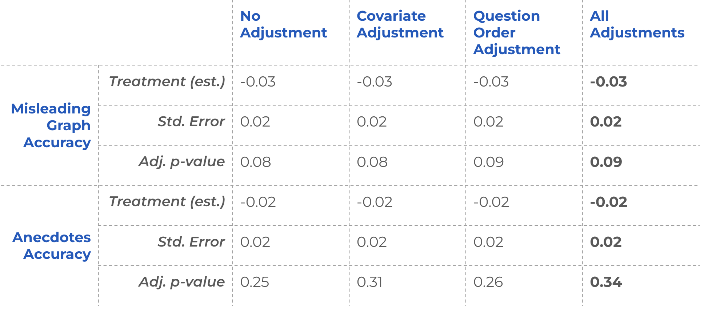

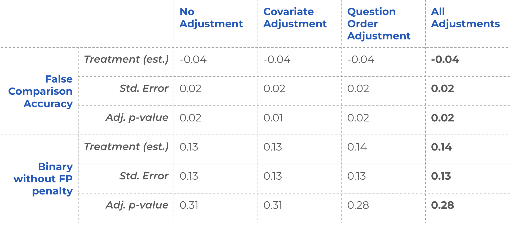

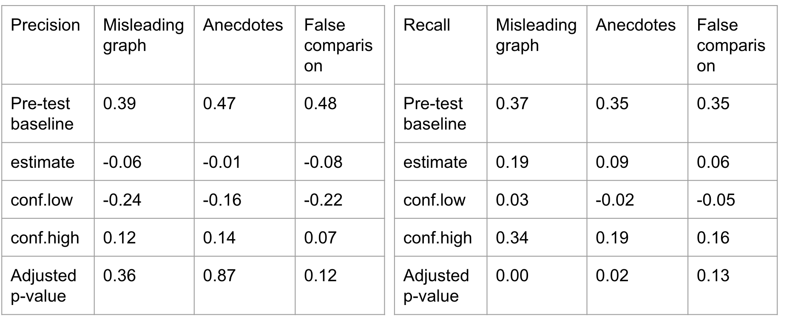
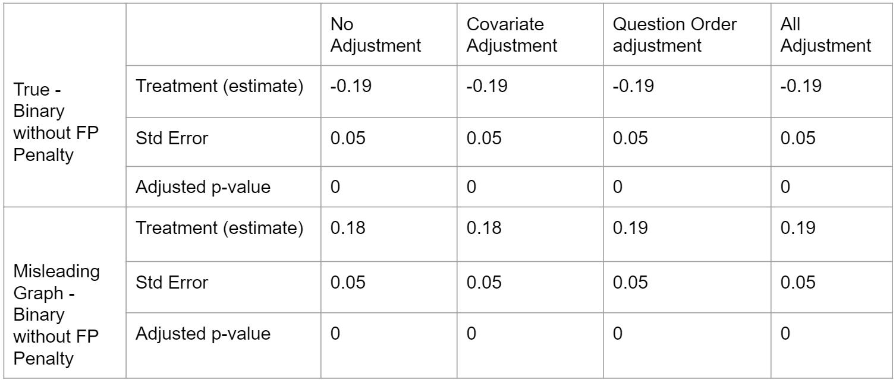

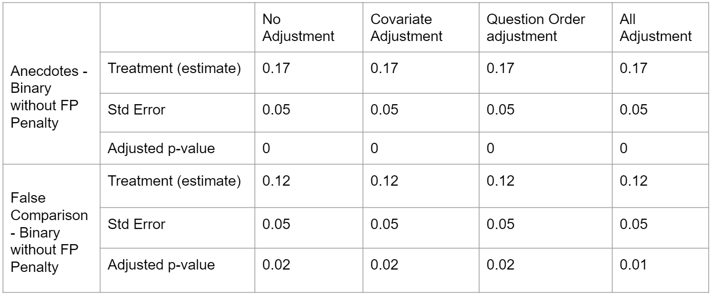

<!-- ### Correlation of Tactics -->

<!-- As an additional check, we look at the correlation between tactics selected. For each question, we compare how often tactics are selected together. Tactics seem to increase in correlation in the post-test regardless of treatment. -->


<!-- ```{r} -->
<!-- treated_post <- df_attention %>% -->
<!--   select( -->
<!--     treated, -->
<!--     True1_Pre_2, -->
<!--     True1_Post_2, -->
<!--     True2_Pre_2, -->
<!--     True2_Post_2, -->
<!--     MisGraph1_Pre_2, -->
<!--     MisGraph1_Post_2, -->
<!--     Anecdotes1_Pre_2, -->
<!--     Anecdotes1_Post_2, -->
<!--     FalseComp1_Pre_2, -->
<!--     FalseComp1_Post_2, -->
<!--     Combined1_Pre_2, -->
<!--     Combined1_Post_2 -->
<!--   ) %>%  -->
<!--   pivot_longer( -->
<!--     !treated, -->
<!--     names_to = "question",  -->
<!--     values_to = "choices" -->
<!--   ) %>%  -->
<!--   mutate( -->
<!--     True = if_else(str_detect(choices, "Post is not manipulative"), 1, 0), -->
<!--     MisGraph = if_else(str_detect(choices, "Manipulative graph"), 1, 0), -->
<!--     FalseComp = if_else(str_detect(choices, "False comparison"), 1, 0), -->
<!--     Anecdote = if_else(str_detect(choices, "Misleading anecdote"), 1, 0), -->
<!--     Evidence = if_else(str_detect(choices, "Evidence taken out of context"), 1, 0), -->
<!--     Other = if_else(str_detect(choices, "Other"), 1, 0), -->
<!--     is_post = if_else(str_detect(question, "Post"), 1, 0) -->
<!--   ) %>%  -->
<!--   filter( -->
<!--     treated==1 & is_post == 1 -->
<!--   ) %>%  -->
<!--   select( -->
<!--     # True, -->
<!--     MisGraph, -->
<!--     FalseComp, -->
<!--     Anecdote, -->
<!--     Evidence, -->
<!--     Other -->
<!--   ) %>%  -->
<!--   cor() %>%  -->
<!--   ggcorrplot(lab = TRUE, lab_size = 2.25, tl.cex = 8, title='Treated, Post', show.legend = F) -->

<!-- treated_pre <- df_attention %>% -->
<!--   select( -->
<!--     treated, -->
<!--     True1_Pre_2, -->
<!--     True1_Post_2, -->
<!--     True2_Pre_2, -->
<!--     True2_Post_2, -->
<!--     MisGraph1_Pre_2, -->
<!--     MisGraph1_Post_2, -->
<!--     Anecdotes1_Pre_2, -->
<!--     Anecdotes1_Post_2, -->
<!--     FalseComp1_Pre_2, -->
<!--     FalseComp1_Post_2, -->
<!--     Combined1_Pre_2, -->
<!--     Combined1_Post_2 -->
<!--   ) %>%  -->
<!--   pivot_longer( -->
<!--     !treated, -->
<!--     names_to = "question",  -->
<!--     values_to = "choices" -->
<!--   ) %>%  -->
<!--   mutate( -->
<!--     True = if_else(str_detect(choices, "Post is not manipulative"), 1, 0), -->
<!--     MisGraph = if_else(str_detect(choices, "Manipulative graph"), 1, 0), -->
<!--     FalseComp = if_else(str_detect(choices, "False comparison"), 1, 0), -->
<!--     Anecdote = if_else(str_detect(choices, "Misleading anecdote"), 1, 0), -->
<!--     Evidence = if_else(str_detect(choices, "Evidence taken out of context"), 1, 0), -->
<!--     Other = if_else(str_detect(choices, "Other"), 1, 0), -->
<!--     is_post = if_else(str_detect(question, "Post"), 1, 0) -->
<!--   ) %>%  -->
<!--   filter( -->
<!--     treated==1 & is_post == 0 -->
<!--   ) %>%  -->
<!--   select( -->
<!--     # True, -->
<!--     MisGraph, -->
<!--     FalseComp, -->
<!--     Anecdote, -->
<!--     Evidence, -->
<!--     Other -->
<!--   ) %>%  -->
<!--   cor() %>%  -->
<!--   ggcorrplot(lab = TRUE, lab_size = 2.25, tl.cex = 8, title="Treated, Pre", show.legend = F) -->

<!-- control_pre <- df_attention %>% -->
<!--   select( -->
<!--     treated, -->
<!--     True1_Pre_2, -->
<!--     True1_Post_2, -->
<!--     True2_Pre_2, -->
<!--     True2_Post_2, -->
<!--     MisGraph1_Pre_2, -->
<!--     MisGraph1_Post_2, -->
<!--     Anecdotes1_Pre_2, -->
<!--     Anecdotes1_Post_2, -->
<!--     FalseComp1_Pre_2, -->
<!--     FalseComp1_Post_2, -->
<!--     Combined1_Pre_2, -->
<!--     Combined1_Post_2 -->
<!--   ) %>%  -->
<!--   pivot_longer( -->
<!--     !treated, -->
<!--     names_to = "question",  -->
<!--     values_to = "choices" -->
<!--   ) %>%  -->
<!--   mutate( -->
<!--     True = if_else(str_detect(choices, "Post is not manipulative"), 1, 0), -->
<!--     MisGraph = if_else(str_detect(choices, "Manipulative graph"), 1, 0), -->
<!--     FalseComp = if_else(str_detect(choices, "False comparison"), 1, 0), -->
<!--     Anecdote = if_else(str_detect(choices, "Misleading anecdote"), 1, 0), -->
<!--     Evidence = if_else(str_detect(choices, "Evidence taken out of context"), 1, 0), -->
<!--     Other = if_else(str_detect(choices, "Other"), 1, 0), -->
<!--     is_post = if_else(str_detect(question, "Post"), 1, 0) -->
<!--   ) %>%  -->
<!--   filter( -->
<!--     treated==0 & is_post == 0 -->
<!--   ) %>%  -->
<!--   select( -->
<!--     # True, -->
<!--     MisGraph, -->
<!--     FalseComp, -->
<!--     Anecdote, -->
<!--     Evidence, -->
<!--     Other -->
<!--   ) %>%  -->
<!--   cor() %>%  -->
<!--   ggcorrplot(lab = TRUE, lab_size = 2.25, tl.cex = 8, title="Control, Pre", show.legend = F) -->

<!-- control_post <- df_attention %>% -->
<!--   select( -->
<!--     treated, -->
<!--     True1_Pre_2, -->
<!--     True1_Post_2, -->
<!--     True2_Pre_2, -->
<!--     True2_Post_2, -->
<!--     MisGraph1_Pre_2, -->
<!--     MisGraph1_Post_2, -->
<!--     Anecdotes1_Pre_2, -->
<!--     Anecdotes1_Post_2, -->
<!--     FalseComp1_Pre_2, -->
<!--     FalseComp1_Post_2, -->
<!--     Combined1_Pre_2, -->
<!--     Combined1_Post_2 -->
<!--   ) %>%  -->
<!--   pivot_longer( -->
<!--     !treated, -->
<!--     names_to = "question",  -->
<!--     values_to = "choices" -->
<!--   ) %>%  -->
<!--   mutate( -->
<!--     True = if_else(str_detect(choices, "Post is not manipulative"), 1, 0), -->
<!--     MisGraph = if_else(str_detect(choices, "Manipulative graph"), 1, 0), -->
<!--     FalseComp = if_else(str_detect(choices, "False comparison"), 1, 0), -->
<!--     Anecdote = if_else(str_detect(choices, "Misleading anecdote"), 1, 0), -->
<!--     Evidence = if_else(str_detect(choices, "Evidence taken out of context"), 1, 0), -->
<!--     Other = if_else(str_detect(choices, "Other"), 1, 0), -->
<!--     is_post = if_else(str_detect(question, "Post"), 1, 0) -->
<!--   ) %>%  -->
<!--   filter( -->
<!--     treated==0 & is_post == 1 -->
<!--   ) %>%  -->
<!--   select( -->
<!--     # True, -->
<!--     MisGraph, -->
<!--     FalseComp, -->
<!--     Anecdote, -->
<!--     Evidence, -->
<!--     Other -->
<!--   ) %>%  -->
<!--   cor() %>%  -->
<!--   ggcorrplot(lab = TRUE, lab_size = 2.25, tl.cex = 8, title="Control, Post", show.legend = F) -->
<!-- ``` -->

<!-- ```{r} -->
<!-- grid.arrange(treated_pre, treated_post, control_pre, control_post, ncol=2) -->
<!-- ``` -->
<!-- ```{r} -->
<!-- df_long <- df_attention %>% -->
<!--   select( -->
<!--     treated, -->
<!--     True1_Pre_2, -->
<!--     True1_Post_2, -->
<!--     True2_Pre_2, -->
<!--     True2_Post_2, -->
<!--     MisGraph1_Pre_2, -->
<!--     MisGraph1_Post_2, -->
<!--     Anecdotes1_Pre_2, -->
<!--     Anecdotes1_Post_2, -->
<!--     FalseComp1_Pre_2, -->
<!--     FalseComp1_Post_2, -->
<!--     Combined1_Pre_2, -->
<!--     Combined1_Post_2 -->
<!--   ) %>%  -->
<!--   pivot_longer( -->
<!--     !treated, -->
<!--     names_to = "question",  -->
<!--     values_to = "choices" -->
<!--   ) %>%  -->
<!--   mutate( -->
<!--     True = if_else(str_detect(choices, "Post is not manipulative"), 1, 0), -->
<!--     MisGraph = if_else(str_detect(choices, "Manipulative graph"), 1, 0), -->
<!--     FalseComp = if_else(str_detect(choices, "False comparison"), 1, 0), -->
<!--     Anecdote = if_else(str_detect(choices, "Misleading anecdote"), 1, 0), -->
<!--     Evidence = if_else(str_detect(choices, "Evidence taken out of context"), 1, 0), -->
<!--     Other = if_else(str_detect(choices, "Other"), 1, 0), -->
<!--     is_post = if_else(str_detect(question, "Post"), 1, 0), -->
<!--     question_type = str_extract(question, '[^_]*') -->
<!--   ) -->
<!-- ``` -->

<!-- ```{r} -->
<!-- df_long %>%  -->
<!--   # filter(str_detect(question, 'True1')) %>%  -->
<!--   group_by(question_type, treated, is_post) %>%  -->
<!--   summarize(MisGraph = mean(MisGraph), -->
<!--             FalseComp = mean(FalseComp), -->
<!--             Anecdote = mean(Anecdote), -->
<!--             Evidence = mean(Evidence), -->
<!--             Other = mean(Other), -->
<!--             .groups = 'keep') -->
<!-- ``` -->

<!-- ### Tom's OR Tactics -->

<!-- We replaced this with the unpenalized binary metric which makes more sense. -->

<!-- ```{r} -->
<!-- t.test( -->
<!--   df_attention %>% filter(treated == 1) %>% pull(tactics_2_delta), -->
<!--   df_attention %>% filter(treated == 0) %>% pull(tactics_2_delta), -->
<!--   conf.level = conf_level -->
<!-- ) %>% -->
<!--   broom::tidy() %>% -->
<!--   # mutate(p.value_adjusted = p.adjust(p.value, method = "BH", n = 10)) %>% -->
<!--   mutate_if(is.numeric, round, digits = 2) %>% -->
<!--   dplyr::select(-method, -alternative) -->
<!-- ``` -->


<!-- ```{r} -->
<!-- t.test(df %>% filter(treated == 1) %>% pull(tactics_2_pre)) %>% broom::tidy() %>% mutate(period = "pre", treated = "1") %>% -->
<!--   rbind( -->
<!--     t.test(df %>% filter(treated == 0) %>% pull(tactics_2_pre)) %>% broom::tidy() %>% mutate(period = "pre", treated = "0") -->
<!--   ) %>% -->
<!--   rbind( -->
<!--     t.test(df %>% filter(treated == 1) %>% pull(tactics_2_post)) %>% broom::tidy() %>% mutate(period = "post", treated = "1") -->
<!--   ) %>% -->
<!--   rbind( -->
<!--     t.test(df %>% filter(treated == 0) %>% pull(tactics_2_post)) %>% broom::tidy() %>% mutate(period = "post", treated = "0") -->
<!--   ) %>% -->
<!--   mutate(period = factor(period, levels = c("pre", "post")), -->
<!--          treated = factor(treated, levels = c("1", "0"))) %>% -->
<!--   ggplot(aes( -->
<!--     period, -->
<!--     estimate, -->
<!--     ymin = conf.low, -->
<!--     ymax = conf.high, -->
<!--     color = treated -->
<!--   )) + -->
<!--   geom_pointrange(position = position_dodge(.05)) + -->
<!--   geom_line(aes(group = treated)) + -->
<!--   scale_color_grey() + -->
<!--   labs( -->
<!--     title = "OR Tactics Overall", -->
<!--     subtitle = "1 if true and no tactic is selected (this is not manipulative selected) -->
<!-- 1 if misleading and at least one of 3 covered tactic is selected -->
<!-- 0 otherwise -->
<!-- ", -->
<!--     x = "pre- or post-treatment period", -->
<!--     y = "score" -->
<!--   ) + -->
<!--   theme_classic() -->
<!-- ``` -->
<!-- ```{r} -->
<!-- t.test( -->
<!--   df_attention %>% filter(treated == 1) %>% pull(tactics_2_delta), -->
<!--   df_attention %>% filter(treated == 0) %>% pull(tactics_2_delta), -->
<!--   conf.level = conf_level -->
<!-- ) %>% -->
<!--   broom::tidy() %>% -->
<!--   # mutate(p.value_adjusted = p.adjust(p.value, method = "BH", n = 10)) %>% -->
<!--   mutate_if(is.numeric, round, digits = 2) %>% -->
<!--   dplyr::select(-method, -alternative) -->
<!-- ``` -->


<!-- By Question -->

<!-- ```{r} -->
<!-- pre_post_individual %>% -->
<!--   dplyr::select( -->
<!--     treated, -->
<!--     MisGraph1_Pre_2_tactics_2, -->
<!--     FalseComp1_Pre_2_tactics_2, -->
<!--     Anecdotes1_Pre_2_tactics_2, -->
<!--     Combined1_Pre_2_tactics_2, -->
<!--     MisGraph1_Post_2_tactics_2, -->
<!--     FalseComp1_Post_2_tactics_2, -->
<!--     Anecdotes1_Post_2_tactics_2, -->
<!--     Combined1_Post_2_tactics_2, -->
<!--     True1_Pre_2_tactics_2, -->
<!--     True2_Pre_2_tactics_2, -->
<!--     True1_Post_2_tactics_2, -->
<!--     True2_Post_2_tactics_2 -->
<!--   ) %>% -->
<!--   filter(treated == 1) %>% -->
<!--   select_if(is.numeric) %>% -->
<!--   map_df(~ broom::tidy(t.test(.)), .id = 'var') %>% -->
<!--   mutate(treated = "1") %>% -->
<!--   rbind( -->
<!--     pre_post_individual %>% -->
<!--       dplyr::select( -->
<!--         treated, -->
<!--         MisGraph1_Pre_2_tactics_2, -->
<!--         FalseComp1_Pre_2_tactics_2, -->
<!--         Anecdotes1_Pre_2_tactics_2, -->
<!--         Combined1_Pre_2_tactics_2, -->
<!--         MisGraph1_Post_2_tactics_2, -->
<!--         FalseComp1_Post_2_tactics_2, -->
<!--         Anecdotes1_Post_2_tactics_2, -->
<!--         Combined1_Post_2_tactics_2, -->
<!--         True1_Pre_2_tactics_2, -->
<!--         True2_Pre_2_tactics_2, -->
<!--         True1_Post_2_tactics_2, -->
<!--         True2_Post_2_tactics_2 -->
<!--       ) %>% -->
<!--       filter(treated == 0) %>% -->
<!--       select_if(is.numeric) %>% -->
<!--       map_df(~ broom::tidy(t.test(.)), .id = 'var') %>% -->
<!--       mutate(treated = "0") -->
<!--   ) %>% -->
<!--   separate(var, into = c("type", "period")) %>% -->
<!--   mutate(period = factor(period, levels = c("Pre", "Post")), -->
<!--          treated = factor(treated, levels = c("1", "0"))) %>% -->
<!--   ggplot(aes( -->
<!--     period, -->
<!--     estimate, -->
<!--     ymin = conf.low, -->
<!--     ymax = conf.high, -->
<!--     color = treated -->
<!--   )) + -->
<!--   geom_pointrange(position = position_dodge(.1)) + -->
<!--   geom_line(aes(group = interaction(treated, type))) + -->
<!--   scale_color_grey() + -->
<!--   labs( -->
<!--     title = "OR Tactics by Question", -->
<!--     subtitle = "Binarized (true or any of the 3 taught tactics)", -->
<!--     x = "pre- or post-treatment period", -->
<!--     y = "Average score" -->
<!--   ) + -->
<!--   theme_classic() + -->
<!--   facet_wrap(. ~ type) -->
<!-- ``` -->

<!-- ```{r} -->
<!-- t.test( -->
<!--   df_attention %>% filter(treated == 1) %>% pull(MisGraph1_Delta_2_tactics_2), -->
<!--   df_attention %>% filter(treated == 0) %>% pull(MisGraph1_Delta_2_tactics_2), -->
<!--   conf.level = conf_level -->
<!-- ) %>% -->
<!--   broom::tidy() %>% -->
<!--   # mutate(p.value_adjusted = p.adjust(p.value, method = "BH", n = 10)) %>% -->
<!--   mutate_if(is.numeric, round, digits = 2) %>% -->
<!--   dplyr::select(-method, -alternative) -->
<!-- ``` -->
<!-- ```{r} -->
<!-- t.test( -->
<!--   df_attention %>% filter(treated == 1) %>% pull(FalseComp1_Delta_2_tactics_2), -->
<!--   df_attention %>% filter(treated == 0) %>% pull(FalseComp1_Delta_2_tactics_2), -->
<!--   conf.level = conf_level -->
<!-- ) %>% -->
<!--   broom::tidy() %>% -->
<!--   # mutate(p.value_adjusted = p.adjust(p.value, method = "BH", n = 10)) %>% -->
<!--   mutate_if(is.numeric, round, digits = 2) %>% -->
<!--   dplyr::select(-method, -alternative) -->
<!-- ``` -->
<!-- ```{r} -->
<!-- t.test( -->
<!--   df_attention %>% filter(treated == 1) %>% pull(Anecdotes1_Delta_2_tactics_2), -->
<!--   df_attention %>% filter(treated == 0) %>% pull(Anecdotes1_Delta_2_tactics_2), -->
<!--   conf.level = conf_level -->
<!-- ) %>% -->
<!--   broom::tidy() %>% -->
<!--   # mutate(p.value_adjusted = p.adjust(p.value, method = "BH", n = 10)) %>% -->
<!--   mutate_if(is.numeric, round, digits = 2) %>% -->
<!--   dplyr::select(-method, -alternative) -->
<!-- ``` -->
<!-- ```{r} -->
<!-- t.test( -->
<!--   df_attention %>% filter(treated == 1) %>% pull(True1_Delta_2_tactics_2), -->
<!--   df_attention %>% filter(treated == 0) %>% pull(True1_Delta_2_tactics_2), -->
<!--   conf.level = conf_level -->
<!-- ) %>% -->
<!--   broom::tidy() %>% -->
<!--   # mutate(p.value_adjusted = p.adjust(p.value, method = "BH", n = 10)) %>% -->
<!--   mutate_if(is.numeric, round, digits = 2) %>% -->
<!--   dplyr::select(-method, -alternative) -->
<!-- ``` -->
<!-- ```{r} -->
<!-- t.test( -->
<!--   df_attention %>% filter(treated == 1) %>% pull(True2_Delta_2_tactics_2), -->
<!--   df_attention %>% filter(treated == 0) %>% pull(True2_Delta_2_tactics_2), -->
<!--   conf.level = conf_level -->
<!-- ) %>% -->
<!--   broom::tidy() %>% -->
<!--   # mutate(p.value_adjusted = p.adjust(p.value, method = "BH", n = 10)) %>% -->
<!--   mutate_if(is.numeric, round, digits = 2) %>% -->
<!--   dplyr::select(-method, -alternative) -->
<!-- ``` -->
<!-- ```{r} -->
<!-- t.test( -->
<!--   df_attention %>% filter(treated == 1) %>% pull(Combined1_Delta_2_tactics_2), -->
<!--   df_attention %>% filter(treated == 0) %>% pull(Combined1_Delta_2_tactics_2), -->
<!--   conf.level = conf_level -->
<!-- ) %>% -->
<!--   broom::tidy() %>% -->
<!--   # mutate(p.value_adjusted = p.adjust(p.value, method = "BH", n = 10)) %>% -->
<!--   mutate_if(is.numeric, round, digits = 2) %>% -->
<!--   dplyr::select(-method, -alternative) -->
<!-- ``` -->

## Sharing Actions

### Summary Results - Sharing Actions

There is no significant change in online or offline sharing behavior after taking our course.

### H5 - Sharing Online

H5 is that: participants will be less likely to share misinformation online after taking the course.

The results below suggest that participants’ propensity to share information online did not change significantly with treatment. This is not entirely unexpected since we did not explicitly steer our treated users towards sharing less through our course. That said, we had hoped that if participants get better at identifying misinformation, then they would share such content less. However, since this secondary effect on sharing would be smaller than the overall effect on identifying misinformation, it is possible that there is a small effect that we did not have enough power to detect.

We may need to design specific lessons in the course to influence sharing directly (e.g. explaining that sharing misinformation could be harmful) to find larger, more easily detectable effect sizes. We also didn't explicitly test to see if some participants may share misinformation with the intention of debunking it. However, since sharing misinformation for any reason is harmful, as it increases its visibility and popularity, the overall sharing metric is most crucial and the one we chose to focus on.

```{r}
sharing_questions <- pre_post_individual %>%
  mutate(
    pre_true_3a = (True1_Pre_3a + True2_Pre_3a) / 2,
    post_true_3a = (True1_Post_3a + True2_Post_3a) / 2,
    pre_false_3a = (
      MisGraph1_Pre_3a + FalseComp1_Pre_3a + Anecdotes1_Pre_3a + Combined1_Pre_3a
    ) / 4,
    post_false_3a = (
      MisGraph1_Post_3a + FalseComp1_Post_3a + Anecdotes1_Post_3a + Combined1_Post_3a
    ) / 4
  ) %>%
  mutate(
    pre_true_3b = (True1_Pre_3b + True2_Pre_3b) / 2,
    post_true_3b = (True1_Post_3b + True2_Post_3b) / 2,
    pre_false_3b = (
      MisGraph1_Pre_3b + FalseComp1_Pre_3b + Anecdotes1_Pre_3b + Combined1_Pre_3b
    ) / 4,
    post_false_3b = (
      MisGraph1_Post_3b + FalseComp1_Post_3b + Anecdotes1_Post_3b + Combined1_Post_3b
    ) / 4
  ) 
```

```{r}
sharing_questions %>%
  dplyr::select(treated,
         pre_true_3a,
         post_true_3a,
         pre_false_3a,
         post_false_3a) %>%
  filter(treated == 1) %>%
  select_if(is.numeric) %>%
  map_df( ~ broom::tidy(t.test(.)), .id = 'var') %>%
  mutate(treated = "1") %>%
  rbind(
    sharing_questions %>%
      dplyr::select(
        treated,
        pre_true_3a,
        post_true_3a,
        pre_false_3a,
        post_false_3a
      ) %>%
      filter(treated == 0) %>%
      select_if(is.numeric) %>%
      map_df( ~ broom::tidy(t.test(.)), .id = 'var') %>%
      mutate(treated = "0")
  ) %>%
  separate(var, into = c("period", "type")) %>%
  mutate(period = factor(period, levels = c("pre", "post")),
         treated = factor(treated, levels = c("1", "0"))) %>%
  ggplot(aes(
    period,
    estimate,
    ymin = conf.low,
    ymax = conf.high,
    color = treated
  )) +
  geom_pointrange(position = position_dodge(.1)) +
  geom_line(aes(group = interaction(treated, type))) +
  scale_color_grey() +
  labs(title = "Online Sharing Propensity",
       x = "pre- or post-treatment period",
       y = "1-6 likelihood to share post online") +
  theme_classic() +
  facet_wrap(. ~ type)
```

```{r}
t.test(
  df_attention %>% filter(treated == 1) %>% pull(mean_Delta_3a_False),
  df_attention %>% filter(treated == 0) %>% pull(mean_Delta_3a_False),
  conf.level = conf_level
) %>%
  broom::tidy() %>%
  # mutate(p.value_adjusted = p.adjust(p.value, method = "BH", n = 10)) %>%
  mutate_if(is.numeric, round, digits = 2) %>%
  dplyr::select(-method, -alternative)
```

```{r, results='hide'}
# Including both True and Misinfo posts
t.test(
  df_attention %>% filter(treated == 1) %>% pull(mean_Delta_3a),
  df_attention %>% filter(treated == 0) %>% pull(mean_Delta_3a),
  conf.level = conf_level
) %>%
  broom::tidy() %>%
  # mutate(p.value_adjusted = p.adjust(p.value, method = "BH", n = 10)) %>%
  mutate_if(is.numeric, round, digits = 2) %>%
  dplyr::select(-method, -alternative)
```

### H6 - Sharing Offline

H6 is that: participants will be less likely to share misinformation offline after taking the course.

As with H5, the results below suggest that participants’ propensity to share information offline did not change significantly with treatment. Again, this behavior may need to be something that treatment targets explicitly in order to influence or may require a much larger sample size to detect.

```{r}
sharing_questions %>%
  dplyr::select(treated,
         pre_true_3b,
         post_true_3b,
         pre_false_3b,
         post_false_3b) %>%
  filter(treated == 1) %>%
  select_if(is.numeric) %>%
  map_df( ~ broom::tidy(t.test(.)), .id = 'var') %>%
  mutate(treated = "1") %>%
  rbind(
    sharing_questions %>%
      dplyr::select(
        treated,
        pre_true_3b,
        post_true_3b,
        pre_false_3b,
        post_false_3b
      ) %>%
      filter(treated == 0) %>%
      select_if(is.numeric) %>%
      map_df( ~ broom::tidy(t.test(.)), .id = 'var') %>%
      mutate(treated = "0")
  ) %>%
  separate(var, into = c("period", "type")) %>%
  mutate(period = factor(period, levels = c("pre", "post")),
         treated = factor(treated, levels = c("1", "0"))) %>%
  ggplot(aes(
    period,
    estimate,
    ymin = conf.low,
    ymax = conf.high,
    color = treated
  )) +
  geom_pointrange(position = position_dodge(.1)) +
  geom_line(aes(group = interaction(treated, type))) +
  scale_color_grey() +
  labs(title = "Offline Sharing Propensity",
       x = "pre- or post-treatment period",
       y = "1-6 likelihood to share post offline") +
  theme_classic() +
  facet_wrap(. ~ type)
```

```{r}
t.test(
  df_attention %>% filter(treated == 1) %>% pull(mean_Delta_3b_False),
  df_attention %>% filter(treated == 0) %>% pull(mean_Delta_3b_False),
  conf.level = conf_level
) %>%
  broom::tidy() %>%
  # mutate(p.value_adjusted = p.adjust(p.value, method = "BH", n = 10)) %>%
  mutate_if(is.numeric, round, digits = 2) %>%
  dplyr::select(-method, -alternative)
```

```{r, results='hide'}
# Including both True and Misinfo posts
t.test(
  df_attention %>% filter(treated == 1) %>% pull(mean_Delta_3b),
  df_attention %>% filter(treated == 0) %>% pull(mean_Delta_3b),
  conf.level = conf_level
) %>%
  broom::tidy() %>%
  # mutate(p.value_adjusted = p.adjust(p.value, method = "BH", n = 10)) %>%
  mutate_if(is.numeric, round, digits = 2) %>%
  dplyr::select(-method, -alternative)
```
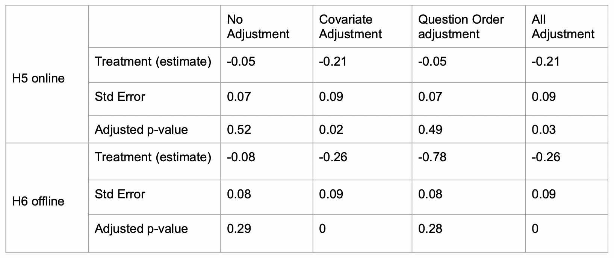

## Heterogeneous Treatment Effects (HTE)


```{r}
demographic_colnames <-
  c(
    'Gender',
    'Race',
    'Education',
    'Income',
    'Ideology',
    'GeneralTrust',
    'KnowFauci',
    'TrustFauci',
    'TrustScientists',
    'NewsSources',
    'PostFrequency',
    'BlockUserSocialMedia',
    'ReportUserSocialMedia',
    'SeenManipulative',
    'KnowSpot'
  )
```

We first convert the categorical covariates into a numeric scale.

```{r}
HTE_data <-
  df_attention %>% mutate(Gender_numeric = case_when(Gender == 'Male' ~ 1,
                                                 Gender == 'Female' ~ 2,
                                                 TRUE ~ 3))
HTE_data <-
  HTE_data %>% mutate(White = ifelse(Race == 'White', 1, 0))

group1_educ = c("Did not graduate from high school", "High school degree")
group2_educ = c("Associate degree", "Bachelor's degree", "Some collage")
HTE_data <- HTE_data %>%
  mutate(
    education_level_2 = case_when(
      Education %in% group1_educ ~ 1,
      Education %in% group2_educ ~ 2,
      TRUE ~ 3
    )
  )

HTE_data <-
  HTE_data %>% mutate(GeneralTrust_numeric = as.numeric(GeneralTrust))

HTE_data <-
  HTE_data %>% mutate(FauciTrust_numeric = as.numeric(TrustFauci))

HTE_data <-
  HTE_data %>% mutate(SciTrust_numeric = as.numeric(TrustScientists))

HTE_data <- HTE_data %>%
  mutate(
    PostFrequency_numeric = case_when(
      PostFrequency == "Many times a day" ~ 5,
      PostFrequency == "Daily" ~ 4,
      PostFrequency == "Weekly" ~ 3,
      PostFrequency == "Less than monthly" ~ 2,
      PostFrequency == "Monthly" ~ 1,
      PostFrequency == "I don't use social media" ~ 0
    )
  )

HTE_data <- HTE_data %>% mutate(
  BlockUserSocialMedia_numeric = case_when(
    BlockUserSocialMedia == 'Yes' ~ 3,
    BlockUserSocialMedia == 'No' ~ 2,
    TRUE ~ 1
  )
)

HTE_data <- HTE_data %>% mutate(
  ReportUserSocialMedia_numeric = case_when(
    ReportUserSocialMedia == 'Yes' ~ 3,
    ReportUserSocialMedia == 'No' ~ 2,
    TRUE ~ 1
  )
)

n <- nrow(HTE_data)
```

### Summary Results - HTE

Heterogeneity in treatment effects are both a risk and opportunity of intervention studies. On one hand, heterogeneity can be good for identifying groups of people for whom the treatment will be most effective so one can more efficiently target interventions. On the other hand, heterogeneity can also mean that your intervention is not effective for a population of people. For example, if the intervention is more effective among political liberal versus conservative individuals, it may be good that one can target liberals for more efficient outcomes, but it can also be bad that the intervention does not improve the ability of conservative individuals to identify misinformation. 

However, we see little heterogeneity in the treatment effects. In fact, we only find heterogeneity across different incomes. Again, on one hand, this lack of heterogeneity may not be desirable because it provides a less precise answer to who to target with the intervention, but it is also good because it indicates that the treatment is likely appropriate for a large audience. 

### H7 - Susceptibility to Misinformation

H7 is that: participants with different levels of susceptibility to misinformation at baseline will react differently to the treatment in terms of their overall ability to identify manipulative content.

We investigated this hypothesis using three measures of misinformation susceptibility from our survey:

1. Participant performance on the pre-test (`pre_score`)
2. Participants who self-identified as knowing how to spot manipulative techniques used in articles or headlines (`KnowSpot`)
3. Participants who self-identified as having seen a manipulative news article or headline (`SeenManipulative`)

The results of HTE analysis based on these three variables are shown below. None of the effects are significant. 

The results based on `pre-score` may indicate that our test questions were sufficiently neutral to remove any effect. Indeed, our test questions were deliberately designed not to be politically polarizing. Some prior literature has found HTE based on misinformation susceptibility using tailored indices (e.g. Maertens et al. (2021), Bruder et al. (2013)). Although these indices were typically based on politically-charged examples.

Our results based on `KnowSpot` and `SeenManipulative` may indicate that participants struggle to self-identify their own susceptibility. This has also been shown elsewhere (Rapp & Salovich (2018)).  

```{r}
# pre_score
HTE_data <- HTE_data %>% mutate(
  pre_score = True1_Pre_1 + True2_Pre_1 + MisGraph1_Pre_1 + FalseComp1_Pre_1 + Anecdotes1_Pre_1 + Combined1_Pre_1
)

model_2 <- lm(mean_Delta_1_False ~ treated * pre_score, HTE_data)

results_2 <- coeftest(model_2, vcov = vcovHC(model_2, type = "HC1"), level = conf_level)
results_2
```

```{r}
# KnowSpot
HTE_data <- HTE_data %>%
  mutate(KnowSpot_numeric = case_when(KnowSpot == "No" ~ 1, # 124
                                      KnowSpot == "Not sure" ~ 2, # 196
                                      KnowSpot == "Yes" ~ 3 # 321
                                      ))
                                      
model_2 <-
  lm(mean_Delta_1_False ~ treated * KnowSpot_numeric, HTE_data)

results_2 <-
  coeftest(model_2, vcov = vcovHC(model_2, type = "HC1"), level = conf_level)
results_2
```

```{r}
# SeenManipulative
HTE_data <- HTE_data %>%
  mutate(
    SeenManipulative_numeric = case_when(
      SeenManipulative == "No" ~ 1,
      # 77
      SeenManipulative == "Not sure" ~ 2,
      # 158
      SeenManipulative == "Yes" ~ 3 # 406
    )
  )

model_2 <-
  lm(mean_Delta_1_False ~ treated * SeenManipulative_numeric,
     HTE_data)

results_2 <- coeftest(model_2, vcov = vcovHC(model_2, type = "HC1"), level = conf_level)
results_2
```

### H8 - Political Ideology

H8 is that: participants with different political ideologies will react differently to the treatment in terms of their overall ability to identify manipulative content.

We investigated this hypothesis using a question that asked participants to self-identify as one of "very liberal," "moderately liberal," "moderate," "moderately conservative,"  and "very conservative." The results, shown below, indicate that there were no significant HTE. This likely reflects the fact that we deliberately chose post examples to test misinformation that wouldn't be politically polarizing, and we used the non-polarized term manipulative information instead of misinformation.

```{r}
HTE_data <- HTE_data %>%
  mutate(
    Ideology_numeric = case_when(
      Ideology == "Very liberal" ~ -2,
      Ideology == "Moderately liberal" ~ -1,
      Ideology == "Moderate" ~ 0,
      Ideology == "Moderately conservative" ~ 1,
      Ideology == "Very conservative" ~ 2
    )
  )

model_2 <-
  lm(mean_Delta_1_False ~ treated * Ideology_numeric, HTE_data)

results_2 <- coeftest(model_2, vcov = vcovHC(model_2, type = "HC1"), level = conf_level)
results_2
```

Possibly, if we used more politically polarizing content and/ or treatments, we would have found heterogeneity by ideology. However, in the test that we ran, we did not find significant level of heterogeneity by ideology. 

### H9 - Income

H9 is that: participants with different levels of income will react differently to the treatment in terms of their overall ability to identify manipulative content.

We investigated this hypothesis using a question that asked participants to indicate which range best described their income: 

* less than \$25,000
* \$25,000-\$49,999
* \$50,000-\$74,999
* \$75,000-\$99,999
* \$100,000-\$149,999
* \$150,000 or more. 

We turned these categorical income values into the best possible continuous values we could come up with which was taking the mid points of the buckets. For the group with incomes above \$150,000 we used a truncation of \$200,000 and took the midpoint to be \$175,000. Then we ran a regression interacting the newly created continuous income variable with the treatment. The results of this are below and show that our treatment was more effective for the lower income individuals. We find that on average for each $10,000 increase in income, the effect size of the treatment is reduced by 0.04 from the 0.8 effect size at an income of zero. This effect is statistically significant at the 10% level.

This result is in line with prior literature (Pan, Liu & Fang (2021), Kricorian, Civen & Equils (2021)). It likely reflects the fact that higher incomes tend to already be associated with higher levels of education and verbal reasoning (Bjälkebring & Peters (2021)).

```{r}
HTE_data <- HTE_data %>%
  mutate(
    Income_numeric = case_when(
      Income == "Less than $25,000" ~ 1,
      # 172
      Income == "$25,000 to $49,999" ~ 2,
      # 192
      Income == "$50,000 to $74,999" ~ 3,
      # 198
      Income == "$75,000 to $99,999" ~ 3,
      # 198
      Income == "$100,000 to $149,999" ~ 4,
      # 78
      Income == "$150,000 or more" ~ 4 # 78
    )
  )

HTE_data <- HTE_data %>%
  mutate(
    Income_numeric_cont = case_when(
      Income == "Less than $25,000" ~ 12500,
      # 172
      Income == "$25,000 to $49,999" ~ 37500,
      # 192
      Income == "$50,000 to $74,999" ~ 62500,
      # 198
      Income == "$75,000 to $99,999" ~ 87500,
      # 198
      Income == "$100,000 to $149,999" ~ 125000,
      # 78
      Income == "$150,000 or more" ~ 175000 
    )
  )

model_2 <-
  lm(mean_Delta_1_False ~ treated * Income_numeric_cont, HTE_data)

results_2 <- coeftest(model_2, vcov = vcovHC(model_2, type = "HC1"), level = conf_level)
results_2
```


<!-- ```{r} -->
<!-- model_2 <- -->
<!--   lm(mean_Delta_1_False ~ treated * as.factor(Income_numeric), HTE_data) -->

<!-- results_2 <- coeftest(model_2, vcov = vcovHC(model_2, type = "HC1"), level = conf_level) -->
<!-- results_2 -->
<!-- ``` -->


Next, we repeated this analysis keeping the original income buckets and estimating the interaction terms between the indicators for each income bucket and the treatment. The results of this analysis is shown in the graph below. This graph shows too that the treatment is most effective for the lowest income individuals. For the two lowest income brackets there is a statistically significant difference between the control and treatment groups, the treatment being effective in helping participants detect misinformation. For the higher income groups the improvement in the treated groups is not statistically significant compared to their respective control groups.


```{r}

Income_level = c("Less than $25,000", "$25,000 to $49,999", "$50,000 to $74,999", "$75,000 to $99,999", "$100,000 to $149,999", "$150,000 or more")

HTE_data = HTE_data %>% mutate(income_level_cont = as.factor(Income_numeric_cont))
levels(HTE_data$income_level_cont) = Income_level

means_accuracy_ <- HTE_data %>% 
  # select our variables of interest
  dplyr::select(treated, income_level_cont, mean_Delta_1_False) %>%
  # group by treatment and income
  group_by(treated, income_level_cont) %>%
  summarize(mean = mean(mean_Delta_1_False),
            sd = sd(mean_Delta_1_False),
            n=n(),
            se = sd/sqrt(n))
```

```{r}
means_accuracy_ %>%
  ggplot(aes(income_level_cont, mean, group = treated, color = treated)) +
  geom_errorbar(aes(ymin = mean - 1.96*se, ymax = mean + 1.96*se, 
                    linetype = income_level_cont),
              width = .1,
              position=position_dodge(width = .4), show.legend = TRUE) + 
  geom_point(aes(fill=treated), size =3, shape = c(20, 20, 21, 21, 22, 22, 23, 23, 24, 24, 25, 25),
             position=position_dodge2(width= .4))  +
  scale_shape_manual(name = "Missing values", values=c(20, 20, 21, 21, 22, 22, 23, 23, 24, 24, 25, 25)) + 
  scale_y_continuous(breaks = seq(-1, 1.7 , 0.2), 
                     labels = c(--1, -0.8, 0.6, -0.4, -0.2, 0, 0.2, 0.4, 0.6, 0.8, 1, 1.2, 1.5, 1.8), 
                     limits = c(-1, 1.8)) + 
  scale_x_discrete(labels = function(x)str_replace(str_replace_all(x, "\\_", " "), " ", "\\\n")) + 
  labs(title = "Means and 95% CI by Arm \n and income Level", 
       x = 'Treatment', 
       y = "Post - Pre manipulation detection", 
       caption  = "For participants who passed the attention check (N = 641); 95% CI displayed.") +
  theme_minimal() + 
  theme(strip.text = element_text(size = 12), 
        axis.text = element_text(size = 7), 
        axis.title = element_text(size = 12, face = "bold"), 
        #legend.position = "none", 
        plot.title = element_text(size = 16, face = "bold", hjust = 0.5))
```

The above approach shows similar results as using the continuous income variable. It needs to be noted that the results for higher income individuals suggest that the treatment effect may be effective for them as well, however, because of the lower sample size in these groups, the estimates are noisier. Further studies could focus on these groups and ensure sufficient sample size to be able to identify a potentially relatively lower effect size.


Additionally, because of the relatively low numbers of individuals in some of the higher income buckets, we repeated this analysis combining some of the groups. We combined the highest two and the middle two income groups for the graph below. This third approach also confirms the above finding that our treatment was the most effective for the lower income groups.

```{r}

Income_level = c("Less than $25,000", "$25,000 to $49,999", "$50,000 to $99,999", "$100,000 or more")

HTE_data = HTE_data %>% mutate(income_level = as.factor(Income_numeric))
levels(HTE_data$income_level) = Income_level

means_accuracy_ <- HTE_data %>% 
  # select our variables of interest
  dplyr::select(treated, income_level, mean_Delta_1_False) %>%
  # group by treatment and income
  group_by(treated, income_level) %>%
  summarize(mean = mean(mean_Delta_1_False),
            sd = sd(mean_Delta_1_False),
            n=n(),
            se = sd/sqrt(n))
```

```{r}
means_accuracy_ %>%
  ggplot(aes(income_level, mean, group = treated, color = treated)) +
  geom_errorbar(aes(ymin = mean - 1.96*se, ymax = mean + 1.96*se, 
                    linetype = income_level),
              width = .1,
              position=position_dodge(width = .4), show.legend = TRUE) + 
  geom_point(aes(fill=treated), size =3, shape = c(21, 21, 22, 22, 23, 23, 24, 24),
             position=position_dodge2(width= .4))  +
  scale_shape_manual(name = "Missing values", values=c(21, 21, 22, 22, 23, 23, 24, 24)) + 
  scale_y_continuous(breaks = seq(-0.6, 1.2 , 0.2), 
                     labels = c(-0.6, -0.4, -0.2, 0, 0.2, 0.4, 0.6, 0.8, 1, 1.2), 
                     limits = c(-0.6, 1.1)) + 
  scale_x_discrete(labels = function(x)str_replace(str_replace_all(x, "\\_", " "), " ", "\\\n")) + 
  labs(title = "Means and 95% CI by Arm \n and income Level", 
       x = 'Treatment', 
       y = "Post - Pre manipulation detection", 
       caption  = "For participants who passed the attention check (N = 641); 95% CI displayed.") +
  theme_minimal() + 
  theme(strip.text = element_text(size = 12), 
        axis.text = element_text(size = 7), 
        axis.title = element_text(size = 12, face = "bold"), 
        #legend.position = "none", 
        plot.title = element_text(size = 16, face = "bold", hjust = 0.5))
```


Future analyses should examine whether this heterogeneity by income is due to some fundamental difference by income or is being confounded by another variable, such as political knowledge, interest, or reasoning levels. Understanding more specifically where this HTE is coming from will be important for properly implementing the treatment in the field and designing new content to reach people for whom the present treatment was less effective (i.e., higher income individuals). 


## Causal Trees for HTE Analysis


Testing the three pre specified HTE we found that our treatment appears to generalize well and be equally effective for all, except for high income individuals. We now turn to using machine learning (ML) to further study HTEs. We expect that ML will help more effectively select multiple covariates to group people giving a better classification with very similar group members as compared to a single covariate division. Therefore, we expect that groups made using machine learning could show stronger HTEs. The ML subgroups can also be used to inform new covariates or heterogeneous policy assignments for future surveys. We also expect ML HTEs to reveal interesting correlations between covariates that can inform design decisions in the future.

```{r}
library(causalTree)
library(grf)
library(rpart)
library(glmnet)
library(splines)
library(MASS)
```

```{r}
n <- nrow(HTE_data)

# Treatment: does the the gov't spend too much on "welfare" (1) or "assistance to the poor" (0)
HTE_data = HTE_data %>% mutate(treatment = as.numeric(treated))
treatment <- "treatment"

# Outcome: 1 for 'yes', 0 for 'no'
outcome <- "mean_Delta_1_False"

covariates <-
  c(
    'Gender_numeric',
    'White',
    'education_level_2',
    'Income_numeric',
    'Ideology_numeric',
    'GeneralTrust_numeric',
    'FauciTrust_numeric',
    'SciTrust_numeric',
    'PostFrequency_numeric',
    'BlockUserSocialMedia_numeric',
    'ReportUserSocialMedia_numeric',
    'SeenManipulative_numeric',
    'KnowSpot_numeric'
  )


romano_wolf_correction <- function(t.orig, t.boot) {
  abs.t.orig <- abs(t.orig)
  abs.t.boot <- abs(t.boot)
  abs.t.sorted <- sort(abs.t.orig, decreasing = TRUE)
  
  max.order <- order(abs.t.orig, decreasing = TRUE)
  rev.order <- order(max.order)
  
  M <- nrow(t.boot)
  S <- ncol(t.boot)
  
  p.adj <- rep(0, S)
  p.adj[1] <- mean(apply(abs.t.boot, 1, max) > abs.t.sorted[1])
  for (s in seq(2, S)) {
    cur.index <- max.order[s:S]
    p.init <-
      mean(apply(abs.t.boot[, cur.index, drop = FALSE], 1, max) > abs.t.sorted[s])
    p.adj[s] <- max(p.init, p.adj[s - 1])
  }
  p.adj[rev.order]
}
# ols, indices = interact, cov.type = 'HC'
summary_rw_lm <-
  function(model,
           indices = NULL,
           cov.type = "HC2",
           num.boot = 10000) {
    if (is.null(indices)) {
      indices <- 1:nrow(coef(summary(model)))
    }
    # Grab the original t values.
    summary <- coef(summary(model))[indices, , drop = FALSE]
    t.orig <- summary[, "t value"]
    
    # Null resampling.
    # This is a trick to speed up bootstrapping linear models.
    # Here, we don't really need to re-fit linear regressions, which would be a bit slow.
    # We know that beta hat ~ N(beta, Sigma), and we have an estimate Sigma hat.
    # So we can approximate "null t-values" by
    #  - Draw beta.boot ~ N(0, Sigma-hat) --- note the 0 here, this is what makes it a *null* t-value.
    #  - Compute t.boot = beta.boot / sqrt(diag(Sigma.hat))
    Sigma.hat <- vcovHC(model, type = cov.type)[indices, indices]
    se.orig <- sqrt(diag(Sigma.hat))
    num.coef <- length(se.orig)
    beta.boot <-
      mvrnorm(n = num.boot,
              mu = rep(0, num.coef),
              Sigma = Sigma.hat)
    t.boot <- sweep(beta.boot, 2, se.orig, "/")
    p.adj <- romano_wolf_correction(t.orig, t.boot)
    
    result <- cbind(summary[, c(1, 2, 4), drop = F], p.adj)
    colnames(result) <-
      c('Estimate', 'Std. Error', 'Orig. p-value', 'Adj. p-value')
    result
  }
```

```{r}
fmla <- paste(outcome, " ~", paste(covariates, collapse = " + "))

# Dividing data into three subsets
indices <-
  split(seq(nrow(HTE_data)), sort(seq(nrow(HTE_data)) %% 3))
names(indices) <- c('split', 'est', 'test')

# Fitting the forest
ct.unpruned <- honest.causalTree(
  formula = fmla,
  # Define the model
  data = HTE_data[indices$split, ],
  treatment = HTE_data[indices$split, treatment],
  est_data = HTE_data[indices$est, ],
  est_treatment = HTE_data[indices$est, treatment],
  minsize = 1,
  # Min. number of treatment and control cases in each leaf
  HonestSampleSize = length(indices$est),
  #  Num obs used in estimation after splitting
  # We recommend not changing the parameters below
  split.Rule = "CT",
  # Define the splitting option
  cv.option = "TOT",
  # Cross validation options
  cp = 0,
  # Complexity parameter
  split.Honest = TRUE,
  # Use honesty when splitting
  cv.Honest = TRUE              # Use honesty when performing cross-validation
)
```

But we find that none of the HTE groups made in the 17 leaves show statistically significant HTE after p-value adjustment.

```{r}
# Table of cross-validated values by tuning parameter.
ct.cptable <- as.data.frame(ct.unpruned$cptable)

# Obtain optimal complexity parameter to prune tree.
cp.selected <- which.min(ct.cptable$xerror)
cp.optimal <- ct.cptable[cp.selected, "CP"]

# Prune the tree at optimal complexity parameter.
ct.pruned <- ct.unpruned # prune(tree=ct.unpruned, cp=cp.optimal)

# Predict point estimates (on estimation sample)
tau.hat.est <- predict(ct.pruned, newdata = HTE_data[indices$est, ])

# Create a factor column 'leaf' indicating leaf assignment in the estimation set
num.leaves <- length(unique(tau.hat.est))
leaf <-
  factor(tau.hat.est,
         levels = sort(unique(tau.hat.est)),
         labels = seq(num.leaves))

rpart.plot(
  x = ct.pruned,
  # Pruned tree
  type = 3,
  # Draw separate split labels for the left and right directions
  fallen = TRUE,
  # Position the leaf nodes at the bottom of the graph
  leaf.round = 1,
  # Rounding of the corners of the leaf node boxes
  extra = 100,
  # Display the percentage of observations in the node
  branch = .1,
  # Shape of the branch lines
  box.palette = "RdBu"
) # Palette for coloring the node
```

```{r}
fmla <- paste0(outcome, ' ~ ', paste0(treatment, '* leaf'))
ols_ct <- lm(fmla, data = transform(HTE_data[indices$est, ], leaf = leaf))

ols_ct_summary <- summary(ols_ct)
te_summary <- coef(ols_ct_summary)[(num.leaves+1):(2*num.leaves), c("Estimate", "Std. Error")]

```

```{r}
# This is only valid in randomized datasets.
fmla <- paste0(outcome, ' ~ ', paste0(treatment, '* leaf'))
if (num.leaves == 1) {
  print("Skipping since there's a single leaf.")
  
} else if (num.leaves == 2) {
  # if there are only two leaves, no need to correct for multiple hypotheses
  ols <- lm(fmla, data = transform(HTE_data[indices$est, ], leaf = leaf))
  coeftest(ols, vcov = vcovHC(ols, 'HC2'))[4, , drop = F]
  
} else {
  # if there are three or more leaves, use Romano-Wolf test correction
  ols <- lm(fmla, data = transform(HTE_data[indices$est, ], leaf = leaf))
  interact <-
    which(sapply(names(coef(ols)), function(x)
      grepl(paste0(treatment, ":"), x)))
  summary_rw_lm(ols, indices = interact, cov.type = 'HC')

}
```

# Additional Analyses

## Controlling Variance and Corrections

### Covariate Adjustment to Reduce Variance

The outcomes of interest might have variability that can be explained by our covariates. To test for the possibility of variance reduction, we use the control group's outcome  and regress it against the covariates. A t-test on the coefficients captures the covariates that are significantly linked to the outcome of interest. We expect these covariates to capture some of the variance in the outcome and improve power. 

```{r}
data_control = HTE_data %>% filter(treatment == 0)
```


#### Overall Outcomes

We find that only trust in Dr. Fauci and the self identified ability to spot misinformation are statistically significant in explaining pre-test scores. 

```{r}

fmla <- paste('mean_Delta_1_False', " ~", paste(covariates, collapse = " + "))

model = lm(fmla, data_control)
coeftest(model, vcov = vcovHC(model, type="HC1"))
```

```{r}
fmla = paste('mean_Delta_1_False ~  treated')
model = lm(fmla, HTE_data)
results <- coeftest(model, vcov = vcovHC(model, type = "HC1"), level = conf_level)
results
```

Covariate correction did not reduce the variance for change in overall score for misinfo questions.

```{r}
#MisGraph1_Delta_2
fmla = paste('mean_Delta_1_False ~ FauciTrust_numeric + KnowSpot_numeric + treated')
model = lm(fmla, HTE_data)
results <- coeftest(model, vcov = vcovHC(model, type = "HC1"), level = conf_level)
results
```

To control for any variation in the difficulty of the exact matched pre and post test questions we show participants, we randomized which question each person sees in the pre and in the post question, from each of the six pairs of questions. We also corrected for this randomization and showed minor improvements in the estimates for nearly all outcomes.

```{r}
fmla = paste('mean_Delta_1_False ~ as.factor(neg_misgraph1) + treated')
model = lm(fmla, HTE_data)
results <- coeftest(model, vcov = vcovHC(model, type = "HC1"), level = conf_level)
results
```

A combined correction of question order and covariates did not improve our results for change in overall score for misinfo questions.

```{r}
fmla = paste('mean_Delta_1_False ~ as.factor(neg_misgraph1) + FauciTrust_numeric + KnowSpot_numeric + treated')
model = lm(fmla, HTE_data)
results <- coeftest(model, vcov = vcovHC(model, type = "HC1"), level = conf_level)
results
```

We find that only Ideology is statistically significant in explaining change in overall score for true questions. 

```{r}

fmla <- paste('mean_Delta_1_True', " ~", paste(covariates, collapse = " + "))

model = lm(fmla, data_control)
coeftest(model, vcov = vcovHC(model, type="HC1"))
```


```{r}
fmla = paste('mean_Delta_1_True ~  treated')
model = lm(fmla, HTE_data)
results <- coeftest(model, vcov = vcovHC(model, type = "HC1"), level = conf_level)
results
```

Covariate correction did not reduce the variance for change in overall score for true questions.

```{r}
#MisGraph1_Delta_2
fmla = paste('mean_Delta_1_True ~ Ideology_numeric + treated')
model = lm(fmla, HTE_data)
results <- coeftest(model, vcov = vcovHC(model, type = "HC1"), level = conf_level)
results
```

We also corrected for this randomization and showed minor improvements in the estimates for nearly all outcomes.

```{r}
fmla = paste('mean_Delta_1_True ~ as.factor(neg_misgraph1) + treated')
model = lm(fmla, HTE_data)
results <- coeftest(model, vcov = vcovHC(model, type = "HC1"), level = conf_level)
results
```

A combined correction of question order and covariates did not improve our results for change in overall score for true questions.

```{r}
fmla = paste('mean_Delta_1_True ~ as.factor(neg_misgraph1) + Ideology_numeric + treated')
model = lm(fmla, HTE_data)
results <- coeftest(model, vcov = vcovHC(model, type = "HC1"), level = conf_level)
results
```

#### Sharing Questions

Next, we tried the same approach for the sharing questions.

We find that trust in Fauci, frequency of posting on social media, blocking users on social media, and self identified ability to identify misinformation are statistically significant in explaining change in overall score for sharing online. 


Covariate correction did not reduce the variance. We also corrected for this randomization and showed minor improvements in the estimates for nearly all outcomes. A combined correction of question order and covariates did not improve our results.


```{r}

fmla <- paste('mean_Delta_3a_False', " ~", paste(covariates, collapse = " + "))

model = lm(fmla, data_control)
coeftest(model, vcov = vcovHC(model, type="HC1"))
```

```{r}
fmla = paste('mean_Delta_3a_False ~  treated')
model = lm(fmla, HTE_data)
results <- coeftest(model, vcov = vcovHC(model, type = "HC1"), level = conf_level)
results
```

```{r}
#MisGraph1_Delta_2
fmla = paste('mean_Delta_3a_False ~ FauciTrust_numeric + PostFrequency_numeric + BlockUserSocialMedia_numeric + SeenManipulative_numeric + KnowSpot_numeric + treated')
model = lm(fmla, HTE_data)
results <- coeftest(model, vcov = vcovHC(model, type = "HC1"), level = conf_level)
results
```

```{r}
fmla = paste('mean_Delta_3a_False ~ as.factor(neg_misgraph1) + treated')
model = lm(fmla, HTE_data)
results <- coeftest(model, vcov = vcovHC(model, type = "HC1"), level = conf_level)
results
```

```{r}
fmla = paste('mean_Delta_3a_False ~ as.factor(neg_misgraph1) + FauciTrust_numeric + PostFrequency_numeric + BlockUserSocialMedia_numeric + SeenManipulative_numeric + KnowSpot_numeric + treated')
model = lm(fmla, HTE_data)
results <- coeftest(model, vcov = vcovHC(model, type = "HC1"), level = conf_level)
results
```

We find that only general level of trust is statistically significant in explaining change in overall score for sharing misinfo offline.

Covariate correction did not reduce the variance. We also corrected for this randomization and showed minor improvements in the estimates for nearly all outcomes. A combined correction of question order and covariates did not improve our results.

```{r}

fmla <- paste('mean_Delta_3b_False', " ~", paste(covariates, collapse = " + "))

model = lm(fmla, data_control)
coeftest(model, vcov = vcovHC(model, type="HC1"))
```

```{r}
fmla = paste('mean_Delta_3b_False ~  treated')
model = lm(fmla, HTE_data)
results <- coeftest(model, vcov = vcovHC(model, type = "HC1"), level = conf_level)
results
```

```{r}
#MisGraph1_Delta_2
fmla = paste('mean_Delta_3b_False ~ GeneralTrust_numeric + treated')
model = lm(fmla, HTE_data)
results <- coeftest(model, vcov = vcovHC(model, type = "HC1"), level = conf_level)
results
```

```{r}
fmla = paste('mean_Delta_3b_False ~ as.factor(neg_misgraph1) + treated')
model = lm(fmla, HTE_data)
results <- coeftest(model, vcov = vcovHC(model, type = "HC1"), level = conf_level)
results
```

```{r}
fmla = paste('mean_Delta_3b_False ~ as.factor(neg_misgraph1) + GeneralTrust_numeric + treated')
model = lm(fmla, HTE_data)
results <- coeftest(model, vcov = vcovHC(model, type = "HC1"), level = conf_level)
results
```

#### Tactics Level Accuracy

We find that none of the covariates are statistically significant in explaining change in accuracy for misleading graph questions. 

Covariate correction did not reduce the variance. We also corrected for this randomization and showed minor improvements in the estimates for nearly all outcomes. A combined correction of question order and covariates did not improve our results. This trend is followed for accuracy of all tactics.


```{r}

fmla <- paste('MisGraph1_Delta_2_accuracy', " ~", paste(covariates, collapse = " + "))

model = lm(fmla, data_control)
coeftest(model, vcov = vcovHC(model, type="HC1"))
```

```{r}
fmla = paste('MisGraph1_Delta_2_accuracy ~  treated')
model = lm(fmla, HTE_data)
results <- coeftest(model, vcov = vcovHC(model, type = "HC1"), level = conf_level)
results
```

```{r}
#MisGraph1_Delta_2
fmla = paste('MisGraph1_Delta_2_accuracy ~ Ideology_numeric + treated')
model = lm(fmla, HTE_data)
results <- coeftest(model, vcov = vcovHC(model, type = "HC1"), level = conf_level)
results
```

```{r}
fmla = paste('MisGraph1_Delta_2_accuracy ~ as.factor(neg_misgraph1) + treated')
model = lm(fmla, HTE_data)
results <- coeftest(model, vcov = vcovHC(model, type = "HC1"), level = conf_level)
results
```

```{r}
fmla = paste('MisGraph1_Delta_2_accuracy ~ as.factor(neg_misgraph1) + Ideology_numeric + treated')
model = lm(fmla, HTE_data)
results <- coeftest(model, vcov = vcovHC(model, type = "HC1"), level = conf_level)
results
```

We find that gender, race, income, ideology, trust in scientists, and frequency of posting on social media are statistically significant in explaining change in accuracy for false anecdotes questions. 

```{r}

fmla <- paste('Anecdotes1_Delta_2_accuracy', " ~", paste(covariates, collapse = " + "))

model = lm(fmla, data_control)
coeftest(model, vcov = vcovHC(model, type="HC1"))
```

```{r}
fmla = paste('Anecdotes1_Delta_2_accuracy ~  treated')
model = lm(fmla, HTE_data)
results <- coeftest(model, vcov = vcovHC(model, type = "HC1"), level = conf_level)
results
```

```{r}
#MisGraph1_Delta_2
fmla = paste('Anecdotes1_Delta_2_accuracy ~ Gender_numeric + White + Income_numeric + Ideology_numeric + SciTrust_numeric + PostFrequency_numeric + treated')
model = lm(fmla, HTE_data)
results <- coeftest(model, vcov = vcovHC(model, type = "HC1"), level = conf_level)
results
```

```{r}
fmla = paste('Anecdotes1_Delta_2_accuracy ~ as.factor(neg_misgraph1) + treated')
model = lm(fmla, HTE_data)
results <- coeftest(model, vcov = vcovHC(model, type = "HC1"), level = conf_level)
results
```

```{r}
fmla = paste('Anecdotes1_Delta_2_accuracy ~ as.factor(neg_misgraph1) + Gender_numeric + White + Income_numeric + Ideology_numeric + SciTrust_numeric + PostFrequency_numeric + treated')
model = lm(fmla, HTE_data)
results <- coeftest(model, vcov = vcovHC(model, type = "HC1"), level = conf_level)
results
```

We find that none of the covariates are statistically significant in explaining change in accuracy for false comparison questions. 

```{r}

fmla <- paste('FalseComp1_Delta_2_accuracy', " ~", paste(covariates, collapse = " + "))

model = lm(fmla, data_control)
coeftest(model, vcov = vcovHC(model, type="HC1"))
```

```{r}
fmla = paste('FalseComp1_Delta_2_accuracy ~  treated')
model = lm(fmla, HTE_data)
results <- coeftest(model, vcov = vcovHC(model, type = "HC1"), level = conf_level)
results
```

```{r}
#MisGraph1_Delta_2
fmla = paste('FalseComp1_Delta_2_accuracy ~ Ideology_numeric + treated')
model = lm(fmla, HTE_data)
results <- coeftest(model, vcov = vcovHC(model, type = "HC1"), level = conf_level)
results
```

```{r}
fmla = paste('FalseComp1_Delta_2_accuracy ~ as.factor(neg_misgraph1) + treated')
model = lm(fmla, HTE_data)
results <- coeftest(model, vcov = vcovHC(model, type = "HC1"), level = conf_level)
results
```

```{r}
fmla = paste('FalseComp1_Delta_2_accuracy ~ as.factor(neg_misgraph1) + Ideology_numeric + treated')
model = lm(fmla, HTE_data)
results <- coeftest(model, vcov = vcovHC(model, type = "HC1"), level = conf_level)
results
```


#### Un-penalized Tactic Level Statistic

Next, we analyze the new statistics we defined for evaluating individual tactics that do not penalize for selecting additional tactics.

We find that education and ideology are statistically significant in explaining change in overall outcome for the new statistic. 

Covariate correction did not reduce the variance. We also corrected for this randomization and showed minor improvements in the estimates for nearly all outcomes. A combined correction of question order and covariates did not improve our results. This trend holds for the accuracy of all tactics.


```{r}

fmla <- paste('tactics_Delta_2', " ~", paste(covariates, collapse = " + "))

model = lm(fmla, data_control)
coeftest(model, vcov = vcovHC(model, type="HC1"))
```

```{r}
fmla = paste('tactics_Delta_2 ~  treated')
model = lm(fmla, HTE_data)
results <- coeftest(model, vcov = vcovHC(model, type = "HC1"), level = conf_level)
results
```

```{r}
#MisGraph1_Delta_2
fmla = paste('tactics_Delta_2 ~ education_level_2 + Ideology_numeric + treated')
model = lm(fmla, HTE_data)
results <- coeftest(model, vcov = vcovHC(model, type = "HC1"), level = conf_level)
results
```

```{r}
fmla = paste('tactics_Delta_2 ~ as.factor(neg_misgraph1) + treated')
model = lm(fmla, HTE_data)
results <- coeftest(model, vcov = vcovHC(model, type = "HC1"), level = conf_level)
results
```

```{r}
fmla = paste('tactics_Delta_2 ~ as.factor(neg_misgraph1) + education_level_2 + Ideology_numeric + treated')
model = lm(fmla, HTE_data)
results <- coeftest(model, vcov = vcovHC(model, type = "HC1"), level = conf_level)
results
```

We find that none of the covariates are statistically significant in explaining change in overall outcome for true questions for the new statistic. 

```{r}

fmla <- paste('True1_Delta_2', " ~", paste(covariates, collapse = " + "))

model = lm(fmla, data_control)
coeftest(model, vcov = vcovHC(model, type="HC1"))
```

```{r}
fmla = paste('True1_Delta_2 ~  treated')
model = lm(fmla, HTE_data)
results <- coeftest(model, vcov = vcovHC(model, type = "HC1"), level = conf_level)
results
```

```{r}
#MisGraph1_Delta_2
fmla = paste('True1_Delta_2 ~ Ideology_numeric + treated')
model = lm(fmla, HTE_data)
results <- coeftest(model, vcov = vcovHC(model, type = "HC1"), level = conf_level)
results
```

```{r}
fmla = paste('True1_Delta_2 ~ as.factor(neg_misgraph1) + treated')
model = lm(fmla, HTE_data)
results <- coeftest(model, vcov = vcovHC(model, type = "HC1"), level = conf_level)
results
```

```{r}
fmla = paste('True1_Delta_2 ~ as.factor(neg_misgraph1) + Ideology_numeric + treated')
model = lm(fmla, HTE_data)
results <- coeftest(model, vcov = vcovHC(model, type = "HC1"), level = conf_level)
results
```

We find that education is statistically significant in explaining change in misleading graphs for the new statistic. 

```{r}

fmla <- paste('MisGraph1_Delta_2', " ~", paste(covariates, collapse = " + "))

model = lm(fmla, data_control)
coeftest(model, vcov = vcovHC(model, type="HC1"))
```

```{r}
fmla = paste('MisGraph1_Delta_2 ~  treated')
model = lm(fmla, HTE_data)
results <- coeftest(model, vcov = vcovHC(model, type = "HC1"), level = conf_level)
results
```

```{r}
#MisGraph1_Delta_2
fmla = paste('MisGraph1_Delta_2 ~ education_level_2 + treated')
model = lm(fmla, HTE_data)
results <- coeftest(model, vcov = vcovHC(model, type = "HC1"), level = conf_level)
results
```

```{r}
fmla = paste('MisGraph1_Delta_2 ~ as.factor(neg_misgraph1) + treated')
model = lm(fmla, HTE_data)
results <- coeftest(model, vcov = vcovHC(model, type = "HC1"), level = conf_level)
results
```

```{r}
fmla = paste('MisGraph1_Delta_2 ~ as.factor(neg_misgraph1) + education_level_2 + treated')
model = lm(fmla, HTE_data)
results <- coeftest(model, vcov = vcovHC(model, type = "HC1"), level = conf_level)
results
```

We find that gender is statistically significant in explaining change in false anecdotes for the new statistic. 

```{r}

fmla <- paste('Anecdotes1_Delta_2', " ~", paste(covariates, collapse = " + "))

model = lm(fmla, data_control)
coeftest(model, vcov = vcovHC(model, type="HC1"))
```

```{r}
fmla = paste('Anecdotes1_Delta_2 ~  treated')
model = lm(fmla, HTE_data)
results <- coeftest(model, vcov = vcovHC(model, type = "HC1"), level = conf_level)
results
```

```{r}
#MisGraph1_Delta_2
fmla = paste('Anecdotes1_Delta_2 ~ Gender_numeric + treated')
model = lm(fmla, HTE_data)
results <- coeftest(model, vcov = vcovHC(model, type = "HC1"), level = conf_level)
results
```

```{r}
fmla = paste('Anecdotes1_Delta_2 ~ as.factor(neg_misgraph1) + treated')
model = lm(fmla, HTE_data)
results <- coeftest(model, vcov = vcovHC(model, type = "HC1"), level = conf_level)
results
```

```{r}
fmla = paste('Anecdotes1_Delta_2 ~ as.factor(neg_misgraph1) + Gender_numeric + treated')
model = lm(fmla, HTE_data)
results <- coeftest(model, vcov = vcovHC(model, type = "HC1"), level = conf_level)
results
```

We find that none of the covariates are statistically significant in explaining change in false comparison for the new statistic. 

```{r}

fmla <- paste('FalseComp1_Delta_2', " ~", paste(covariates, collapse = " + "))

model = lm(fmla, data_control)
coeftest(model, vcov = vcovHC(model, type="HC1"))
```

```{r}
fmla = paste('FalseComp1_Delta_2 ~  treated')
model = lm(fmla, HTE_data)
results <- coeftest(model, vcov = vcovHC(model, type = "HC1"), level = conf_level)
results
```

```{r}
#MisGraph1_Delta_2
fmla = paste('FalseComp1_Delta_2 ~ Ideology_numeric + treated')
model = lm(fmla, HTE_data)
results <- coeftest(model, vcov = vcovHC(model, type = "HC1"), level = conf_level)
results
```

```{r}
fmla = paste('FalseComp1_Delta_2 ~ as.factor(neg_misgraph1) + treated')
model = lm(fmla, HTE_data)
results <- coeftest(model, vcov = vcovHC(model, type = "HC1"), level = conf_level)
results
```

```{r}
fmla = paste('FalseComp1_Delta_2 ~ as.factor(neg_misgraph1) + Ideology_numeric + treated')
model = lm(fmla, HTE_data)
results <- coeftest(model, vcov = vcovHC(model, type = "HC1"), level = conf_level)
results
```


### Correcting for Covariate Imbalance

We checked whether different covariates that we later use for HTE analysis are balanced between treatment and control groups and correct for any imbalances.

```{r}
covariates <-
  c(
    'Gender_numeric',
    'White',
    'education_level_2',
    'Income_numeric',
    'Ideology_numeric',
    'GeneralTrust_numeric',
    'FauciTrust_numeric',
    'SciTrust_numeric',
    'PostFrequency_numeric',
    'BlockUserSocialMedia_numeric',
    'ReportUserSocialMedia_numeric',
    'SeenManipulative_numeric',
    'KnowSpot_numeric'
  )

p_vals = rep(0, length(covariates))

for (i in 1:length(covariates)) {
  covariate = covariates[i]
  
  # Regress Ideology_numeric over treatment:
  fmla = paste(covariate, '~', treatment)
  ols_balance <- lm(fmla, HTE_data)
  # Calculate robust standard errors:
  result = coeftest(ols_balance, vcov = vcovHC(ols_balance, type = "HC1"))
  
  p_vals[i] = result[2, 4]
}

p_vals = p.adjust(p_vals, method = 'BH')
cov_not_balanced = covariates[which(p_vals <= 0.05)]
cov_not_balanced
```

`Race`, `Block Users Social Media`, and `Report Users Social Media` are not balanced between treatment and control. Since the blocking and reporting covariate are highly correlated, we only corrected for `Block Users Social Media` and `Race` in our new calculations.

```{r}
model = lm(mean_Delta_1_False ~ treated , HTE_data)
results <- coeftest(model, vcov = vcovHC(model, type = "HC1"))
results
```

```{r}
model = lm(mean_Delta_1_False ~ treated + White + BlockUserSocialMedia_numeric, HTE_data)
results <- coeftest(model, vcov = vcovHC(model, type = "HC1"))
results
```

Regression adjustment for these covariates did not meaningfully improve performance, so we continued using the covariate adjustments described in the previous section.

```{r}
model = lm(mean_Delta_3a_False ~ treated, HTE_data)
results <- coeftest(model, vcov = vcovHC(model, type = "HC1"))
results
```

```{r}
model = lm(mean_Delta_3a_False ~ treated + pre_score, HTE_data)
results <- coeftest(model, vcov = vcovHC(model, type = "HC1"))
results
```

```{r}
model = lm(mean_Delta_3b_False ~ treated, HTE_data)
results <- coeftest(model, vcov = vcovHC(model, type = "HC1"))
results
```

```{r}
model = lm(mean_Delta_3b_False ~ treated + pre_score, HTE_data)
results <- coeftest(model, vcov = vcovHC(model, type = "HC1"))
results
```

```{r}
model = lm(MisGraph1_Delta_2_accuracy ~ treated, HTE_data)
results <- coeftest(model, vcov = vcovHC(model, type = "HC1"))
results
```

```{r}
model = lm(
  MisGraph1_Delta_2_accuracy ~ treated + BlockUserSocialMedia_numeric + White,
  HTE_data
)
results <- coeftest(model, vcov = vcovHC(model, type = "HC1"))
results
```

```{r}
model = lm(Anecdotes1_Delta_2_accuracy ~ treated, HTE_data)
results <- coeftest(model, vcov = vcovHC(model, type = "HC1"))
results
```

```{r}
model = lm(
  Anecdotes1_Delta_2_accuracy ~ treated + BlockUserSocialMedia_numeric + White,
  HTE_data
)
results <- coeftest(model, vcov = vcovHC(model, type = "HC1"))
results
```

```{r}
model = lm(FalseComp1_Delta_2_accuracy ~ treated, HTE_data)
results <- coeftest(model, vcov = vcovHC(model, type = "HC1"))
results
```

```{r}
model = lm(
  FalseComp1_Delta_2_accuracy ~ treated + BlockUserSocialMedia_numeric + White,
  HTE_data
)
results <- coeftest(model, vcov = vcovHC(model, type = "HC1"))
results
```

```{r}
model = lm(mean_Delta_3a_False ~ treated, HTE_data)
results <- coeftest(model, vcov = vcovHC(model, type = "HC1"))
results
```

```{r}
model = lm(mean_Delta_3a_False ~ treated + BlockUserSocialMedia_numeric + White,
           HTE_data)
results <- coeftest(model, vcov = vcovHC(model, type = "HC1"))
results
```

```{r}
model = lm(mean_Delta_3b_False ~ treated, HTE_data)
results <- coeftest(model, vcov = vcovHC(model, type = "HC1"))
results
```

```{r}
model = lm(mean_Delta_3b_False ~ treated + BlockUserSocialMedia_numeric + White,
           HTE_data)
results <- coeftest(model, vcov = vcovHC(model, type = "HC1"))
results
```


To control for any variation in the difficulty of the pre- and post-test questions, we randomized which question each participant saw in the pre- and post-tests, from each of the six pairs of questions. 

Correcting for this randomization yielded minor improvements in the estimates for nearly all outcomes.


### Multiple Hypothesis Correction

Since the hypotheses in our experiment are dependent on each other, a Bonferroni or Holm correction would be too strict. Benjamini-Hochberg correction is a better alternative, but it controls for False Discovery Rate (FDR) rather than Family Wise Error Rate (FWER) which is more substantive. 

We decided to use a bootstrap correction, by simulating our experiment from the pilot data with testing for what fraction of times we detected a false discovery. The code for bootstrap is given below. 

We found a corrected alpha of 0.007 from our bootstrap simulation. We use this corrected alpha throughout all of our main results.

This alpha performs FWER at a significance level greater than that of Bonferroni correction (0.05/9), which makes sense as the outcomes are dependent on each other. As the power analysis graphs in the PAP shows, we still have sufficient power. This agrees with our estimate from the PAP and pilot, and acts as a sanity check to our PAP analysis.

```{r}
N <- dim(df_attention)[1]

count = 1

data_control = HTE_data %>% filter(treatment == 0)
data_treated = HTE_data %>% filter(treatment == 1)
no_control = dim(data_control)[1]
no_treated = dim(data_treated)[1]

trial <- function() {  # trial() simulates experiment by sampling from pilot

  outcome1_control = sample(data_control$mean_Delta_1_False, no_control, replace = TRUE) # avg overall score
  outcome1_treatment = sample(data_control$mean_Delta_1_False, no_treated, replace = TRUE)

  outcome2_control = sample(data_control$MisGraph1_Delta_2_accuracy, no_control, replace = TRUE) # graph Q
  outcome2_treatment = sample(data_control$MisGraph1_Delta_2_accuracy, no_treated, replace = TRUE)

  outcome3_control = sample(data_control$Anecdotes1_Delta_2_accuracy, no_control, replace = TRUE)  # anecdote Q
  outcome3_treatment = sample(data_control$Anecdotes1_Delta_2_accuracy, no_treated, replace = TRUE)

  outcome4_control = sample(data_control$FalseComp1_Delta_2_accuracy, no_control, replace = TRUE) # false comparison Q
  outcome4_treatment = sample(data_control$FalseComp1_Delta_2_accuracy, no_treated, replace = TRUE)

  outcome5_control = sample(data_control$mean_Delta_3a_False, no_control, replace = TRUE) # behavior 1 Q
  outcome5_treatment = sample(data_control$mean_Delta_3a_False, no_treated, replace = TRUE)

  outcome6_control = sample(data_control$mean_Delta_3b_False, no_control, replace = TRUE) # behavior 2 Q
  outcome6_treatment = sample(data_control$mean_Delta_3b_False, no_treated, replace = TRUE)

  outcome7_control = sample(data_control$mean_Delta_3a_False * data_control$pre_score, no_control, replace = TRUE) # HTE 1
  outcome7_treatment = sample(data_control$mean_Delta_3a_False * data_control$pre_score, no_treated, replace = TRUE)

  outcome8_control = sample(data_control$mean_Delta_3a_False * data_control$Ideology_numeric, no_control, replace = TRUE) # HTE 2
  outcome8_treatment = sample(data_control$mean_Delta_3a_False * data_control$Ideology_numeric, no_treated, replace = TRUE)

  outcome9_control = sample(data_control$mean_Delta_3a_False * data_control$Income_numeric, no_control, replace = TRUE) # HTE 3
  outcome9_treatment = sample(data_control$mean_Delta_3a_False * data_control$Income_numeric, no_control, replace = TRUE)


  p_val_1 = t.test(outcome1_control, outcome1_treatment)$p.value
  p_val_2 = t.test(outcome2_control, outcome2_treatment)$p.value
  p_val_3 = t.test(outcome3_control, outcome3_treatment)$p.value
  p_val_4 = t.test(outcome4_control, outcome4_treatment)$p.value
  p_val_5 = t.test(outcome5_control, outcome5_treatment)$p.value
  p_val_6 = t.test(outcome6_control, outcome6_treatment)$p.value
  p_val_7 = t.test(outcome7_control, outcome7_treatment)$p.value
  p_val_8 = t.test(outcome8_control, outcome8_treatment)$p.value
  p_val_9 = t.test(outcome9_control, outcome9_treatment)$p.value

  p_values = c(p_val_1, p_val_2, p_val_3, p_val_4, p_val_5, p_val_6, p_val_7, p_val_8, p_val_9 )
  return(p_values)
}
```


```{r, cache = TRUE}
set.seed(103851)
wrapper_replicate <- function(alpha){
  #print(count)
  count = count + 1
  outcome = replicate(1000, trial()) # replicate experiment

    return(mean(apply(outcome, 2, function(x) min(x) <= alpha))) # make any false discovery
}

alpha_range <- seq(0.005, 0.01, length.out = 50) # trying to find the right alpha among these

frac_wrong2 <- sapply(alpha_range, wrapper_replicate) # false discoveries with different values of alpha

alpha_range[max(which(frac_wrong2 < 0.05))] # find the alpha at which fraction of false discoveries < 0.05
```

## Robustness Checks

### Attention Check for Robustness

Using `pass at least 1 attention check` increases our sample size from 641 to 838, which is 84.3% of total participants. While our sample size increases by using this less strict attention check measure, we expect that we are also adding noise by increasing the sample with less attentive participants. With this larger set, our effect sizes are reduced a little, but not enough to change any of the core insights. Since we care about the quality of our answers, we used `pass both attention check` criteria for our main analysis.

```{r}
df_attention <-  df %>%
  filter(attention_miss < 2)
```

#### H1 - Identifying Manipulativeness

```{r}
t.test(
  df_attention %>% filter(treated == 1) %>% pull(mean_Delta_1_False),
  df_attention %>% filter(treated == 0) %>% pull(mean_Delta_1_False)
) %>%
  broom::tidy() %>%
  mutate(p.value_adjusted = p.adjust(p.value, method = "BH", n = 10)) %>%
  mutate_if(is.numeric, round, digits = 2) %>%
  dplyr::select(-method, -alternative)
```

#### SH1 - Misidentifying True

```{r}
t.test(
  df_attention %>% filter(treated == 1) %>% pull(mean_Delta_1_True),
  df_attention %>% filter(treated == 0) %>% pull(mean_Delta_1_True)
) %>%
  broom::tidy() %>%
  mutate(p.value_adjusted = p.adjust(p.value, method = "BH", n = 10)) %>%
  mutate_if(is.numeric, round, digits = 2) %>%
  dplyr::select(-method, -alternative)
```

#### H2 - Misleading Graphs Tactic

```{r}
t.test(
  df_attention %>% filter(treated == 1) %>% pull(MisGraph1_Delta_2_accuracy),
  df_attention %>% filter(treated == 0) %>% pull(MisGraph1_Delta_2_accuracy)
) %>%
  broom::tidy() %>%
  mutate(p.value_adjusted = p.adjust(p.value, method = "BH", n = 10)) %>%
  mutate_if(is.numeric, round, digits = 2) %>%
  dplyr::select(-method,-alternative)
```

```{r}
t.test(
  df_attention %>% filter(treated == 1) %>% pull(MisGraph1_Delta_2_recall),
  df_attention %>% filter(treated == 0) %>% pull(MisGraph1_Delta_2_recall)
) %>%
  broom::tidy() %>%
  mutate(p.value_adjusted = p.adjust(p.value, method = "BH", n = 10)) %>%
  mutate_if(is.numeric, round, digits = 2) %>%
  dplyr::select(-method,-alternative)
```

```{r}
t.test(
  df_attention %>% filter(treated == 1) %>% pull(MisGraph1_Delta_2_fpr),
  df_attention %>% filter(treated == 0) %>% pull(MisGraph1_Delta_2_fpr)
) %>%
  broom::tidy() %>%
  mutate(p.value_adjusted = p.adjust(p.value, method = "BH", n = 10)) %>%
  mutate_if(is.numeric, round, digits = 2) %>%
  dplyr::select(-method,-alternative)
```

```{r}
t.test(
  df_attention %>% filter(treated == 1) %>% pull(MisGraph1_Delta_2_precision),
  df_attention %>% filter(treated == 0) %>% pull(MisGraph1_Delta_2_precision)
) %>%
  broom::tidy() %>%
  mutate(p.value_adjusted = p.adjust(p.value, method = "BH", n = 10)) %>%
  mutate_if(is.numeric, round, digits = 2) %>%
  dplyr::select(-method,-alternative)
```

#### H3 - Anecdotes Tactic

```{r}
t.test(
  df_attention %>% filter(treated == 1) %>% pull(Anecdotes1_Delta_2_accuracy),
  df_attention %>% filter(treated == 0) %>% pull(Anecdotes1_Delta_2_accuracy)
) %>%
  broom::tidy() %>%
  mutate(p.value_adjusted = p.adjust(p.value, method = "BH", n = 10)) %>%
  mutate_if(is.numeric, round, digits = 2) %>%
  dplyr::select(-method,-alternative)
```

```{r}
t.test(
  df_attention %>% filter(treated == 1) %>% pull(Anecdotes1_Delta_2_recall),
  df_attention %>% filter(treated == 0) %>% pull(Anecdotes1_Delta_2_recall)
) %>%
  broom::tidy() %>%
  mutate(p.value_adjusted = p.adjust(p.value, method = "BH", n = 10)) %>%
  mutate_if(is.numeric, round, digits = 2) %>%
  dplyr::select(-method,-alternative)
```

```{r}
t.test(
  df_attention %>% filter(treated == 1) %>% pull(Anecdotes1_Delta_2_fpr),
  df_attention %>% filter(treated == 0) %>% pull(Anecdotes1_Delta_2_fpr)
) %>%
  broom::tidy() %>%
  mutate(p.value_adjusted = p.adjust(p.value, method = "BH", n = 10)) %>%
  mutate_if(is.numeric, round, digits = 2) %>%
  dplyr::select(-method,-alternative)
```

```{r}
t.test(
  df_attention %>% filter(treated == 1) %>% pull(Anecdotes1_Delta_2_precision),
  df_attention %>% filter(treated == 0) %>% pull(Anecdotes1_Delta_2_precision)
) %>%
  broom::tidy() %>%
  mutate(p.value_adjusted = p.adjust(p.value, method = "BH", n = 10)) %>%
  mutate_if(is.numeric, round, digits = 2) %>%
  dplyr::select(-method,-alternative)
```

#### H4 - False Comparisons Tactic

```{r}
t.test(
  df_attention %>% filter(treated == 1) %>% pull(FalseComp1_Delta_2_accuracy),
  df_attention %>% filter(treated == 0) %>% pull(FalseComp1_Delta_2_accuracy)
) %>%
  broom::tidy() %>%
  mutate(p.value_adjusted = p.adjust(p.value, method = "BH", n = 10)) %>%
  mutate_if(is.numeric, round, digits = 2) %>%
  dplyr::select(-method,-alternative)
```

```{r}
t.test(
  df_attention %>% filter(treated == 1) %>% pull(FalseComp1_Delta_2_recall),
  df_attention %>% filter(treated == 0) %>% pull(FalseComp1_Delta_2_recall)
) %>%
  broom::tidy() %>%
  mutate(p.value_adjusted = p.adjust(p.value, method = "BH", n = 10)) %>%
  mutate_if(is.numeric, round, digits = 2) %>%
  dplyr::select(-method,-alternative)
```

```{r}
t.test(
  df_attention %>% filter(treated == 1) %>% pull(FalseComp1_Delta_2_fpr),
  df_attention %>% filter(treated == 0) %>% pull(FalseComp1_Delta_2_fpr)
) %>%
  broom::tidy() %>%
  mutate(p.value_adjusted = p.adjust(p.value, method = "BH", n = 10)) %>%
  mutate_if(is.numeric, round, digits = 2) %>%
  dplyr::select(-method,-alternative)
```

```{r}
t.test(
  df_attention %>% filter(treated == 1) %>% pull(FalseComp1_Delta_2_precision),
  df_attention %>% filter(treated == 0) %>% pull(FalseComp1_Delta_2_precision)
) %>%
  broom::tidy() %>%
  mutate(p.value_adjusted = p.adjust(p.value, method = "BH", n = 10)) %>%
  mutate_if(is.numeric, round, digits = 2) %>%
  dplyr::select(-method,-alternative)
```

#### H5 - Sharing Online

```{r}
t.test(
  df_attention %>% filter(treated == 1) %>% pull(mean_Delta_3a_False),
  df_attention %>% filter(treated == 0) %>% pull(mean_Delta_3a_False)
) %>%
  broom::tidy() %>%
  mutate(p.value_adjusted = p.adjust(p.value, method = "BH", n = 10)) %>%
  mutate_if(is.numeric, round, digits = 2) %>%
  dplyr::select(-method, -alternative)
```

#### H6 - Sharing Offline

```{r}
t.test(
  df_attention %>% filter(treated == 1) %>% pull(mean_Delta_3b_False),
  df_attention %>% filter(treated == 0) %>% pull(mean_Delta_3b_False)
) %>%
  broom::tidy() %>%
  mutate(p.value_adjusted = p.adjust(p.value, method = "BH", n = 10)) %>%
  mutate_if(is.numeric, round, digits = 2) %>%
  dplyr::select(-method, -alternative)
```

```{r}
# Reset attention back to stricter criteria
df_attention <-  df %>%
  filter(attention_miss == 0)
```

### Power Confirmation

With the actual data, we can calculate the power of every question.

```{r}
df_summarized <- df %>%
  filter(attention_miss == 0) %>%
  group_by(treated) %>%
  summarize(
    n = n(),
    Delta_1_False_mean = mean(mean_Delta_1_False),
    Delta_1_False_sd = sd(mean_Delta_1_False),
    Delta_1_True_mean = mean(mean_Delta_1_True),
    Delta_1_True_sd = sd(mean_Delta_1_True),
    Delta_2_mean = mean(tactics_Delta),
    Delta_2_sd = sd(tactics_Delta),
    Delta_3a_False_mean = mean(mean_Delta_3a_False),
    Delta_3a_False_sd = sd(mean_Delta_3a_False),
    Delta_3b_False_mean = mean(mean_Delta_3b_False),
    Delta_3b_False_sd = sd(mean_Delta_3b_False)
  )

calculate_power <- function(n_treatment,
                            n_control,
                            split,
                            treatment_mean,
                            treatment_sd,
                            control_mean,
                            control_sd) {
  treatment_group <- rnorm(n_treatment, treatment_mean, treatment_sd)
  control_group <- rnorm(n_control, control_mean, control_sd)
  
  t.test(treatment_group, control_group) %>% broom::tidy()
}

power_sims <- function(n_treatment,
                       n_control,
                       split,
                       treatment_mean,
                       treatment_sd,
                       control_mean,
                       control_sd,
                       p_adjustments) {
  power_results <- tibble()
  for (i in 1:1000) {
    power_results <- power_results %>%
      rbind(
        calculate_power(
          n_treatment,
          n_control,
          split,
          treatment_mean,
          treatment_sd,
          control_mean,
          control_sd
        ) %>% mutate(i = i)
      )
  }
  
  power_results %>%
    mutate(row_n = row_number()) %>%
    group_by(row_n) %>%
    mutate(p_value_adjusted = p.adjust(p.value, method = "BH", n = p_adjustments)) %>%
    mutate(significant = if_else(p_value_adjusted < .05, 1, 0)) %>%
    ungroup() %>%
    summarize(power = sum(significant) / 1000) %>%
    mutate(
      n_treatment = n_treatment,
      n_control = n_control,
      treatment_mean = treatment_mean,
      treatment_sd = treatment_sd,
      control_mean = control_mean,
      control_sd = control_sd,
      p_adjustments
    )
}
```

Overall, our pre-experiment power calculations proved to be fairly accurate. For example, in the experiment we observed a 12.3 percentage point increase in the main detection task with 641 participants with a 2/3 test-control split. As seen in the graph below, we estimated that this scenario would be marginally significant. 

### Power Calculation Graph

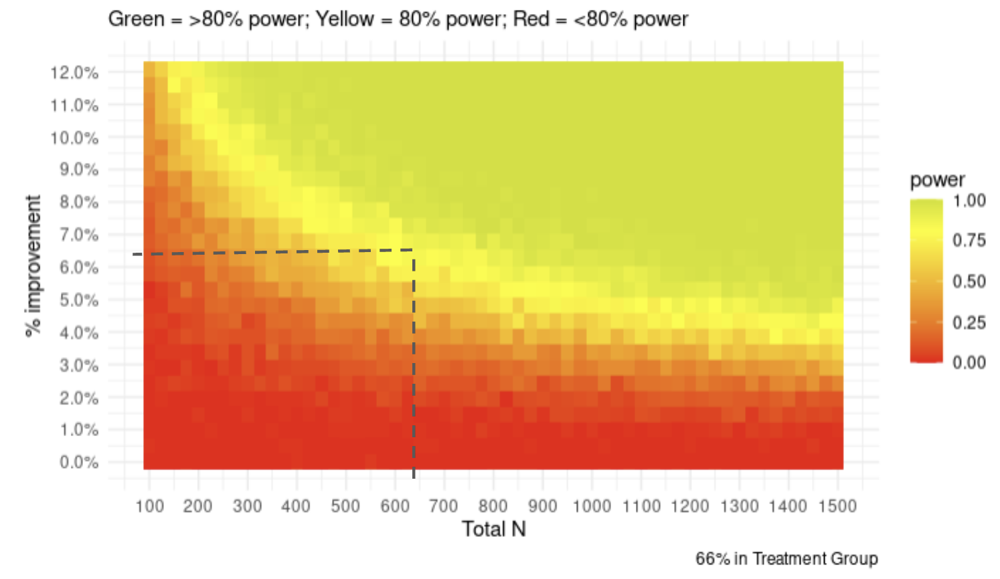

We would have more confidence in achieving a significant result if the experiment had at least 1,000 participants or achieved an 8.0% or greater improvement. In other words, having a slightly larger sample size would greatly help achieve a significant results. Although more difficult, a stronger treatment could also help. Implementing a Romano-Wolff correction may possibly also help in this regard. 

Importantly, we didn’t observe any real difference in the standard deviations between the control and treatment groups for the main task. This was unfortunate: we made this assumption and used imbalanced control and treatment group sizes in the hope of increasing our power. Doing a post-hoc power calculation, our power would have marginally improved if we allocated participants to control and treatment equally.

```{r, results='hide'}
# Delta_1_False
n_treatment <- 214
n_control <- 427
treatment_mean <- 0.7394614	
treatment_sd <- 1.160356	
control_mean <- 0.1133178	
control_sd = 1.132510
p_adjustments <- 10

power_sims(
  n_treatment,
  n_control,
  split,
  treatment_mean,
  treatment_sd,
  control_mean,
  control_sd,
  p_adjustments
)
```

```{r, results='hide'}
# Delta_1_True
n_treatment <- 214
n_control <- 427
treatment_mean <- -0.6147541
treatment_sd <- 1.842621	
control_mean <- 0.1588785	
control_sd = 1.676401
p_adjustments <- 10

power_sims(
  n_treatment,
  n_control,
  split,
  treatment_mean,
  treatment_sd,
  control_mean,
  control_sd,
  p_adjustments
)
```


```{r, results='hide'}
# Delta_2
n_treatment <- 214
n_control <- 427
treatment_mean <- -0.10538642
treatment_sd <- 1.389310
control_mean <- 0.08878505
control_sd = 1.306023
p_adjustments <- 10

power_sims(
  n_treatment,
  n_control,
  split,
  treatment_mean,
  treatment_sd,
  control_mean,
  control_sd,
  p_adjustments
)
```

```{r, results='hide'}
# Delta_3a
n_treatment <- 214
n_control <- 427
treatment_mean <- -0.207260
treatment_sd <- 0.9550121
control_mean <- -0.161215	
control_sd = 0.7929800
p_adjustments <- 10

power_sims(
  n_treatment,
  n_control,
  split,
  treatment_mean,
  treatment_sd,
  control_mean,
  control_sd,
  p_adjustments
)
```

```{r, results='hide'}
# Delta_3b
n_treatment <- 214
n_control <- 427
treatment_mean <- -0.3079625	
treatment_sd <- 1.0083314
control_mean <- -0.2242991
control_sd = 0.9366273
p_adjustments <- 10

power_sims(
  n_treatment,
  n_control,
  split,
  treatment_mean,
  treatment_sd,
  control_mean,
  control_sd,
  p_adjustments
)
```

```{r}
# Overall power summary
df_summarized %>%
  mutate(
    Delta_1_False_power = 0.999,
    Delta_1_True_power = 0.992,
    Delta_2_power = 0.097,
    Delta_3a_power = 0.012,
    Delta_3b_power = 0.036
  ) %>%
  mutate_if(is.numeric, round, digits = 2) %>%
  dplyr::select(
    treated,
    n,
    Delta_1_False_power,
    Delta_1_True_power,
    Delta_2_power,
    Delta_3a_power,
    Delta_3b_power
  )
```

## Time Spent

To better understand how participants interacted with the survey, we analyzed the time they spent engaging with different components. First, we tested whether the control and treatment groups spent a different amount of time completing their respective courses. The difference is significant, but only before multiple-hypothesis adjustments. 

```{r}
t.test(
  df_attention %>% filter(treated == 1) %>% pull(Treatment_Timer_Total),
  df_attention %>% filter(treated == 0) %>% pull(Control_Timer_Total)
) %>%
  broom::tidy() %>%
  mutate(p.value_adjusted = p.adjust(p.value, method = "BH", n = 10)) %>%
  mutate_if(is.numeric, round, digits = 2) %>%
  dplyr::select(-method, -alternative)
```

Next, we tested whether participants spent more time on the pre-treatment test than post-treatment test. Note that, for this test, we included all participants regardless of whether they were in the treatment or control arm. The results suggest that the difference is significant; participants spent, on average, less time post-treatment than they did pre-treatment.

```{r}
t.test(df_attention %>% pull(Post_Timer_Total),
       df_attention %>% pull(Pre_Timer_Total)) %>%
  broom::tidy() %>%
  mutate(p.value_adjusted = p.adjust(p.value, method = "BH", n = 10)) %>%
  mutate_if(is.numeric, round, digits = 2) %>%
  dplyr::select(-method, -alternative)
```

Next, we tested whether this same difference between the pre and post-tests was present if we only consider treated participants. The results suggest that the difference is significant, both before and after adjustments.

```{r}
t.test(
  df_attention %>% filter(treated == 1) %>% pull(Post_Timer_Total),
  df_attention %>% filter(treated == 1) %>% pull(Pre_Timer_Total)
) %>%
  broom::tidy() %>%
  mutate(p.value_adjusted = p.adjust(p.value, method = "BH", n = 10)) %>%
  mutate_if(is.numeric, round, digits = 2) %>%
  dplyr::select(-method, -alternative)
```

Finally, we tested if the different time participants spent on the pre and post-tests differed based on their allocation to the control and treatment arms. The results suggest that the difference wasn't significant, even before adjustments.

```{r}
t.test(
  df_attention %>% filter(treated == 1) %>% pull(Delta_Timer_Total),
  df_attention %>% filter(treated == 0) %>% pull(Delta_Timer_Total)
) %>%
  broom::tidy() %>%
  mutate(p.value_adjusted = p.adjust(p.value, method = "BH", n = 10)) %>%
  mutate_if(is.numeric, round, digits = 2) %>%
  dplyr::select(-method, -alternative)
```

## Pre-Treatment Correlations

```{r}
data_covariates <-
  dplyr::select(
    HTE_data,
    c(
      'mean_Delta_1_False',
      'MisGraph1_Delta_2_accuracy',
      'Anecdotes1_Delta_2_accuracy',
      'FalseComp1_Delta_2_accuracy',
      'mean_Delta_3a',
      'mean_Delta_3b',
      'pre_score',
      'Gender_numeric',
      'White',
      'education_level_2',
      'Income_numeric',
      'Ideology_numeric',
      'GeneralTrust_numeric',
      'FauciTrust_numeric',
      'SciTrust_numeric',
      'PostFrequency_numeric',
      'BlockUserSocialMedia_numeric',
      'ReportUserSocialMedia_numeric',
      'SeenManipulative_numeric',
      'KnowSpot_numeric'
    )
  )

ggcorrplot(cor(data_covariates))
```

We see that only `pre_score` (i.e. baseline susceptibility score calculated from pre-test survey responses) is correlated with the main outcomes of the experiment. This makes sense as the main outcomes are calculated as post-score - pre-score, i.e. we have already adjusted for `pre_score` in the design of our experiment. It is interesting to note that `pre_score` is also correlated with the sharing behavior measured by `mean_Delta_3a` and `mean_Delta_3b`. Correcting for the pre-score covariate did not meaningfully change the estimates for sharing outcomes.


# Discussion and Recommendations

## Summary of Insights

As reference again:

1. Our 6-minutes tactics focused course helped participants label manipulative posts as 12 percentage points more manipulative.
2. At the same time, we see increased skepticism for posts in general. Participants also labeled non-manipulative posts as 15.4 percentage points more manipulative. In particular, participants were more skeptical of non-manipulative graphs.
3. The rate at which participants can identify the tactics taught in our course increases (although this is only statistically significant for misleading graphs and anecdotes). However, we see drops in accuracy across all 3. This drop is due to a general increase in the frequency that participants selected tactics in the post-test. There is a (not statistically significant) increase in false positive identification, suggesting the users are not precise in their recognition of these tactics. 
4. Our tactics course did not seem to change online and offline sharing behavior. 
5. We found a heterogeneous treatment effect (HTE) for income only. In particular, we found that our treatment was relatively more effective for participants with lower incomes compared to participants with higher incomes. Otherwise, the treatment was consistent for participants with different ideologies and baseline misinformation susceptibility.
6. We performed additional covariate balancing and variance reduction techniques. These helped improve the significance of our estimates slightly, but not enough to change any of our initial conclusions.


## Recommendations for First Draft

Based on these results, we recommend that First Draft:

1. **Continue running courses to educate the public about misinformation by teaching them to recognize manipulative tactics. **The pilot study for our experiment investigated courses that focused on tactics, emotions, and a combination of the two. The pilot data suggested that the tactics course had the highest point estimate of ~3.65 amongst all the options tested (although the difference wasn’t statistically significant). The results of our experiment similarly suggest that a tactics course can help the public identify manipulative content. Relative to the control group, the treated group rated manipulative content as 12.6 percentage points more manipulative on a 6-point scale. We also found little evidence of HTE, which suggests that our course is widely effective across many different demographic groups. \

    There are, however, caveats to this recommendation. Future research would have to investigate the longer-term impact of treatment, and whether this helps mitigate the increased skepticism participants had for non-manipulative information. If not, the course may have to be modified. Moreover, our treatment was limited to 2 minutes per tactic because the length of our survey was constrained. First Draft may want to investigate if a longer course is more effective. These caveats are discussed in more detail in the sections on Limitations and Future Experiments below. 

2. **Consider adding material about other tactics to their courses. **First Draft’s tactics course currently includes material about misleading graphs and imposter content (among other tactics). At their request, our treatment taught participants about anecdotes and false comparisons – which hadn’t previously been included in a First Draft course. Our results suggest that teaching participants about these new tactics can be just as effective as those that First Draft currently uses. In particular, relative to the control group, the treated group improved their ability to identify anecdotes and false comparisons by 17 percentage points and 12 percentage points, respectively (using the accuracy metric without a false positive penalty). This is comparable to the result for misleading graphs which increased by 19 percentage points. These tactics are all based on Cook’s (2020) FLICC taxonomy. Extrapolating from our results, other tactics in the FLICC taxonomy may be just as effective as those tested in our experiment and currently taught by First Draft. Note, however, that the same caveats discussed for the first recommendation also apply.

3. **Investigate whether our results can be replicated if the course is delivered via SMS. **First Draft’s courses are designed to be delivered via SMS in snippets over a period of 14 days. Our experiment was constrained because our course needed to be delivered to participants in one continuous sitting over the course of a ~15 minute survey (on average, our participants spent 7.02 minutes completing the treatment course). Although our course was designed to convey multiple short snippets of messages which could also be delivered via text messages, further research is needed to verify any difference in effectiveness based on different delivery formats. Using multiple text messages to spread out the information over the course of multiple days and weeks may mean that participants learn and retain the material differently.

4. **Use more interactive elements to deliver their courses. **First Draft already leverages the SMS format of their course to ask participants questions and send them automated responses. In line with findings from the literature – which suggest that these interactive elements can increase participant engagement – we tailored our course to include more thought-provoking questions and relatable examples (Roblyer & Wiencke (2003), Hake (1998)). These are discussed in more detail in the Methodology Section above. Anecdotally, the free-form comments suggest these techniques seem to have improved the overall quality of the survey. Some participants, for instance, wrote that “this survey was very different from any others I’ve taken in the past.” Others wrote that “this was the most interesting survey I’ve taken in a long time,” and that the “survey was educational and very unique.”


## Limitations

The conclusions we could draw from our experiment were limited by format, budget, and time constraints. These limitations are discussed in more detail below.

1. **Our results suggest participants became more skeptical of non-manipulative posts (as well as manipulative ones). **
    * If this skepticism persists, the results could be harmful. Like misinformation, undermining the validity of legitimate information can also be damaging.
    * Some of this skepticism may be attributed to the difficulty of our test questions. For example, some of our true questions contained non-misleading anecdotes, (despite anecdotes being taught as a manipulative tactic), which may have confused participants.
    * What’s more, the long-term impacts of treatment may be different for manipulative and non-manipulative content. For instance, some of the effects we observe may be the result of priming or the experimenter demand effect. But, long-term, if participants retain information about some of the tactics but aren’t pressured by the immediacy of the course, then they may be better able to distinguish manipulative from non-manipulative content.
    * Because our experiment was limited to a single survey per participant, it was unable to measure the medium- to long-term impact of treatment. Furthermore, we didn’t measure how participants interpreted the 6-point scale they used to rate manipulativeness. This prevented us from further investigating whether they were responding to misleading and non-misleading content differently.
2. **Participants were not precise in their ability to recognize the tactics taught during treatment.**
    * As a result of treatment, participants tended to select 1.63 more tactics per question, on average. However, this increased both the number of true and false positives that they chose. This makes it difficult to measure how effective our course was at teaching participants to identify each tactic. 
    * This result may suggest that treated participants became more cautious: given what they learned in treatment, they deliberately cast a wider net even if they weren’t sure if the tactics were present or not. One limitation of our treatment is that it didn’t explicitly teach participants that false positives are not desirable.
    * Even if participants did become more cautious, we can’t validate that this is what happened based on the data we collected. We didn’t ask participants about their confidence a tactic was present when they selected it.
3. **Treatment only had a minor impact on behavioral outcomes.**
    * In our design, we assumed that participants would understand that sharing manipulative information is harmful. We therefore expected that successfully teaching participants to identify manipulative content would reduce their sharing behavior. Given that our treatment effects were relatively small, it is possible that any secondary impact on sharing was even smaller and that we weren’t sufficiently powered to detect it. 
    * Treatment also did not explicitly steer participants towards sharing content more or less. Moreover, there are many other factors we didn’t measure which may impact sharing behavior.  For instance, the survey didn’t ask users about their intention if they said they wanted to share a post. It is therefore possible, for example, that they wanted to share a manipulative post and debunk it by explaining why it contained misinformation.
4. **Our experiment identified very few HTE.**
    * The absence of many HTEs is a strength of our treatment. It suggests that our course is effective for a wide range of demographic groups. However, the absence of HTE for ideology and misinformation susceptibility conflicts with findings in other research (e.g. Garrett & Bond (2021)).
    * For ideology, this likely reflects the fact that the posts we showed participants were deliberately politically neutral. (We also used the term manipulative information that, unlike misinformation, is not polarized.) Thus, one limitation of our study is that we don’t know the impact of treatment on politically charged content. This is significant because some disinformation actors produce content that is intentionally polarizing.

For misinformation susceptibility, this may reflect a weakness in how we measured this susceptibility. Other work has developed tailored indices to measure heterogeneity based on susceptibility (e.g. Maertens et al. (2021), Bruder et al. (2013)). We opted not to use these indices in our experiment to condense the length of the survey.


## Future Experiments

To address the limitations discussed above, future experiments could use several approaches:


1. **To address participants becoming more skeptical of non-manipulative posts, a future experiment could discourage false positives. Specifically, it could:**
    * Include a course module explaining why false positives can also be harmful.
    * Provide incentives (e.g. small payments), if participants can successfully identify the tactics in a post without any false positives or negatives.
    * Ask participants how confident they are that each tactic they identify in a post is actually there. This could help researchers distinguish between participants who are making emphatic mistakes, to those being cautious by casting a wider net.
    * Measure how participants are interpreting the 6-point scale used to rate manipulativeness (e.g. using an arm with a binary outcome for comparison). This could help assess if there are any non-linearities to account for.
    * Better calibrate the test questions. Some of our test questions may have unintentionally led participants astray.
2. **To decouple whether participants are learning the tactics (or if our results reflect a priming or experimenter demand effect), a future experiment could:**
    * As in point (1), provide incentives (e.g. small payments), if participants can successfully identify the tactics in a post without any false positives or negatives, and ask participants how confident they are that each tactic they identify in a post is actually there.
    * Follow up with the same participants several days or weeks after treatment to measure the long-term impact of the course.
    * Use a longer intervention and/or multiple touch points. This could involve delivering treatment via SMS over a period of 14 days, which would better approximate the true experience of a First Draft course. It could also permit the experiment to investigate if spending more than 2 minutes per tactic is more effective.
    * Provide opportunities for follow-up actions (such as allowing participants to fact check specific posts). This would also better reflect the resources participants would have access to in the real world.
    * Observe real-world behavior after the experiment, for example by installing an app on participants’ phones (with their consent). This may also be beneficial for First Draft given that influencing behavior on social media is ultimately their outcome of concern.
3. **To more actively shape behavioral outcomes, future experiments could: **
    * Contain a module explaining how participants should address manipulative posts they encounter.
    * Ask participants about their motivation for taking actions.
    * Match topics in the posts used for the pre- and post-tests to account for participants’ interests.
    * Explain the potential negative consequences of sharing misinformation.
4. **To compare the HTE for our course to those observed in other literature, future experiments could:**
    * Include some politically-polarizing posts.
    * Measure misinformation susceptibility using several indices developed and validated elsewhere (e.g. in Maertens et al. (2021) and Bruder et al. (2013)).
    * Increase sample size or the length of the intervention to have more power for identifying potentially small HTE.


# References

* Bjälkebring, P., & Peters, E. (2021). Money matters (especially if you are good at math): Numeracy, verbal intelligence, education, and income in satisfaction judgments. PloS one, 16(11), e0259331.
* Bruder, M., Haffke, P., Neave, N., Nouripanah, N., & Imhoff, R. (2013). Measuring individual differences in generic beliefs in conspiracy theories across cultures: Conspiracy Mentality Questionnaire. Frontiers in psychology, 4, 225.
* Kricorian, K., Civen, R., & Equils, O. (2022). COVID-19 vaccine hesitancy: Misinformation and perceptions of vaccine safety. Human Vaccines & Immunotherapeutics, 18(1), 1950504.
* Cook, J. (2020). Deconstructing climate science denial. In Research Handbook on Communicating Climate Change. Edward Elgar Publishing.
* Pan, W., Liu, D., & Fang, J. (2021). An examination of factors contributing to the acceptance of online health misinformation. Frontiers in psychology, 12, 524.
* Garrett, R. K., & Bond, R. M. (2021). Conservatives’ susceptibility to political misperceptions. Science Advances, 7(23), eabf1234.
* Hake, R. R. (1998). Interactive-engagement versus traditional methods: A six-thousand-student survey of mechanics test data for introductory physics courses. American journal of Physics, 66(1), 64-74.
* Maertens, R., Götz, F., Schneider, C. R., Roozenbeek, J., Kerr, J. R., Stieger, S., ... & van der Linden, S. (2021). The Misinformation Susceptibility Test (MIST): A psychometrically validated measure of news veracity discernment.
* Rapp, D. N., & Salovich, N. A. (2018). Can’t we just disregard fake news? The consequences of exposure to inaccurate information. Policy Insights from the Behavioral and Brain Sciences, 5(2), 232-239.
* Roblyer, M. D., & Wiencke, W. R. (2003). Design and use of a rubric to assess and encourage interactive qualities in distance courses. In The American journal of distance education, 17(2), 77-98.

