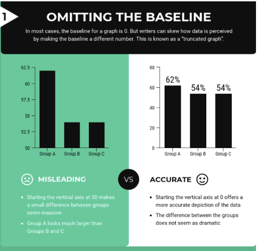
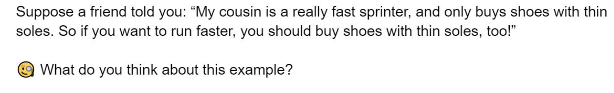
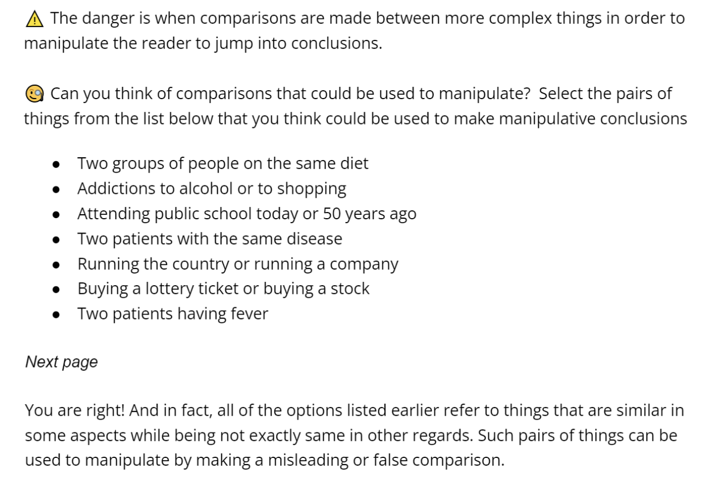

<style>
div.blue { background-color:#e6f0ff; border-radius: 5px; padding: 20px;}
</style>

<style>
div.medblue { background-color: #b3d1ff; border-radius: 5px; padding: 5px;}
</style>

<style>
div.darkblue { background-color: #9ac2ff; border-radius: 5px; padding: 5px;}
</style>


```{r setup, include = FALSE}
set.seed(94305)
knitr::opts_chunk$set(
  eval = TRUE,
  echo = TRUE,
  warning = FALSE,
  message = FALSE
)
```


---

### Load required packages

```{r load_packages, include=FALSE}
library(tidyverse)
library(randomizr)
library(estimatr)
library(kableExtra)
library(ggthemes)
library(reshape2)
library(bindata)
set.seed(103851)
```

## Motivation


Online misinformation has become a crucial threat to a well-informed citizenry. False/manipulative statements and conspiracy theories are widely circulated on social media, challenging our public health responses to the pandemic and eroding voters’ trust in democratic institutions. This project seeks to identify a low-cost way of increasing people’s ability to recognize online misinformation. In particular, it focuses on teaching people to recognize manipulative tactics in online information, and reduce their likelihood of sharing manipulative content online and offline.

First Draft has created a “Protection from deception” SMS course that teaches users to recognize misinformation through a series of text messages over 14 days. In principle, our experiment is intended to test the efficacy of such a course. But it has also been designed to navigate several constraints: 

* The experiment is limited to a 15-minute online survey. This survey is responsible for collecting participant demographics/covariates, delivering the treatment or control messaging, and evaluating its effectiveness by implementing a pre and  post-treatment test. This time-limit constrains the length and depth of the course we can show to participants.

* The online survey is unable to target participants based on their characteristics (such demographics or misinformation susceptibility). This prevents customizing the content for a particular audience. The survey must instead be accessible by and effective for a representative sample of the US population.

* The study has a limited sample size of 1,000-1,5000 participants. First Draft also indicated that they expect the treatment effect to be small.

Taking these together, we are wary of the experiment’s power. To navigate these constraints, we considered results from the pilot, the literature, and input from First Draft. We’ve adapted and supplemented a subset of First Draft’s SMS course to serve as our treatment. Our 6-minute “mini-course” includes a mixture of new and existing content focusing on specific manipulative tactics. First Draft requested we include new content previously untested in the existing literature.

Our course teaches participants to recognize three features common to misinformation based on a taxonomy developed in Cook (2020): misleading graphs, anecdotes, and false comparisons (the latter two being novel content). Our approach focuses on teaching participants to recognize tactics rather than misinformation itself. This is intentional. Audiences often require significant context, topic-specific knowledge, or access to evidence to correctly identify misinformation. Manipulative tactics, on the other hand, are topic-agnostic and objective. We can therefore expect participants to more accurately identify these tactics regardless of their existing knowledge. The **Treatment** section further elaborates on the rationale for our design choices.

Our experiment will investigate whether participants are able to better recognize these tactics by the end of the course relative to the control group. We will also test the effects for each tactic independently. Furthermore we will test the effects of our treatment on follow-up actions such as sharing the information on social media and discussing it offline. Finally, we will explore heterogeneous treatment effects (HTE) based on two covariates we collect (income and ideology) and the participants’ performance on the pre-intervention test.


## Research Questions

Our experiment will focus on four research questions:

1. Can a 6-minute course focused on manipulative tactics, in the vein of First Draft’s existing SMS courses, help users better identify manipulative content?

2. Does the course reduce the sharing of  manipulative content online and offline?

3. Does the course make participants better at identifying each individual tactic covered in the course?

4. Are there heterogeneous treatment effects (HTE) where our course works better for certain subgroups than others? In particular, are there any differences based on users’ misinformation susceptibility at baseline (as measured during the pre-test), political ideology, and income level?


## Experimental Setup

### Sample Recruitment

Participants will be adults 18 years and older living in the US, recruited through Lucid. We target a nationally representative sample to obtain more generalizable results. The original intention of First Draft’s SMS course is to educate US citizens on election-related disinformation. Using this representative sample makes our results generalizable and useful for First Draft. 

The data will be collected through a self-paced online survey implemented via Qualtrics.

Our budget for the experiment is 1,000-1,500 participants. We expect there to be some drop-off from attention checks, so we used a conservative sample size target of 800 for our pre-analysis calculations.


### Experimental Design

Our experiment design focused on obtaining sufficient power to detect our main outcomes (i.e. identifying manipulative tactics), while also accommodating several HTE analyses on priority subgroups. 

```{r power_pilot, cache = TRUE}
lm_interacted_model <- function(N,
                                # overall sample size
                                p_list,
                                # probability of treatment assignment,
                                # separate entry for each factor,
                                # entries will be normalized to sum to 1
                                b0,
                                # baseline mean outcome (i.e., mean for the control)
                                b_main_list,
                                # main effects above baseline,
                                # separate entry for each factor level
                                b_2wy_list,
                                # 2-way interactions
                                sigma,
                                # SD, used to construct residual error,
                                fmla = NULL
                                # formula for test we are performing
) {

  K <- length(p_list) # number of factors
  degree = 2 # max order of interaction in the model

  # Count number of levels in each factor
  L_list <- list()
  for(k in 1:length(p_list)){
    L_list[[paste0('L', k)]] <- length(p_list[[k]]) # naming the levels
  }
  number_marginal = n #(sum(unlist(L_list))-length(L_list)) # number of marginal effects

  # complete randomization of treatment assignment
  wmat <- as.data.frame(lapply(1:K, function(k)
    factor(
      complete_ra(N,
                  num_arms = L_list[[k]],
                  prob_each = p_list[[k]]),
      levels = paste0('T', 1:L_list[[k]]),
      labels = 1:L_list[[k]]
    ) ))

  # add names for the treatment assignment
  colnames(wmat) <- paste0('w', 1:K, '.')

  # simulation based on provided data generation process
  if (is.null(fmla)) fmla = paste0('~.^', degree)
  mmat <- model.matrix(fmla , as.data.frame(wmat)) # indicators for whether to include w1, w2 and the interaction

  betas <- unlist(c(b0, b_main_list, b_2wy_list)) # define the betas
  y <- as.vector(mmat %*% betas + rnorm(N, sd = sigma)) # simulate outcomes


    # analysis of outcomes by including interaction in the model
  lm_long <- lm_robust(y~., data = as.data.frame(cbind(y, mmat[,-1]))) # regression of simulated outcome on all the indicators except intercept

  # analysis of outcomes by excluding interactions in the model
  lm_short <- lm_robust(y~., data = as.data.frame(cbind(y, mmat[,hte]))) # regression of simulated outcome on all the indicators except intercept and interaction


  return(list(lm_long,lm_short))
}

#### POWER CALCULATION
set.seed(103851)

# definition
possible.ns <- seq(from = 100, to = 2000, by = 100) # possible total sample size
power.interaction <- rep(NA, length(possible.ns)) # save power to detect the specified interaction effect
power.onemarginal <- rep(NA, length(possible.ns)) # save power to detect at least one of the marginal effects
power.allmarginals <- rep(NA, length(possible.ns)) # save power to detect all marginal effects, with Bonferroni correction
power.all_FDR <- rep(NA, length(possible.ns)) # save power to detect all marginal effects, with FDR control

alpha <- 0.05  # significance level
sims <- 100 # 100 simulations

# based on pilot data
b0 <- 1.525574 # mean of control # 2.542623
sigma <- 2.520098 # SD of control # 3.253432

## YOU NEED TO EDIT THE FOLLOWING PARAMETERS:


p_list <- list(c(1/2, 1/2),
               c(168/291, 123/291),
               c(119/291, 172/291),
               c(190/291, 101/291))


no_hte = sum(sapply(p_list[-1], function(a) length(a)-1))


b_main_list <- list('w1.2' = 0.153) # Tactics Course


# what is a meaningful interaction to test?
b_2wy_list <- list('w1.1:w2.2' = 1.158, # Income
                   'w1.2:w2.2' = 0.153,
                   'w1.1:w3.2' = 1.09, # Reflect
                   'w1.2:w3.2' = 0.153,
                   'w1.1:w4.2' = 0.68, # Ideology
                   'w1.2:w4.2' = 0.153
                   )

fmla = formula('~w1. + w1.:w2. + w1.:w3. + w1.:w4.  ') # formula we are testing for to make mmat
n <- length(b_2wy_list) + length(b_main_list) # total number of hypotheses
m <- 3 # index of which interaction to test (here, Tactics Course & quiz)
hte <- 2*(2:(no_hte+1))

hypotheses <- rep("two.tailed", n) # hypothesis type for marginal effect 1, marginal effect 2, and interaction effect, can be "two.tailed", "greater", or "lower"

## END OF PARAMETERS

#### Outer loop to vary the experiment size
for (j in 1:length(possible.ns)) {
  N <- possible.ns[j]
  # Count number of levels in each factor
  L_list <- list()
  for(k in 1:length(p_list)){
    L_list[[paste0('L', k)]] <- length(p_list[[k]]) # naming the levels
  }
  number_marginal = n #(sum(unlist(L_list))-length(L_list)) # number of marginal effects

  # hold the p values and coefficients from both long and short models
  pvec <- cvec <- matrix(NA, sims, n)
  pvec_s <- cvec_s <- matrix(NA, sims, no_hte)

  #### Inner loop to conduct experiments "sims" times over for each N ####
  for (i in 1:sims) {

    # apply the analysis function defined above

    fits <- lm_interacted_model(N,
                                p_list = p_list, # randomization probs
                                b0 = b0, # intercept
                                b_main_list = b_main_list, # main effects
                                b_2wy_list = b_2wy_list, # 2-way
                                sigma = sigma,
                                fmla = fmla)
    fit0 <- fits[[1]] # long model with interaction
    fit1 <- fits[[2]] # short model without interaction # TODO: not used not, check back see if needed

    ### To capture coefficients and pvalues, according to the hypothesis type
    for(h in 1:n){
      if(hypotheses[h] == 'two.tailed'){
        pvec[i,h] <- summary(fit0)$coefficients[h + 1, 4] # pvalues for the h-th indicator (+1 due to intercept), 4th column: p-value for a two-sided test
        cvec[i,h] <- TRUE     # check if sign of coefficient is consistent with the hypothesis
      } else if (hypotheses[h] == 'greater'){
        pvec[i,h] <- pt(coef(summary(fit0))[h + 1, 3], fit0$df[h + 1], # 3rd column: t-stat
                        lower.tail = FALSE
        )
        cvec[i,h] <- summary(fit0)$coefficients[h + 1, 1]>0 # greater: >0
      } else if (hypotheses[h] == 'lower'){
        pvec[i,h] <- pt(coef(summary(fit0))[h + 1, 3], fit0$df[h + 1],
                        lower.tail = TRUE)
        cvec[i,h] <- summary(fit0)$coefficients[h + 1, 1]<0 # lower: <0
      }
    }
    # from short model without interactions
    for(s in 1:length(hte)){
      if(hypotheses[s] == 'two.tailed'){
        pvec_s[i,s] <- summary(fit1)$coefficients[s + 1, 4]

        cvec_s[i,s] <- TRUE
      } else if (hypotheses[s] == 'greater'){
        pvec_s[i,s] <- pt(coef(summary(fit1))[s + 1, 3], fit1$df[s + 1],
                        lower.tail = FALSE
        )
        cvec_s[i,s] <- summary(fit1)$coefficients[s + 1, 1]>0
      } else if (hypotheses[s] == 'lower'){
        pvec_s[i,s] <- pt(coef(summary(fit1))[s + 1, 3], fit1$df[s + 1],
                        lower.tail = TRUE)
        cvec_s[i,s] <- summary(fit1)$coefficients[s + 1, 1]<0
      }
    }
  }


  # power for detecting the chosen interaction with index m
  power.interaction[j] <- mean(sapply(1:sims, function(x)
    cvec[x, m]*(pvec[x, m]<alpha)
    )) # get pvalues and coefficients of the relevant interaction term

  # power for detecting at least one marginal effect
  power.onemarginal[j] <- mean(sapply(1:sims, function(x)
    max(cvec_s[x,]*( pvec_s[x,]<alpha/no_hte ))==1)) # Bonferroni or FDR

  # power for detecting all marginal effects
  power.allmarginals[j] <- mean(sapply(1:sims, function(x)
    all(cvec_s[x,]*( pvec_s[x,]<(alpha/no_hte ))) )) # Bonferroni
  # note that power for detecting at least one is the same with Bonferroni or FDR, but not the power for detecting all effects
  power.all_FDR[j] <- mean(sapply(1:sims, function(x)
    all(cvec_s[x,]*(pvec_s[x,]<alpha)) )) # FDR - cutoff for the max pvalue is alpha
}


# save simulated power data
gg_df2 <- data.frame(
  N = possible.ns,
  Interaction = power.interaction,
  `At least one` = power.onemarginal,
  `All with Bonferroni` = power.allmarginals,
  `All with FDR` = power.all_FDR
)

# start the plot
gg_df2 <- gg_df2 %>% melt(
  id.vars = "N", value.name = "Power", # the y-axis
  variable.name = "Type" # legend
)

# plotting power against sample size by type of power
ggplot(data = gg_df2, aes(x = N, y = Power, group = Type, col = Type)) + # power against size
  theme_minimal() +
  geom_point() +
  # vertical line indicating sample size where power first exceeds 0.8
  geom_segment(aes(
    x = possible.ns[min(which(power.interaction>0.8))],
    y = 0,
    xend = possible.ns[min(which(power.interaction>0.8))],
    yend = 0.8
  ),
  data = gg_df2, colour = "blue", lty = "dashed"
  ) +
  # horizontal line indicating sample size where power first exceeds 0.8
  geom_segment(aes(
    x = min(possible.ns),
    y = 0.8,
    xend = possible.ns[min(which(power.interaction>0.8))],
    yend = 0.8
  ),
  data = gg_df2, colour = "blue", lty = "dashed"
  ) +
  # vertical line indicating sample size where power first exceeds 0.8
  geom_segment(aes(
    x = possible.ns[min(which(power.allmarginals>0.8))],
    y = 0,
    xend = possible.ns[min(which(power.allmarginals>0.8))],
    yend = 0.8
  ),
  data = gg_df2, colour = "blue", lty = "dashed"
  ) +
  # horizontal line indicating sample size where power first exceeds 0.8
  geom_segment(aes(
    x = min(possible.ns),
    y = 0.8,
    xend = possible.ns[min(which(power.allmarginals>0.8))],
    yend = 0.8
  ),
  data = gg_df2, colour = "blue", lty = "dashed"
  ) +
  # vertical line indicating sample size where power first exceeds 0.8
  geom_segment(aes(
    x = possible.ns[min(which(power.all_FDR>0.8))],
    y = 0,
    xend = possible.ns[min(which(power.all_FDR>0.8))],
    yend = 0.8
  ),
  data = gg_df2, colour = "blue", lty = "dashed"
  ) +
  # horizontal line indicating sample size where power first exceeds 0.8
  geom_segment(aes(
    x = min(possible.ns),
    y = 0.8,
    xend = possible.ns[min(which(power.all_FDR>0.8))],
    yend = 0.8
  ),
  data = gg_df2, colour = "blue", lty = "dashed"
  ) +
  # vertical line indicating sample size where power first exceeds 0.8
  geom_segment(aes(
    x = possible.ns[min(which(power.onemarginal>0.8))],
    y = 0,
    xend = possible.ns[min(which(power.onemarginal>0.8))],
    yend = 0.8
  ),
  data = gg_df2, colour = "blue", lty = "dashed"
  ) +
  # horizontal line indicating sample size where power first exceeds 0.8
  geom_segment(aes(
    x = min(possible.ns),
    y = 0.8,
    xend = possible.ns[min(which(power.onemarginal>0.8))],
    yend = 0.8
  ),
  data = gg_df2, colour = "blue", lty = "dashed"
  ) +
  scale_y_continuous(breaks = seq(0.2, 1, .2)) +  # y axis scale +
ggtitle('Power analysis without pre-post test design for main outcome & 3 HTE')

```

We performed a simulation using the pilot experiment design, testing for a statistically significant change in the confidence weighted accuracy score and 3 HTEs (4 outcomes in total) using only 1 treatment arm (Tactics). As shown in the figure above, a power analysis for the outcomes of interest suggests that 1,500 participants would give us less than 20% power for each hypothesis. (Since we are interested in being able to give precise recommendations, the “at least one”, the only powered approach is not appropriate for this context). This prompted us to modify our experiment to include a pre-post test design. 

The following figure gives a high level overview of our new experiment flow:


This figure is explained in detail below.  

#### Demographic Questions

The participants will first answer a set of questions to collect demographic information about age, gender, race, education, income, partisanship/ideology, trust levels, information sources, and social media use. (Please see the Covariates section and the Survey Script for more detail.) We placed the demographics questions before the pre-test since we care about using these covariates for HTE analysis. This way, the pre-test questions can not impact the participant’s reported demographics.

The demographic questions may prime participants to behave slightly differently during the pre-test (eg. they may be more aware that this survey tests misinformation since we ask questions about social media use). However, this effect should carry over to the post-test as well. Since we are measuring the difference between pre and post, and across the treatment and control groups, the priming effect should normalize out.

#### Pre-Test

After demographics, the participants respond to a pre-test that is representative of the tactics we will be teaching in the treatment arm. This sets a baseline for each participant to measure the incremental impact of our treatments. We also use this score as one of the covariates of interest for HTE analysis: susceptibility to misinformation at baseline. (See the **Pre-Post Test with Control** section for more detail.)

#### Treatment/Control Assignment

After the pre-test, the participants will be randomly assigned to control and treatment groups. During the assignment, we will stratify based on income and ideology. That is, we will use Qualtrics to balance the random assignment of participants into each of the 30 possible income and ideology answer combinations (five options for ideology x six options for income). As a result, we can guarantee random assignment to treatment and control while also ensuring balanced assignment based on these two priority covariates. This procedure will enable us to further reduce variance and increase power. The ratio of assignment into treatment and control, within each stratum, will be a ⅔ treatment to ⅓ control. This uneven assignment should further increase our power since we expect the variance of the outcome to be smaller for the control (where the pre and post-test differences should be zero) than the treatment. See the **Power Calculation** section for more details on how we set this ratio.
 
#### Treatment & Control

Both the treatment and the control intervention will contain a ~6-minute mini-course. For the treatment, the content will cover 3 manipulative tactics common to misinformation. The control group will see a mini-course on the neutral topic of sleep. (Please see the **Treatment** section for more detail.)
 
#### Post-Test + Outcome Questions

Finally, the participants will work through a post-test that has comparable examples as the pre-test. This will assess if the participants learned the tactics taught in the mini-course. (Note: we will randomize for each participant which question of the comparable pairs they answer pre and post to ensure that slight differences in the exact questions aren’t impacting the effects we identify.) The control group helps normalize the post-test improvements that come naturally from doing more questions. (Please see the **Outcome** section for more details.)

### Pre-Post Test with Control

```{r read data }
# read in the data
data <- read.csv("Data/FDPilot.csv")  
data <- data[which(data$Finished == "True"),] # remove incomplete observations

# The variable for treatment assignment of each participant is 
# currently either "Got it." or  "". Let's transform them into 
# boolean (true or false):

data$Control <- data$Control == "Got it."

# Here, (data$Control == "Got it.") evaluates whether this is
# true, and assigns the boolean truth value back to the binary
# variable, so Control will be TRUE if previously Control == 
# "Got it." and FALSE otherwise. We can do the same to the other
# binary variables for treatment status:

data$Tactics <- data$Tactics == "Got it."
data$TacticQuiz <- data$TacticQuiz == "Got it."
data$Combined <- data$Combined == "Got it."
data$CombinedQuiz <- data$CombinedQuiz == "Got it."

data <- data %>%
  mutate(treatment = case_when(
      Control ~ 'Control', 
      Tactics  ~ 'Tactics', 
      TacticQuiz ~ 'TacticQuiz', 
      Combined ~ 'Combined', 
      CombinedQuiz ~ 'CombinedQuiz'))

# To facilitate future analysis, let's make sure that
# the baseline of treatment levels is "Control":

data$treatment <- relevel(as.factor(data$treatment), 
                          ref = "Control")

data$Attention <- data$Attention == "Please go on answering the questions."

data <- data %>%
  filter(Attention == TRUE)

# Posts 1, 4, 5, 7, 8, and 9 contain misinformation: 

data <- data %>%
  mutate(A1 = case_when(
      X01TF == "Yes, I think it contains misinformation" ~ 1, 
      X01TF == "No, I don't think it contains misinformation" ~ -1,
      X01TF == "I can't tell" ~ 0))

data <- data %>%
  mutate(A4 = case_when(
      X04TF == "Yes, I think it contains misinformation" ~ 1, 
      X04TF == "No, I don't think it contains misinformation" ~ -1,
      X04TF == "I can't tell" ~ 0))

data <- data %>%
  mutate(A5 = case_when(
      X05TF == "Yes, I think it contains misinformation" ~ 1, 
      X05TF == "No, I don't think it contains misinformation" ~ -1,
      X05TF == "I can't tell" ~ 0))

data <- data %>%
  mutate(A7 = case_when(
      X07TF == "Yes, I think it contains misinformation" ~ 1, 
      X07TF == "No, I don't think it contains misinformation" ~ -1,
      X07TF == "I can't tell" ~ 0))

data <- data %>%
  mutate(A8 = case_when(
      X08TF == "Yes, I think it contains misinformation" ~ 1, 
      X08TF == "No, I don't think it contains misinformation" ~ -1,
      X08TF == "I can't tell" ~ 0))

data <- data %>%
  mutate(A9 = case_when(
      X09TF == "Yes, I think it contains misinformation" ~ 1, 
      X09TF == "No, I don't think it contains misinformation" ~ -1,
      X09TF == "I can't tell" ~ 0))


# Posts 2, 3, 6, and 10 do NOT contain misinformation: 

data <- data %>%
  mutate(A2 = case_when(
      X02TF == "Yes, I think it contains misinformation" ~ -1, 
      X02TF == "No, I don't think it contains misinformation" ~ 1,
      X02TF == "I can't tell" ~ 0))

data <- data %>%
  mutate(A3 = case_when(
      X03TF == "Yes, I think it contains misinformation" ~ -1, 
      X03TF == "No, I don't think it contains misinformation" ~ 1,
      X03TF == "I can't tell" ~ 0))

data <- data %>%
  mutate(A6 = case_when(
      X06TF == "Yes, I think it contains misinformation" ~ -1, 
      X06TF == "No, I don't think it contains misinformation" ~ 1,
      X06TF == "I can't tell" ~ 0))

data <- data %>%
  mutate(A10 = case_when(
      X10TF == "Yes, I think it contains misinformation" ~ -1, 
      X10TF == "No, I don't think it contains misinformation" ~ 1,
      X10TF == "I can't tell" ~ 0))

data$Accuracy_conf <- (data$A1 * as.numeric(data$X01C_1) + data$A2 * as.numeric(data$X02C_1) + 
                      data$A3 * as.numeric(data$X03C_1) + data$A4 * as.numeric(data$X04C_1) + 
                      data$A5 * as.numeric(data$X05C_1) + data$A6 * as.numeric(data$X06C_1) + 
                      data$A7 * as.numeric(data$X07C_1) + data$A8 * as.numeric(data$X08C_1) + 
                      data$A9 * as.numeric(data$X09C_1) + data$A10 *as.numeric(data$X10C_1))/10


```

```{r mean_by_arm}
means_accuracy_conf <- data %>%
  dplyr::select(treatment, Accuracy_conf) %>%
  group_by(treatment) %>%
  summarize(mean = mean(Accuracy_conf), 
            sd = sd(Accuracy_conf), 
            n=n(), 
            se = sd/sqrt(n))

kable(means_accuracy_conf, 
      caption = "Mean by Arm",
  digits = 3,
  format.args = list(big.mark = ",", 
                     scientific = F)) %>%
  kable_styling(bootstrap_options = "striped")
```

Based on the figure above, the pilot suggested that the ability to recognize misinformation is highly variable between different people. The standard deviation (SD) of misinformation identification overall is ~3 units on a 20 point scale. This means a 1 SD confidence interval would span 30% of the scale of possible values. In order to maximize the power of our experiment and conduct HTE analyses, we decided to structure our experiment with a pre-post test along with a control group.

#### Advantages: Increased Power

The main benefit of conducting a pre-post test experiment is the increased power from (i) decreased variability and (ii) the greater proportion of treatment assignment relative to control.

With a pre-post test, we match the results of each individual with themselves and evaluate the change in their individual performance. This reduces the inter-person variability since the differences between each participant is accounted for when comparing to themselves. Decreased variance leads to higher power.

We also expect a significant decrease in variability in the control group. By designing the pre-post tests to be comparable to each other, we would expect individuals in the control group to perform almost identically on each of the tests. This low variability in the control group means we can shift a proportion of participants from control to treatment. More treatment units will permit HTE analyses of more subgroups. We estimated this drop in variability by running simulations on our pilot data and chose a conservative 1:2 split between control and treatment. See **Power Calculations** for more details about this calculation and the reduction in variability.

#### Considerations

There are 2 downsides to using a pre-post test design that we needed to account for.
First, it increases the length of the survey. Since we have 2 tests, the time taken to complete the evaluation is double the original pilot design. This means that we needed to cut down the number of questions we ask in each test to stay within our survey time limit. We chose to cut each test down to 6 questions.

Second, the pre and post-tests need to be comparable. Many misinformation pre-post experiments in the literature asked identical questions in each test (eg. Basol et al 2021). We worry that this would inflate the treatment effect since users would be answering the same question twice, and have the opportunity to reflect on their answers as they take the mini-course. 

To ensure that we test the ability to recognize the tactics themselves, we design our pre and post-tests to contain different questions, presented in comparable formats using the same distribution of manipulative tactics. We did this by developing the 6 pairs of questions in the following ratios: 2 true, 3 tactics, and 1 “combined tactics” . We then developed 2 comparable question examples to form each pair and will randomize the allocation of questions between pre and post-test among the participants.

The “combined tactics” questions combine the anecdote and false comparison tactics. It also contains a non-misleading graph. This forces participants to consider multiple tactics for each question. It also means participants can not assume that manipulative text is always accompanied by a manipulative graph (and vice versa), when we ask them to identify which tactics are being used.

#### Examples from our Pre-Post Tests

Here are some examples of posts we show in our pre-post tests. For the full list, see our **Survey Script** section.

Misleading Graph:


Combined Tactics:


True Fact:


### Treatment

In designing our treatment, our motivation was twofold. First, we wanted to maximize the effectiveness of our intervention, given the limited survey length. Second, we wanted to ensure that our experiment provides novel and actionable insights relevant to First Draft.

For reasons discussed in the **Experimental Design** and **Power Calculation** sections, we only have one treatment arm in addition to the control. Based on our discussion with First Draft, we decided that focusing on multiple outcomes and studying potential heterogeneities (see the **Covariates** and **Hypotheses** section) are the best use of power instead of testing various treatment arms. The outcomes we focus on include multiple behaviors in addition to the ability to identify manipulative content in general as well as specific manipulative tactics. Additionally, as discussed in the **Experimental Design** section, unlike the pilot, we include pre- and post-assessments of our outcomes of interest to maximize power.   

As discussed in the **Motivation** section, we will only have ~6 minutes to deliver the treatment. We therefore designed our treatment so we can still detect effects despite the course being shorter than First Draft’s SMS courses and the pilot. 

 
First, we maximized participant engagement in the delivery of the course. Both First Draft and the literature suggested that interactive course elements increase participant engagement (Roblyer & Wiencke (2003), Hake (1998)). Interestingly, our analysis of the pilot data suggests that the pilot courses with quizzes didn’t outperform those without (there is also large uncertainty as the confidence intervals are greatly overlapping), see the figure at the end of this section. However, based on our literature review and conversations with First Draft, these quizzes only encouraged limited engagement – adding just a single quiz question at the very end of the treatment message. Therefore, following the literature, we included the following elements in delivering our message (Klein, Junior & Barbosa (2015), Ziden & Rahman (2013)):

* Short and engaging, SMS style message snippets

* Infographics  (McCready, 2020). 



* Interactive questions to provoke thought


* Interactive and relatable examples


Second, within the broader context of misinformation inoculation, our course focuses specifically on manipulative tactics. We did this for several reasons. The tactics course seemed more promising than the emotions one and was included in all the pilot treatments either by itself or combined with the emotions course. As the graph at the end of this section shows, the pilot data suggests that the tactics course itself has comparable effectiveness (or better) than the combined one so it is a promising area of focus (although the confidence intervals are greatly overlapping). Additionally, based on our literature review, interventions focused on specific manipulative tactics have been very effective (Roozenbeek & Van der Linden (2019), Cook, Lewandowsky & Ecker (2017)). Furthermore, First Draft is very interested in learning about potential manipulative tactics that can be taught effectively, particularly tactics that are not yet widely studied. Finally, as suggested by our Partner, focusing on tactics rather than misinformation helps steer our course away from partisan topics which may alienate some participants. We expect the use of non-polarising language to maximize engagement and effectiveness in delivery.

We decided to focus on only three specific manipulative tactics because we have very limited time to deliver them. We picked one tactic already included in the First Draft SMS course and the pilot: misleading graphs. We chose two other tactics that are less studied in the literature and not yet in the First Draft course, because of the Partner’s above-mentioned request. These two were picked from the Cook (2020)’s FLICC taxonomy (shown below). We selected anecdotes and false comparisons because they: (i) are not dependent on context or prior knowledge, (ii) may be applied to a post on any topic, (iii) are not widely analyzed in the literature, and (iv) can each be feasibly taught in ~2-minutes.


Our final consideration in treatment design is choosing a control message that is as neutral as possible. Our control messages use the same delivery style and interactive elements as the treatment. They are also educational but focused on a neutral topic unrelated to manipulative tactics and news, and that is also not too boring nor too exciting. We considered various options based on the literature (e.g. freezer burn in Lewandowsky & Van Der Linden (2021)). The best topic we found that fits these criteria is “sleep.” We are using specific pieces of information based on the book Why We Sleep by Matthew Walker.

#### Pilot Effect Sizes

Here is the summary of our analyses of treatment effects in the pilot, which will be referenced throughout our report:

```{r pilot_analysis, echo = FALSE}
# Create graph where x-axis is the treatment arm, y-axis 
# is the outcome, and color by treatment arm. 
ggplot(means_accuracy_conf, 
       aes(x = treatment, y = mean, 
           group = treatment, color = treatment)) +
  # add bars for 95% confidence interval
  geom_errorbar(aes(ymin = mean - 1.96*se, ymax = mean + 1.96*se),
              width = .1,
              position=position_dodge(width=0.5)) + 
  # add points for average outcome
  geom_point(size =3, position=position_dodge(width=0.5)) +
  # add function to make the treatment labels readable
  scale_x_discrete(labels = function(x) str_replace(str_replace_all(x, "\\_", " "), " ", "\\\n")) + 
    # adjust y-axis scale so we can see the means easily
  scale_y_continuous(breaks = seq(1, 5, 1), 
                     labels = seq(1, 5, 1), 
                     limits = c(1, 4.5)) + 
  # add labels
  labs(title = "Confidence-weighted Accuracy Score \n in Misinformation Identification", 
       x = 'Treatment', y = "Accuracy Score", 
       caption  = "For participants who passed the attention check (N = 291); 95% CI displayed.") +
  # adjust theme for aesthetics
  theme_minimal() + 
  # change text size and face
  theme(strip.text = element_text(size = 12), 
        axis.text = element_text(size = 7), 
        axis.title = element_text(size = 12, face = "bold"), 
        legend.position = "none", 
        plot.title = element_text(size = 16, face = "bold", hjust = 0.5))
```

#### Examples of our Tactics Course

We have included above the examples of what makes our delivery engaging and interactive. Below are some of the key pieces of information that we are teaching the participants about each of the manipulative tactics. For all the details of our treatment and control messaging, please see the **Survey Script**.

Key pieces of the misleading graphs content:  


Key messages of the anecdotes content:  


Key pieces of the false comparisons message:  




### Covariates

The pilot included a rich selection of covariates. The primary use of the covariates is to search for heterogeneous treatment effects in the population and to use them as control variables to reduce variance and increase power (to achieve this we also stratify the random assignment of participants into treatment and control to maintain covariate balance). Therefore, to decide which covariates to collect, we used the pilot data to identify important covariates to use while removing variables that are highly correlated with others. We also used the pilot data to identify particularly promising covariates for HTE analysis. We have supplemented the pilot's high-performing covariates with a literature review to identify additional covariates that show significant HTE in similar experiments. We also consulted our Partner about covariates deemed important. For identifying the covariates for HTE, the most promising ones from the pilot, the literature, and from First Draft are summarized in the figure below.


The following table shows a quantitative analysis of the covariates selected from the pilot selected from Tactics and Tactics Quiz treatment arms. All the listed covariates are significant at the 10% level. The results, however, cannot be trusted completely given the high variability and low power. Additionally, the Race covariate was picked almost everytime by the causal tree package, which makes it a valuable covariate in HTE.


The mean and standard error of the confidence weighted accuracy score of the control population is 2.543 and 0.471 respectively. The estimates of HTE show substantial interactions with the treatments in the pilot. The inflation in interaction size can be attributed to the high variance in the study. Based on the above considerations, our primary focus for HTE are susceptibility to misinformation at baseline, income, and ideology. We chose susceptibility since it is found in the literature and the related variable, Think & Reflect, has been identified in the pilot as promising. We measure susceptibility to misinformation through the pretest score. Income stood out in the pilot and is related to education that is of interest to First Draft. Ideology is promising based on the literature, is of interest to First Draft, and is also related to the promising pilot variable, Trust in Fauci. 

In addition to the above covariates considered for HTE, we collect the following set of demographic variables: age, gender, race, education, trust levels, information sources, and social media use. We will use these variables as control variables to reduce variance in our main regression analysis. We will also use these to identify HTE subgroups from data using causal trees. (Please see the Survey script and the Hypothesis section for more detail.) 

### Outcomes

Our experiment has two outcomes of interest:

1. Participants’ ability to identify manipulative tactics
2. Participants’ willingness to share manipulative content, both online and offline

We will measure these outcomes with the questions below, see the screenshot below. These questions will be asked for every post shown in our pre-post tests. (See **Pre-Post Test with Control** section for specific examples).  


#### Main Outcome - Detecting Manipulation

We adjusted our primary outcome question to ask about identifying manipulative tactics rather than detecting misinformation since the latter often requires context and topic-specific knowledge. Manipulativeness is more objective and can be identified more consistently.

We also collapsed the primary outcome from 2 questions in the pilot to 1 in our new survey, with a 6 scale slider option. We chose 6 (as an even number) to force participants to choose whether they find a post manipulative or not. Simplifying this question saves time, but still measures participants’ confidence in their answer as in the original 2-part setup. This approach also is similar to many other experiments in the literature, including the Go Viral Game (https://www.goviralgame.com) (Basol et al., 2021).

As mentioned in the Pre-Post Test with Control section, we calculated the estimated effect size from the results of our pilot. We saw a point estimate increase of over 20% between the treatment arms and control. Even with large SDs from the pilot, we can still reasonably expect at least 7-10% increase as our treatment effect, that we will be able to detect, since our treatment and our new outcome questions/tests are more targeted towards an objective problem. Also see more of this effect size discussion in our Power Calculations section.

#### Tactics Identification

We provide a multi-select tactics identification question that is only asked when the user selects a manipulative option for the main outcome (i.e. 4-6 on the 6-point scale). Through this process we will have the implicit selection for each manipulative tactic from each participant. We score this selection as correct or not to have our outcomes of interest. 

#### Behavior Question

We kept the pilot’s behavior question about sharing since sharing is one of main factors that accelerate the virality of misinformation. Regardless of users’ intentions, posts gain a far wider audience and experience network distribution effects when they are shared. As such, a reduction in sharing of misinformation is often the most effective way users can prevent its spread.

First Draft was also interested in measuring the influence of treatment on real-life behaviors. As such, we included a question about sharing information offline to capture actions that go beyond the social media platform.

We also considered many other behavioral questions, although they each suffered from several drawbacks. Examples include: 

* **Would you fact check this content? Would you like to read more to find out the trustworthiness of this post?** In practice, fact-checking is a costly process for social media users. However, because answering this question is costless, participant responses may not actually reflect their true behavior.
* **Would you report this content to have it taken down?** Reporting behavior is relatively rare and many social media users aren’t aware it is even possible. Also, since the examples for our outcome questions cover deliberately neutral topics, we didn’t want to encourage users to report this type of content. 
* **Would you unfollow users that post this type of content?** This action is a self remediation technique that could help users stop seeing posts from specific misinformation sources. However, there are many reasons to unfollow an account, and personal interest is one of the more common. Users may respond that they want to unfollow based on the topic of the examples we show them rather than their manipulative tactics. 

### Survey Script

The full text of our survey script can be accessed [here](https://docs.google.com/document/d/1t88qhy2M1ysVQHT0DTT5LrQTa2_ALSI1IWRADCECPn8/edit?usp=sharing).


## Attrition / Attention Checks

We will have 3 attention checks: 1 during the demographics section, 1 at the end of the pre-test, and 1 before the post-test (after the treatment or control course). 

We will include in our analysis all respondents for whom we have collected complete pre-test responses and have passed the two attention checks during the demographic and pre-test sections. As treatment is not revealed at this point, attrition should be independent of treatment assignment conditional on covariates. 
For respondents who attrit after treatment assignment and before collection of post-test responses, the post-test answers will be coded as identical to the corresponding individual pre-test values. This procedure will enable us to identify unbiased intent to treat effects, although this procedure will attenuate the treatment effect estimates. 

Additionally, we will test whether treatment assignment is predictive of attrition. If not, we will be able to estimate average treatment effects using the local average treatment effect on the treated, who did not attrit, without the above attenuation.


## Hypotheses

Our hypotheses are the direct reflection of our motivation, goal, and research questions (see the corresponding sections), as well as the considerations detailed in the **Experiment Design** Section. The first hypothesis is at the core of our project: ability to identify manipulative tactics. The second through fourth hypotheses focus on the ability to identify specific manipulative tactics, the three tactics covered in the treatment, to provide more granular insights into specific directions for future research and policy implementation. (Since our treatment combines messaging to target each of the three tactics, we cannot make causal claims about a particular messaging, e.g. anecdotes, being the most effective. We can only make causal claims about the course as a whole being the most effective for a specific tactic. That said, if the results for one of the tactics is significantly better, it can be taken as suggestive evidence or motivation for further exploring the corresponding part of the course).

The hypotheses five and six focus on the behavioral aspect of sharing misinformation. They are a direct translation of the considerations and motivation described in the **Outcomes** Section. Hypotheses seven, eight, and nine are modified versions of the first hypothesis; they are focused on estimating heterogeneous treatment effects on the ability to identify manipulative content. As described in the **Covariates** Section , our focus for the HTE analysis is susceptibility to misinformation at baseline, income, and ideology. 

### Main effects

**H1**: Participants will be more capable of rating misinformation correctly as manipulative after taking the course.   

We measure the participants score using the following metric. 

$$
\begin{aligned}
  \text{score identify} & = \text{outcome 1} \quad \quad                   \text{if choice post is manipulative} \\ 
   & = \text{7 - outcome 1}  \quad       \text{if post is non manipulative}
\end{aligned}
$$
Our hypothesis translates into :

$$
| \Delta_{post-pre} \text{score identify}|_{treatment} > | \Delta_{post-pre} \text{score identify}|_{control}
$$
This is one of the main goals of the experiment and First Draft, making people better at identifying misinformation.  

**H2-4**: Participants will be more capable of identifying the 3 specified misinformation tactics after taking the course.  

We measure the ability to identify a tactic using precision:

$$
\text{precision}_{T} = \frac{1}{no. Qs}\sum_{i=1}^{\text{no Qs}} I_{i \in\text{misinfo Q}} \, I_\text{selection=1} + I_{i \notin \text{misinfo Qs}} \,  I_{\text{selection = 0}}
$$
 
For each post, we code each tactic identified correctly (score of 1) if it is selected when that manipulative tactic is used or if it is not selected when the tactic is not used in the post. Otherwise, the tactic is not identified correctly (score of 0). Then, we take the average of the scores across the six posts for each tactic to find the precision score for each tactic.

This definition ensures that participants are penalized for not putting in effort, for example, by selecting all or none of the tactics for all questions.

Our hypothesis translates into :  
 
$$
| \Delta_{post-pre} \text{precision}_{T}|_{treatment} > | \Delta_{post-pre} \text{precision}_{T}|_{control}
$$ 
 
 
We will test this hypothesis for each of our 3 tactics (graphs, anecdotes and false comparisons). This hypothesis satisfies the goal of measuring if the course taught participants how to identify individual tactics. 

**H5**: Participants will be less likely to share misinformation online after taking the course. 

**H6**: Participants will be less likely to share misinformation offline after taking the course
We measure the likelihood of sharing misinformation by looking at the propensity to share questions that are manipulative.  

We measure the likelihood of propensity to share misinformation by looking at the questions assessing manipulative content.

$$
\text{Share misinfo likelihood} = \sum_{i \in \text{misinfo Qs}} \text{Sharing score}_{i}
$$

Our hypothesis translates into:

$$
| \Delta_{post-pre} \text{Share misinfo likelihood}|_{treatment} < | \Delta_{post-pre} \text{Share misinfo likelihood}|_{control}
$$ 

We follow the same strategy for the questions about both online and offline sharing behavior. These two hypotheses capture the propensity of misinformation spread both online and offline.

#### Heterogeneity

We expect our treatment to have varying effects on participants based on the respondents’ characteristics. To measure this variability, we will conduct tests for HTE. We limit our analysis to 3 HTEs in order to remain sufficiently powered. (See the **Covariates** section for our detailed rationale for focusing on the below three covariates.)
  

**H7**: Participants with different levels of susceptibility to misinformation at baseline will react differently to the treatment in terms of their overall ability to identify manipulative content.  

We will measure the susceptibility to misinformation from the pre-test scores.

**H8**: Participants with different political ideologies will react differently to the treatment in terms of their overall ability to identify manipulative content.

We are asking the participants to pick political ideologies among 5 choices (very conservative, moderately conservative, moderative, moderately liberal, and very liberal) in the demographics section. Our discussions with the partner and the literature point to political ideology as an important covariate.

**H9**: Participants with different levels of income will react differently to the treatment in terms of their overall ability to identify manipulative content.

Participants will select their level of income in the demographic survey. Income showed high potential for HTE in the pilot.

### Secondary Hypotheses

**SH1**: Participants will not identify true content as more manipulative after taking the course. 

$$
(\sum_{i \in \text{True Qs post}} outcome1_{i} - \sum_{i \in \text{True Qs pre}} outcome1_{i})_{treatment} <  (\sum_{i \in \text{True Qs post}} outcome1_{i} - \sum_{i \in \text{True Qs pre}} outcome1_{i})_{control}
$$

We want to ensure that our treatment is not making participants excessively distrusting of all content such that they start labeling true content as manipulative.

### Exploratory Hypothesis

We will use the additional covariates from the demographic survey to form data-driven hypotheses using causal trees. These hypotheses will not inform the main conclusions of the experiment, and will act as additional findings to inform future research.

Our analysis on the pilot data for the Tactics and Tactics Quiz arms revealed some interesting findings that might be useful for future studies. Using multiple covariates to group people gives a better classification with very similar group members as compared to single covariate division. Therefore, we expect that groups made by causal trees will show stronger HTEs. This is evident from the pilot where we observed smaller p-values for HTEs on causal trees as compared to single covariate HTEs. The ML subgroups can also be used to inform new covariates or heterogenous policy assignments for future surveys. We also expect ML HTEs to reveal interesting correlations between covariates that can inform design decisions in the future.

```{r}
library(causalTree)

library(grf)
library(rpart)
library(glmnet)
library(splines)
library(MASS)
library(lmtest)
library(sandwich)
library(ggplot2)

```

```{r}
n <- nrow(data)

# Treatment: does the the gov't spend too much on "welfare" (1) or "assistance to the poor" (0)
treatment <- "treatment"

# Outcome: 1 for 'yes', 0 for 'no'
outcome <- "Accuracy_conf"

# Additional covariates
data <- data %>%
  mutate(age_subgroup = case_when(
    age < 30 ~ 1,
    age < 45 ~ 2,
    age < 65 ~ 3, 
    TRUE ~ 4
  ))

data <- data %>%
  mutate(White = ifelse(Race == 'White', 1, 0))

group1_educ = c("Did not graduate from high school", "High school degree")
group2_educ = c("Associate degree", "Bachelor's degree", "Some collage")
data <- data %>%
  mutate(education_level = case_when(
    Education %in% group1_educ ~ 1,
    Education %in% group2_educ ~ 2,
    TRUE ~ 3
  ))
data <- data %>%
  mutate(pol_interest = case_when(
    PartyID2 == 'Strong' ~ 3,
    PartyID2 == 'Not very strong' ~ 2,
    TRUE ~ 1
  ))

data <- data%>%
  mutate(TrumpTrust_numeric = parse_number(TrumpTrust))

data <- data%>%
  mutate(FauciTrust_numeric = parse_number(FauciTrust))

covariates <- c("age", "White", "age_subgroup", "education_level", "pol_interest", "TrumpTrust_numeric", "FauciTrust_numeric")

data = data %>%
  mutate(treatment_Combined = ifelse(treatment == 'Combined', 1, 0),
         treatment_CombinedQuiz = ifelse(treatment == 'CombinedQuiz', 1, 0),
         treatment_TacticQuiz = ifelse(treatment == 'TacticQuiz', 1, 0),
         treatment_Tactics = ifelse(treatment == 'Tactics', 1, 0))

romano_wolf_correction <- function(t.orig, t.boot) {
  abs.t.orig <- abs(t.orig)
  abs.t.boot <- abs(t.boot)
  abs.t.sorted <- sort(abs.t.orig, decreasing = TRUE)

  max.order <- order(abs.t.orig, decreasing = TRUE)
  rev.order <- order(max.order)

  M <- nrow(t.boot)
  S <- ncol(t.boot)

  p.adj <- rep(0, S)
  p.adj[1] <- mean(apply(abs.t.boot, 1, max) > abs.t.sorted[1])
  for (s in seq(2, S)) {
    cur.index <- max.order[s:S]
    p.init <- mean(apply(abs.t.boot[, cur.index, drop=FALSE], 1, max) > abs.t.sorted[s])
    p.adj[s] <- max(p.init, p.adj[s-1])
  }
  p.adj[rev.order]
}

summary_rw_lm <- function(model, indices=NULL, cov.type="HC2", num.boot=10000) {

  if (is.null(indices)) {
    indices <- 1:nrow(coef(summary(model)))
  }
  # Grab the original t values.
  summary <- coef(summary(model))[indices,,drop=FALSE]
  t.orig <- summary[, "t value"]

  # Null resampling.
  # This is a trick to speed up bootstrapping linear models.
  # Here, we don't really need to re-fit linear regressions, which would be a bit slow.
  # We know that betahat ~ N(beta, Sigma), and we have an estimate Sigmahat.
  # So we can approximate "null t-values" by
  #  - Draw beta.boot ~ N(0, Sigma-hat) --- note the 0 here, this is what makes it a *null* t-value.
  #  - Compute t.boot = beta.boot / sqrt(diag(Sigma.hat))
  Sigma.hat <- vcovHC(model, type=cov.type)[indices, indices]
  se.orig <- sqrt(diag(Sigma.hat))
  num.coef <- length(se.orig)
  beta.boot <- mvrnorm(n=num.boot, mu=rep(0, num.coef), Sigma=Sigma.hat)
  t.boot <- sweep(beta.boot, 2, se.orig, "/")
  p.adj <- romano_wolf_correction(t.orig, t.boot)

  result <- cbind(summary[,c(1,2,4),drop=F], p.adj)
  colnames(result) <- c('Estimate', 'Std. Error', 'Orig. p-value', 'Adj. p-value')
  result
}
```

```{r causal tree}

treatment = 'treatment_Tactics'
data_tactics = data %>%
  filter(treatment %in% c("Control", "Tactics"))
data_tactics$treatment = factor(data_tactics$treatment)
fmla <- paste(outcome, " ~", paste(covariates, collapse = " + "))

# Dividing data into three subsets
indices <- split(seq(nrow(data_tactics)), sort(seq(nrow(data_tactics)) %% 3))
names(indices) <- c('split', 'est', 'test')

# Fitting the forest
ct.unpruned <- honest.causalTree(
  formula=fmla,            # Define the model
  data=data_tactics[indices$split,],
  treatment=data_tactics[indices$split, treatment],
  est_data=data_tactics[indices$est,],
  est_treatment=data_tactics[indices$est, treatment],
  minsize=1,                 # Min. number of treatment and control cases in each leaf
  HonestSampleSize=length(indices$est), #  Num obs used in estimation after splitting
  # We recommend not changing the parameters below
  split.Rule="CT",            # Define the splitting option
  cv.option="TOT",            # Cross validation options
  cp=0,                       # Complexity parameter
  split.Honest=TRUE,          # Use honesty when splitting
  cv.Honest=TRUE              # Use honesty when performing cross-validation
)

# Table of cross-validated values by tuning parameter.
ct.cptable <- as.data.frame(ct.unpruned$cptable)

# Obtain optimal complexity parameter to prune tree.
cp.selected <- which.min(ct.cptable$xerror)
cp.optimal <- ct.cptable[cp.selected, "CP"]

# Prune the tree at optimal complexity parameter.
ct.pruned <- ct.unpruned # prune(tree=ct.unpruned, cp=cp.optimal)

# Predict point estimates (on estimation sample)
tau.hat.est <- predict(ct.pruned, newdata=data[indices$est,])

# Create a factor column 'leaf' indicating leaf assignment in the estimation set
num.leaves <- length(unique(tau.hat.est))
leaf <- factor(tau.hat.est, levels=sort(unique(tau.hat.est)), labels = seq(num.leaves))

rpart.plot(
  x=ct.pruned,        # Pruned tree
  type=3,             # Draw separate split labels for the left and right directions
  fallen=TRUE,        # Position the leaf nodes at the bottom of the graph
  leaf.round=1,       # Rounding of the corners of the leaf node boxes
  extra=100,          # Display the percentage of observations in the node
  branch=.1,          # Shape of the branch lines
  box.palette="RdBu") # Palette for coloring the node


```
```{r causal tree table}
# This is only valid in randomized datasets.
fmla <- paste0(outcome, ' ~ ', paste0(treatment, '* leaf'))
if (num.leaves == 1) {
  print("Skipping since there's a single leaf.")

} else if (num.leaves == 2) {
  # if there are only two leaves, no need to correct for multiple hypotheses
  ols <- lm(fmla, data=transform(data_tactics[indices$est,], leaf=leaf))
  coeftest(ols, vcov=vcovHC(ols, 'HC2'))[4,,drop=F]

} else {
  # if there are three or more leaves, use Romano-Wolf test correction 
  ols <- lm(fmla, data=transform(data_tactics[indices$est,], leaf=leaf))
  interact <- which(sapply(names(coef(ols)), function(x) grepl(paste0(treatment, ":"), x)))
  summary_rw_lm(ols, indices=interact, cov.type = 'HC2')
}
```

### Multiple Hypotheses Correction

Since the hypotheses in our experiment are dependent on each other, a Bonferroni or Holm correction would be too strict. Benjamini-Hochberg correction is a better alternative, but it controls for False Discovery Rate (FDR) rather than Family Wise Error Rate (FWER) which is more substantive. We decided to use a bootstrap correction, by simulating our experiment from the pilot data with testing for what fraction of times we detected a false discovery. The code for bootstrap is given below. We found a corrected alpha of 0.007857143 from our bootstrap simulation. This alpha performs FWER at a significance level  greater than that of Bonferonni correction (0.05/9), which makes sense as the outcomes are dependent on each other. As the graphs show, we still have sufficient power.

```{r}


data <- data %>%
  mutate(S1 = case_when(
    X01S == "I may share it to criticize its content" ~ 1,
    X01S == "Definitely not" ~ 1, 
    X01S == "I probably wouldn't" ~ 2,
    X01S == "I might share it but I'm not sure" ~ 3,
    X01S == "Probably" ~ 4, 
    X01S == "Definitely" ~ 5))

data <- data %>%
  mutate(S2 = case_when(
    X02S == "I may share it to criticize its content" ~ 1,
    X02S == "Definitely not" ~ 1, 
    X02S == "I probably wouldn't" ~ 2,
    X02S == "I might share it but I'm not sure" ~ 3,
    X02S == "Probably" ~ 4, 
    X02S == "Definitely" ~ 5))

data <- data %>%
  mutate(S3 = case_when(
    X03S == "I may share it to criticize its content" ~ 1,
    X03S == "Definitely not" ~ 1, 
    X03S == "I probably wouldn't" ~ 2,
    X03S == "I might share it but I'm not sure" ~ 3,
    X03S == "Probably" ~ 4, 
    X03S == "Definitely" ~ 5))

data <- data %>%
  mutate(S4 = case_when(
    X04S == "I may share it to criticize its content" ~ 1,
    X04S == "Definitely not" ~ 1, 
    X04S == "I probably wouldn't" ~ 2,
    X04S == "I might share it but I'm not sure" ~ 3,
    X04S == "Probably" ~ 4, 
    X04S == "Definitely" ~ 5))

data <- data %>%
  mutate(S5 = case_when(
    X05S == "I may share it to criticize its content" ~ 1,
    X05S == "Definitely not" ~ 1, 
    X05S == "I probably wouldn't" ~ 2,
    X05S == "I might share it but I'm not sure" ~ 3,
    X05S == "Probably" ~ 4, 
    X05S == "Definitely" ~ 5))

data <- data %>%
  mutate(S6 = case_when(
    X06S == "I may share it to criticize its content" ~ 1,
    X06S == "Definitely not" ~ 1, 
    X06S == "I probably wouldn't" ~ 2,
    X06S == "I might share it but I'm not sure" ~ 3,
    X06S == "Probably" ~ 4, 
    X06S == "Definitely" ~ 5))

data <- data %>%
  mutate(S7 = case_when(
    X07S == "I may share it to criticize its content" ~ 1,
    X07S == "Definitely not" ~ 1, 
    X07S == "I probably wouldn't" ~ 2,
    X07S == "I might share it but I'm not sure" ~ 3,
    X07S == "Probably" ~ 4, 
    X07S == "Definitely" ~ 5))

data <- data %>%
  mutate(S8 = case_when(
    X08S == "I may share it to criticize its content" ~ 1,
    X08S == "Definitely not" ~ 1, 
    X08S == "I probably wouldn't" ~ 2,
    X08S == "I might share it but I'm not sure" ~ 3,
    X08S == "Probably" ~ 4, 
    X08S == "Definitely" ~ 5))

data <- data %>%
  mutate(S9 = case_when(
    X09S == "I may share it to criticize its content" ~ 1,
    X09S == "Definitely not" ~ 1, 
    X09S == "I probably wouldn't" ~ 2,
    X09S == "I might share it but I'm not sure" ~ 3,
    X09S == "Probably" ~ 4, 
    X09S == "Definitely" ~ 5))

data <- data %>%
  mutate(S10 = case_when(
    X10S == "I may share it to criticize its content" ~ 1,
    X10S == "Definitely not" ~ 1, 
    X10S == "I probably wouldn't" ~ 2,
    X10S == "I might share it but I'm not sure" ~ 3,
    X10S == "Probably" ~ 4, 
    X10S == "Definitely" ~ 5))

data <- data %>%
  mutate(S_false = (S1 + S4 + S5 + S7 + S8 + S9)/6)


```

```{r, cache = TRUE}

data2 = data %>% filter(treatment == 'Control')
ac1  = (data2$A1 * as.numeric(data2$X01C_1) +
                       data2$A4 * as.numeric(data2$X04C_1) +
                      data2$A5 * as.numeric(data2$X05C_1) + data2$A6 * as.numeric(data2$X06C_1) +

                       data2$A10 *as.numeric(data2$X10C_1))/10

ac2 <- (data2$A2 * as.numeric(data2$X01C_1) +
                       data2$A3 * as.numeric(data2$X03C_1) +
                      data2$A7 * as.numeric(data2$X07C_1) + data2$A8 * as.numeric(data2$X08C_1) +

                       data2$A9 *as.numeric(data2$X09C_1))/10
ac3 = ac1-ac2 # control post-pre score

s1 = (data2$S1 + data2$S4 + data2$S5)/3
s2 = (data2$S7+data2$S8+data2$S9)/3
s3 = s1-s2 # control post-pre sharing score
N <- 801
split <- 2/3
treatment_mean <- 0 # 0.05 #0.21
treatment_sd <- 0.9862187 * (6)^0.5
control_mean <- 0 #0.05
control_sd = 0.7791459 * (6)^0.5
count = 1


graph_control = seq(1, 6*N*(1-split), 6) # index for graph Q for control in experiment
graph_treatment = seq(1, 6*N*(split), 6) # index for graph Q for treatment in experiment

trial <- function() {  # trial() simulates experiment by sampling from pilot

  delta_control = matrix(0, nrow = 6*N*(1-split), ncol = 5)
  delta_treatment = matrix(0, nrow = 6*N*(split), ncol = 5)

  delta_control[,1] = sample(ac3, 6*N*(1-split), replace = TRUE)
  delta_treatment[,1] = sample(ac3, 6*N*split, replace = TRUE)
  delta_control[,2] = sample(s3, 6*N*(1-split), replace = TRUE)
  delta_treatment[,2] = sample(s3, 6*N*split, replace = TRUE)
  delta_control[,3] = sample(ac3, 6*N*(1-split), replace = TRUE)
  delta_treatment[,3] = sample(ac3, 6*N*split, replace = TRUE)
  delta_control[,4] = sample(ac3, 6*N*(1-split), replace = TRUE)
  delta_treatment[,4] = sample(ac3, 6*N*split, replace = TRUE)
  delta_control[,5] = sample(ac3, 6*N*(1-split), replace = TRUE)
  delta_treatment[,5] = sample(ac3, 6*N*split, replace = TRUE)

  outcome1_control = colMeans(matrix(delta_control[,1], nrow = 6)) # avg overall score
  outcome1_treatment = colMeans(matrix(delta_treatment[,1], nrow = 6))


    outcome2_control = delta_control[graph_control, 1] # graph Q
  outcome2_treatment = delta_treatment[graph_treatment, 1]

  outcome3_control = delta_control[(1+graph_control), 1] # anecdote Q
  outcome3_treatment = delta_treatment[(1+graph_treatment), 1]

  outcome4_control = delta_control[(2+graph_control), 1] # false comparison Q
  outcome4_treatment = delta_treatment[(2+graph_treatment), 1]

  outcome5_control = delta_control[(2+graph_control), 2]  # behaviour 1 Q
  outcome5_treatment = delta_treatment[(2+graph_treatment), 2]

  outcome6_control = delta_control[(1+graph_control), 2]  # behaviour 2 Q
  outcome6_treatment = delta_treatment[(1+graph_treatment), 2]

  outcome7_control = colMeans(matrix(delta_control[,3], nrow = 6)) # HTE 1
  outcome7_treatment = colMeans(matrix(delta_treatment[,3], nrow = 6))

  outcome8_control = colMeans(matrix(delta_control[,4], nrow = 6)) # HTE 2
  outcome8_treatment = colMeans(matrix(delta_treatment[,4], nrow = 6))

  outcome9_control = colMeans(matrix(delta_control[,5], nrow = 6)) # HTE 3
  outcome9_treatment = colMeans(matrix(delta_treatment[,5], nrow = 6))

  ## Remaining Qs not used


  p_val_1 = t.test(outcome1_control, outcome1_treatment)$p.value
  p_val_2 = t.test(outcome2_control, outcome2_treatment)$p.value
  p_val_3 = t.test(outcome3_control, outcome3_treatment)$p.value
  p_val_4 = t.test(outcome4_control, outcome4_treatment)$p.value
  p_val_5 = t.test(outcome5_control, outcome5_treatment)$p.value
  p_val_6 = t.test(outcome6_control, outcome6_treatment)$p.value
  p_val_7 = t.test(outcome7_control, outcome7_treatment)$p.value
  p_val_8 = t.test(outcome8_control, outcome8_treatment)$p.value
  p_val_9 = t.test(outcome9_control, outcome9_treatment)$p.value

  p_values = c(p_val_1, p_val_2, p_val_3, p_val_4, p_val_5, p_val_6, p_val_7, p_val_8, p_val_9 )
  return(p_values)
}


wrapper_replicate <- function(alpha){
  #print(count)
  count = count + 1
  outcome = replicate(1000, trial()) # replicate experiment

    return(mean(apply(outcome, 2, function(x) min(x) <= alpha))) # amake any false discovery
}

alpha_range <- seq(0.005, 0.01, length.out = 50) # trying to find the right alpha among these

frac_wrong2 <- sapply(alpha_range, wrapper_replicate) # false discoveries with different values of alpha

alpha_range[max(which(frac_wrong2 < 0.05))] # find the alpha at which fraction of false discoveries < 0.05

```


## Power Calculations

### Effect Size Estimation

The pilot had an average effect size across all treatment arms of 0.74.

```{r}
# We first get all combinations of arms (for later use):
arm_combos <- combn(unique(data$treatment), 2, simplify = F)

# The first 4 combos are between each treatment arm and control:
arm_combos_control <- arm_combos[1:4]

t_table <- data.frame()

for(i in 1:length(arm_combos_control)){
  arm <- arm_combos[[i]]
  t_pairwise <- t.test(Accuracy_conf ~ treatment, 
                       data = data[data$treatment %in% arm, ])%>% 
    tidy() %>%
    rename(difference = estimate,
           tstat = statistic) %>%
    mutate(se = difference/tstat, 
           comparison = paste(arm[[1]], "-", arm[[2]])) %>%
    dplyr::select(comparison, difference, se, p.value)
  t_table <- rbind(t_table, t_pairwise)
}

t_table %>%
  kable(caption = "Confidence-weighted Accuracy Score in Misinformation Identification:  
        Difference in Between Means by Arm",
        digits = 3,
        format.args = list(big.mark = ",", 
                           scientific = F)) %>%
  kable_styling(bootstrap_options = "striped")

```

This is 30% of the baseline control score (= 2.54). We note that because of the relatively small sample size there is uncertainty around this number. Furthermore, the length of our mini-course will be shorter than the pilot. Papers too in the literature tend to find smaller effect sizes than the 30% from the pilot, for example studies with longer treatments (~1 hr) have shown ~20% effect sizes (Moore & Hancock (2022), Guess et al. (2020)). We expect a smaller effect size from a 6-minute course. Additionally, our discussion with the Partner revealed that a 10% effect size is more reasonable than 30%. Thus, to be conservative, we use the 10% effect size in our power calculations. 

To conduct the power calculations, we took three main steps: 1. Variable estimation from the pilot study; 2. Simulations using these estimations; 3. Visualization of the results.

### Variable Estimation

In order to estimate variables for the power calculations (e.g. SDs), we transformed the pilot data to simulate our proposed test design. First, we rescaled the measurement of the outcomes to fall between 1 and 6 to match our proposed test. Next, the pilot study only measured post-treatment outcomes (not pre and post). To get an estimate for our test design, for the control group, we randomly labeled 5 (3 with misinformation, 2 true) of the 10 misinformation identification questions as being “pre-treatment” and the other 5 as being “post-treatment.” From there, we calculated the deltas between the means of the “post-treatment” and “pre-treatment” answers to calculate the expected mean and SD for the control group. These outcomes should be representative since the control group in our experiment will receive a 6 minute neutral treatment message that is designed to have no effect. In fact, these estimates are likely inflated compared to our actual experiment since our new pre-post tests are designed to be far more comparable. After these manipulations, the estimated SD for the control group based on the pilot data was 0.78 and the mean was ~0. 

To get an estimate of the treatment group, we used nearest neighbor matching to match participants in the control group to individuals who received one of the treatments in the pilot study. Then, we calculated the average score for users in the control group as the “pre-treatment” stand-in and calculated the average score for users in the treatment group as the psuedo-post-treatment. Then, for the pairs of individuals, we took the delta between these averages and calculated a mean and SD that we used for the treatment group estimate for the power calculations. These measures give an approximation since the control group (who did not get any treatment) should be representative of individuals’ pre-treatment responses and the outcomes of the treatment groups in the pilot survey give us an estimate for the treatment group’s post-survey responses. Based on this method, the estimated SD for the treatment group was 0.99 and the mean was -0.35. 

```{r, results = FALSE}
# Converting control in pilot into pre-post test
pre_true <- sample(c("A2_conf", "A3_conf", "A6_conf", "A10_conf"), 2) 
pre_false <- sample(c("A1_conf", "A4_conf", "A5_conf", "A7_conf", "A8_conf", "A9_conf"), 3)
data %>% 
  dplyr::select(X, treatment, A1:A10, X01C_1:X10C_1) %>% 
  filter(treatment == "Control") %>% 
  mutate(A1_conf = A1 * X01C_1,
         A2_conf = A2 * X02C_1,
         A3_conf = A3 * X03C_1,
         A4_conf = A4 * X04C_1,
         A5_conf = A5 * X05C_1,
         A6_conf = A6 * X06C_1,
         A7_conf = A7 * X07C_1,
         A8_conf = A8 * X08C_1,
         A9_conf = A9 * X09C_1,
         A10_conf = A10 * X10C_1) %>% 
  pivot_longer(cols = c("A1_conf", "A2_conf", "A3_conf", "A4_conf", "A5_conf", "A6_conf", "A7_conf", "A8_conf", "A9_conf", "A10_conf")) %>% 
  mutate(period = if_else(name %in% pre_true | name %in% pre_false, "pre", "post"),
         value = scales::rescale(value, c(1, 6))) %>% 
  group_by(X, period) %>% 
  summarize(mean_value = mean(value)) %>% 
  pivot_wider(names_from = period, values_from = mean_value) %>% 
  mutate(delta = post - pre) %>% 
  ungroup() %>% 
  summarize(mean = mean(delta), # mean and sd of post - pre score
            sd = sd(delta))
```

```{r, results = FALSE}
library(MatchIt)
data <- data %>%
  mutate(Ideology_numeric = case_when(
      Ideology == "Very liberal" ~ -2, 
      Ideology == "Moderately liberal" ~ -1,
      Ideology == "Moderate" ~ 0,
      Ideology == "Moderately conservative" ~ 1,
      Ideology == "Very conservative" ~ 2
))
# Matching control with treatment to convert pilot into pre and post
data_match <- data %>% 
  mutate(treatment_binary = if_else(treatment == "Control", 1, 0)) %>% 
  dplyr::select(X, treatment_binary, age, gender, hhi, ethnicity, hispanic, education, region, Ideology_numeric, A1, A2, A3, A4, A5, A6, A7, A8, A9, A10)

m.out1 <- MatchIt::matchit(treatment_binary ~ age + gender + hhi + ethnicity + hispanic + education + region + Ideology_numeric, 
                  data = data_match,
                  method = "nearest",
                  distance = "glm")
```

```{r, results = FALSE}
# mean of pilot control group after rescaling confidence to 1-6 
data %>% 
  filter(treatment == "Control") %>% 
  mutate(A1_conf = A1 * X01C_1,
         A2_conf = A2 * X02C_1,
         A3_conf = A3 * X03C_1,
         A4_conf = A4 * X04C_1,
         A5_conf = A5 * X05C_1,
         A6_conf = A6 * X06C_1,
         A7_conf = A7 * X07C_1,
         A8_conf = A8 * X08C_1,
         A9_conf = A9 * X09C_1,
         A10_conf = A10 * X10C_1) %>% 
  pivot_longer(cols = c("A1_conf", "A2_conf", "A3_conf", "A4_conf", "A5_conf", "A6_conf", "A7_conf", "A8_conf", "A9_conf", "A10_conf")) %>% 
  mutate(value = scales::rescale(value, c(1, 6))) %>% 
  summarize(mean = mean(value))
```

### Simulations

We used the variables above as baselines for our power calculations. Given our treatment and control groups have different SDs, we used simulations for our power calculations. These simulations created synthetic data based on a given sample size, treatment-control split, treatment mean, treatment SD, control mean, control SD, and number of p-value adjustments (using bootstrap). Simulations were then run using these parameters to estimate the power of a given configuration of parameters. 

```{r}
calculate_power_2 <- function(N,
                              split,
                              treatment_mean,
                              treatment_sd,
                              control_mean,
                              control_sd){
  
  treatment_group <- rnorm(N * split, treatment_mean, treatment_sd)
  control_group <- rnorm(N *(1 - split), control_mean, control_sd)
  
  t.test(treatment_group, control_group) %>% broom::tidy()
}
```

```{r}
power_sims <- function(N,
                       split,
                       treatment_mean,
                       treatment_sd,
                       control_mean,
                       control_sd,
                       p_adjustments,
                       corrected_alpha = 0.007857143){
  power_results <- tibble()
for(i in 1:100){
  power_results <- power_results %>% 
    rbind(calculate_power_2(N, split, treatment_mean, treatment_sd, control_mean, control_sd) %>% mutate(i = i))
}
power_results %>% 
  mutate(row_n = row_number()) %>% 
  group_by(row_n) %>% 
  mutate(p_value_adjusted = p.value) %>% 
  mutate(significant = if_else(p_value_adjusted < corrected_alpha, 1, 0)) %>% 
  ungroup() %>% 
  summarize(power = sum(significant) / 100) %>% 
  mutate(N = N, split = split, treatment_mean = treatment_mean, treatment_sd = treatment_sd, control_mean = control_mean, control_sd = control_sd, p_adjustments)
}
```


```{r, cache = TRUE, results = FALSE}
N <- NULL
split <- 2/3
treatment_mean <- NULL
treatment_sd <- 0.9862187
control_mean <- 0
control_sd = 0.7791459
p_adjustments <- 9
power_calcs_1 <- tibble()
for(N in seq(100, 1500, 25)){
  print(N)
  for(treatment_mean in seq(0, .5, .02)){
    power_calcs_1 <- power_calcs_1 %>%
      rbind(power_sims(N,
                       split,
                       treatment_mean,
                       treatment_sd,
                       control_mean,
                       control_sd,
                       p_adjustments))
  }
}
```

```{r, cache = TRUE, results = FALSE}
N <- NULL
split <- NULL
treatment_mean <- .21
treatment_sd <- 0.9862187
control_mean <- 0
control_sd = 0.7791459
p_adjustments <- 9
power_calcs_2 <- tibble()
for(N in seq(100, 1500, 25)){
  print(N)
  for(split in seq(.5, .9, .05)){
    power_calcs_2 <- power_calcs_2 %>%
      rbind(power_sims(N,
                       split,
                       treatment_mean,
                       treatment_sd,
                       control_mean,
                       control_sd,
                       p_adjustments))
  }
}
```

```{r, cache = TRUE, results = FALSE}
N <- 800
split <- 2/3
treatment_mean <- NULL
treatment_sd <- 0.9862187
control_mean <- 0
control_sd = 0.7791459
p_adjustments <- NULL
power_calcs_6 <- tibble()
for(treatment_mean in seq(0, .5, .02)){
  print(treatment_mean)
  for(p_adjustments in 1:20){
    power_calcs_6 <- power_calcs_6 %>%
      rbind(power_sims(N,
                       split,
                       treatment_mean,
                       treatment_sd,
                       control_mean,
                       control_sd,
                       p_adjustments))
  }
}
```

### Visualization

We used the power calculations to inform three core decisions. 
First, we examined the tradeoff between the total number of people in the experiment and the treatment effect. Visualizing these results suggest we can have a well-powered experiment with 800-1,000 participants and a ~7\% improvement in the treatment groups.

```{r}
power_calcs_1 %>%
  mutate(per_improvement = treatment_mean / 4.135656) %>%
  ggplot(aes(N, per_improvement)) +
  geom_tile(aes(fill = power)) +
  scale_fill_gradient2(low = "red",
                       mid = "yellow",
                       high = "chartreuse4",
                       midpoint = .8) +
  scale_x_continuous(breaks = seq(0, 1500, 100)) +
  scale_y_continuous(breaks = seq(0, 1, .01), labels = scales::percent_format()) +
  labs(title = "Power Calculations",
       subtitle = "Green = >80% power; Yellow = 80% power; Red = <80% power",
       caption = "67% test-control split, N=800",
       x = "Total N",
       y = "% improvement") +
  theme_minimal()
```

Next, given we expect a lower SD in the control group compared to the test group (as discussed above, because of the design of the pre and post tests in our experiment, we expect no difference between the before and after scores for individuals in the control group), we used our power calculations to look for an optimal split between the treatment and control groups. Power analysis in the figure below suggests that a 1/3 vs 2/3 treatment-control split is plausible given a 7\% improvement in treatment groups. Even though this split is slightly optimistic given our result below, we do think it is justifiable since we expect our control group to have lower SD than the pseudo calculations from the pilot as our pre and post questions are designed to be comparable.  Moreover, following  the guidance in Özler (2021) also leads to the 1/3 vs 2/3 split assuming a 0.99 SD for the control group and a 0.5 SD for the treatment group (the latter slightly smaller than our estimate of 0.78 above).

```{r}
power_calcs_2 %>%
  mutate(per_improvement = treatment_mean / 4.135656) %>%
  ggplot(aes(N, split)) +
  geom_tile(aes(fill = power)) +
  scale_fill_gradient2(low = "red",
                       mid = "yellow",
                       high = "chartreuse4",
                       midpoint = .8) +
  scale_x_continuous(breaks = seq(0, 1500, 100)) +
  scale_y_continuous(breaks = seq(0, 1, .1), labels = scales::percent_format()) +
  labs(title = "Power Calculations",
       subtitle = "Green = >80% power; Yellow = 80% power; Red = <80% power",
       caption = "~5% Treatment Effect, 67% test-control",
       x = "Total N",
       y = "% split in test group") +
  theme_minimal()
```

Finally, we examined the tradeoff between treatment effect and the number of p-value adjustments we could conduct. We settled on being able to adjust for 9 multiple hypothesis tests given our anticipated effect size. 

```{r}
power_calcs_6 %>%
  mutate(per_improvement = treatment_mean / 4.135656) %>%
  ggplot(aes(per_improvement, p_adjustments)) +
  geom_tile(aes(fill = power)) +
  scale_fill_gradient2(low = "red",
                       mid = "yellow",
                       high = "chartreuse4",
                       midpoint = .8) +
  scale_x_continuous(breaks = seq(0, 1, .01), labels = scales::percent_format()) +
  scale_y_continuous(breaks = seq(0, 20, 2)) +
  labs(title = "Power Calculations",
       subtitle = "Green = >80% power; Yellow = 80% power; Red = <80% power",
       caption = "67% in Treatment Group, N = 800",
       x = "% improvement",
       y = "# of p-value adjustments") +
  theme_minimal()
```

## Planned Analysis

We will start by cleaning the data and constructing the above mentioned variables for our outcomes and covariates. We will drop participants who fail the attention checks prior to treatment assignment. Additionally, we will perform balance checks on the covariates to check the random assignment. 

```{r, eval = FALSE}
# read in the data
data <- read.csv("Data/FDPilot.csv")  
data <- data[which(data$Finished == "True"),] # remove incomplete observations

# The variable for treatment assignment of each participant is 
# currently either "Got it." or  "". Let's transform them into 
# boolean (true or false):

data$Control <- data$Control == "Got it."

# Here, (data$Control == "Got it.") evaluates whether this is
# true, and assigns the boolean truth value back to the binary
# variable, so Control will be TRUE if previously Control == 
# "Got it." and FALSE otherwise. We can do the same to the other
# binary variables for treatment status:

data$Tactics <- data$Tactics == "Got it."

data <- data %>%
  mutate(treatment = case_when(
      Control ~ 'Control', 
      Tactics  ~ 'Tactics'))
data = data %>% filter(treatment %in% c('Control', 'Tactics'))
# To facilitate future analysis, let's make sure that
# the baseline of treatment levels is "Control":

data$treatment <- relevel(as.factor(data$treatment), 
                          ref = "Control")

# We first convert Attention into a boolean as above:

data$Attention <- data$Attention == "Please go on answering the questions."
```


```{r, eval = FALSE}
# Covariate balance (similarly can do it for other covariates)
data <- data %>%
  mutate(Ideology_numeric = case_when(
      Ideology == "Very liberal" ~ -2, 
      Ideology == "Moderately liberal" ~ -1,
      Ideology == "Moderate" ~ 0,
      Ideology == "Moderately conservative" ~ 1,
      Ideology == "Very conservative" ~ 2
))


# Generate summary statistics:
covariate_balance_ideology <- data %>%
  dplyr::select(treatment, Ideology_numeric) %>%
  group_by(treatment) %>%
  summarize(mean = mean(Ideology_numeric), 
            se = sd(Ideology_numeric)/sqrt(n()))

# Generate HTML-friendly table:
kable(covariate_balance_ideology, 
      caption = "Covariate Balance on Ideology in Each Arm",
      # format numbers
      digits = 3,
      format.args = list(big.mark = ",", 
                         scientific = F)) %>%
# Format table:
kable_styling(bootstrap_options = "striped")
```

Next, we will calculate summary statistics pertinent to our outcomes (formulas in the **Hypothesis** section). We will use regression analysis on the outcome metrics to test our central hypotheses (H1-H6). Additionally, we will check for HTE for the three covariates (income, political ideology, and misinformation susceptibility at baseline) as part of testing hypotheses 7-9. Note that we will be using the corrected value of significance level (0.007857143) from our bootstrap simulations for our multiple hypotheses correction. As part of a different learning outcome of this course, we will also use the causal tree function to find data-driven hypotheses for additional HTEs.

```{r, eval = FALSE}
# regression analysis for the outcomes
t_table <- data.frame()
arm_combos = c()
for(i in 1:length(outcomes)){
  outcome = outcomes[i]
  t_pairwise <- t.test(outcome ~ treatment)%>% 
    tidy() %>%
    rename(difference = estimate,
           tstat = statistic) %>%
    mutate(se = difference/tstat, 
           comparison = paste('outcome', i)) %>%
    dplyr::select(comparison, difference, se, p.value)
  t_table <- rbind(t_table, t_pairwise)
}

t_table %>%
  kable(caption = "Confidence-weighted Accuracy Score \n in Misinformation Identification: \n 
        Difference in Between Means for control and treatment",
        digits = 3,
        format.args = list(big.mark = ",", 
                           scientific = F)) %>%
  kable_styling(bootstrap_options = "striped")
```


```{r, eval = FALSE}
# regression analysis for HTE, covariate represents the covariate we are testing HTE for
means_accuracy_ %>%
  ggplot(aes(treatment, mean, group = covariate, color = treatment)) +
  geom_errorbar(aes(ymin = mean - 1.96*se, ymax = mean + 1.96*se, 
                    linetype = as.factor(covariate)),
              width = .1,
              position=position_dodge(width = .4)) + 
  geom_point(size =3,
             position=position_dodge2(width= .4))  +
  scale_y_continuous(breaks = seq(0, 6 , 1), 
                     labels = seq(0, 6, 1), 
                     limits = c(0, 6)) + 
  scale_x_discrete(labels = function(x)str_replace(str_replace_all(x, "\\_", " "), " ", "\\\n")) + 
  labs(title = "Means and 95% CI by Arm \n and covariate Level", 
       x = 'Treatment', 
       y = "Accuracy Score", 
       caption  = "For participants who passed the attention check (N = 291); 95% CI displayed. \n Dotted CIs represent estimates for covariate.") +
  theme_minimal() + 
  theme(strip.text = element_text(size = 12), 
        axis.text = element_text(size = 7), 
        axis.title = element_text(size = 12, face = "bold"), 
        legend.position = "none", 
        plot.title = element_text(size = 16, face = "bold", hjust = 0.5))
```

```{r, eval = FALSE}
# reression analysis for HTE
model_2 <- lm(Accuracy_conf ~ treatment * (covariate), data)

results_2 <- coeftest(model_2, vcov = vcovHC(model_2, type="HC1"))
results_2
```

```{r, eval = FALSE}
# causal tree
treatment = 'treatment_Tactics'
data_tactics = data %>%
  filter(treatment %in% c("Control", "Tactics"))
data_tactics$treatment = factor(data_tactics$treatment)
fmla <- paste(outcome, " ~", paste(covariates, collapse = " + "))

# Dividing data into three subsets
indices <- split(seq(nrow(data_tactics)), sort(seq(nrow(data_tactics)) %% 3))
names(indices) <- c('split', 'est', 'test')

# Fitting the forest
ct.unpruned <- honest.causalTree(
  formula=fmla,            # Define the model
  data=data_tactics[indices$split,],
  treatment=data_tactics[indices$split, treatment],
  est_data=data_tactics[indices$est,],
  est_treatment=data_tactics[indices$est, treatment],
  minsize=1,                 # Min. number of treatment and control cases in each leaf
  HonestSampleSize=length(indices$est), #  Num obs used in estimation after splitting
  # We recommend not changing the parameters below
  split.Rule="CT",            # Define the splitting option
  cv.option="TOT",            # Cross validation options
  cp=0,                       # Complexity parameter
  split.Honest=TRUE,          # Use honesty when splitting
  cv.Honest=TRUE              # Use honesty when performing cross-validation
)

# Table of cross-validated values by tuning parameter.
ct.cptable <- as.data.frame(ct.unpruned$cptable)

# Obtain optimal complexity parameter to prune tree.
cp.selected <- which.min(ct.cptable$xerror)
cp.optimal <- ct.cptable[cp.selected, "CP"]

# Prune the tree at optimal complexity parameter.
ct.pruned <- ct.unpruned # prune(tree=ct.unpruned, cp=cp.optimal)

# Predict point estimates (on estimation sample)
tau.hat.est <- predict(ct.pruned, newdata=data[indices$est,])

# Create a factor column 'leaf' indicating leaf assignment in the estimation set
num.leaves <- length(unique(tau.hat.est))
leaf <- factor(tau.hat.est, levels=sort(unique(tau.hat.est)), labels = seq(num.leaves))

rpart.plot(
  x=ct.pruned,        # Pruned tree
  type=3,             # Draw separate split labels for the left and right directions
  fallen=TRUE,        # Position the leaf nodes at the bottom of the graph
  leaf.round=1,       # Rounding of the corners of the leaf node boxes
  extra=100,          # Display the percentage of observations in the node
  branch=.1,          # Shape of the branch lines
  box.palette="RdBu") # Palette for coloring the node

```

Finally, we will do a power calculation of our main hypotheses through simulation to study the effectiveness of our experiment design. 


```{r, eval = FALSE}
## Power calculation by simulation

# Assume that control_response is N_control x 6 array containing response to the 6 misinfo Qs and treatment_response is N_treatment x 6 array for treatment, and outcomei denote the outcome from the ith hypothesis. Note that the exat calculation will depend in which format we get the data from qualtrics and we can use simple code to calculate the metrics defined in the hypotheses section.


trial = function(control_response_pre, treatment_response_pre, control_response_post, treatment_response_post)  {
  
  # sample from the experiment data and calculate the outcomes from the sample
  
  p_val_1 = t.test(outcome1_control, outcome1_treatment)$p.value
  p_val_2 = t.test(outcome2_control, outcome2_treatment)$p.value
  p_val_3 = t.test(outcome3_control, outcome3_treatment)$p.value
  p_val_4 = t.test(outcome4_control, outcome4_treatment)$p.value
  p_val_5 = t.test(outcome5_control, outcome5_treatment)$p.value
  p_val_6 = t.test(outcome6_control, outcome6_treatment)$p.value
  p_val_7 = t.test(outcome7_control, outcome7_treatment)$p.value
  p_val_8 = t.test(outcome8_control, outcome8_treatment)$p.value
  p_val_9 = t.test(outcome9_control, outcome9_treatment)$p.value
  
  p_values = c(p_val_1, p_val_2, p_val_3, p_val_4, p_val_5, p_val_6, p_val_7, p_val_8, p_val_9 )
  return(p_values)
  
}

wrapper_replicate <- function(alpha){
  print(count)
  count = count + 1
  outcome = replicate(1000, trial()) # replicate experiment
    return(mean(apply(outcome, 2, function(x) min(x) <= alpha)))

}

alpha_corrected = 0.007857143
power = wrapper_replicate(alpha_corrected)
```

## References

* Basol, M., Roozenbeek, J., Berriche, M., Uenal, F., McClanahan, W. P., & Linden, S. van der. (2021). Towards psychological herd immunity: Cross-cultural evidence for two prebunking interventions against COVID-19 misinformation. In _Big Data & Society_.
* Cook, J., Lewandowsky, S., & Ecker, U. K. (2017). Neutralizing misinformation through inoculation: Exposing misleading argumentation techniques reduces their influence. In _PloS one_, 12(5), e0175799.
* Cook, J. (2020). Deconstructing climate science denial. In _Research Handbook on Communicating Climate Change_. Edward Elgar Publishing.
* Guess, A. M., Lerner, M., Lyons, B., Montgomery, J. M., Nyhan, B., Reifler, J., & Sircar, N. (2020). A digital media literacy intervention increases discernment between mainstream and false news in the United States and India. In _Proceedings of the National Academy of Sciences_, 117(27), 15536-15545.
* Hake, R. R. (1998). Interactive-engagement versus traditional methods: A six-thousand-student survey of mechanics test data for introductory physics courses. American journal of Physics, 66(1), 64-74.
* Klein, A. Z., Junior, J. C. D. S. F., & Barbosa, J. L. V. (2015). M-learning in practice: Using SMS for teaching and learning in undergraduate courses. IEEE Latin America Transactions, 13(1), 321-329.
* Lewandowsky, S., & Van Der Linden, S. (2021). Countering misinformation and fake news through inoculation and prebunking. European Review of Social Psychology, 32(2), 348-384.
* Moore, R. C., & Hancock, J. T. (2022). A digital media literacy intervention for older adults improves resilience to fake news. In _Scientific reports_, 12(1), 1-9.
* Roblyer, M. D., & Wiencke, W. R. (2003). Design and use of a rubric to assess and encourage interactive qualities in distance courses. In _The American journal of distance education_, 17(2), 77-98.
* Roozenbeek, J., & Van der Linden, S. (2019). Fake news game confers psychological resistance against online misinformation. In _Palgrave Communications_, 5(1), 1-10.
* Walker, M. (2017). Why we sleep: Unlocking the power of sleep and dreams. Simon and Schuster.
* Ziden, A. A., & Rahman, M. F. A. (2013). Using SMS quiz in teaching and learning. In _Campus-Wide Information Systems_.
* Özler, Berk. “When Should You Assign More Units to a Study Arm?” _World Bank Blogs_, 21 June 2021, https://blogs.worldbank.org/impactevaluations/when-should-you-assign-more-units-study-arm.
* McCready, Ryan. “5 Ways Writers Use Misleading Graphs To Manipulate You [INFOGRAPHIC].” _Venngage_, 17 Apr. 2020, https://venngage.com/blog/misleading-graphs/.